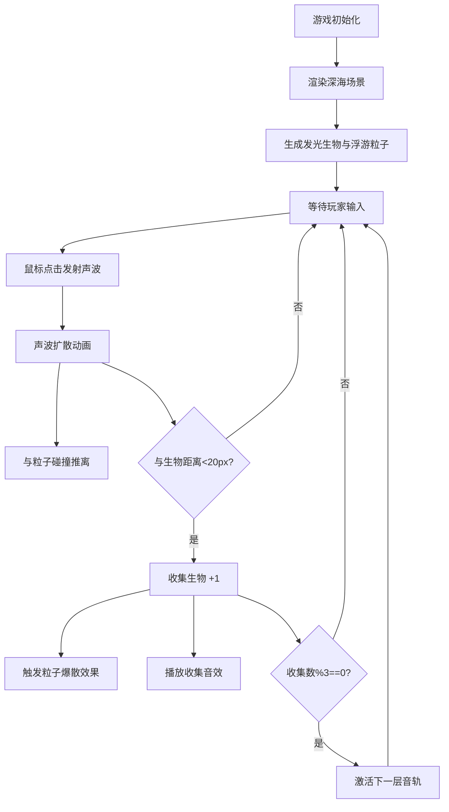

## 1. 产品概述

「深渊回响」是一款浏览器音效交互游戏，玩家在幽暗的深海场景中通过点击和键盘操作触发声波，借助回声反馈定位并收集发光生物，感受沉浸式的深海探索体验。

- 核心玩法：玩家通过鼠标点击发射可视化声波，利用声波与生物的交互反馈发现并收集隐藏的发光生物
- 目标用户：喜欢探索类、氛围类小游戏的休闲玩家
- 产品价值：提供沉浸式、治愈系的深海探索体验，通过视觉与听觉的渐进式反馈营造神秘氛围

## 2. 核心特性

### 2.1 功能模块

1. **深海场景渲染**：全屏 Canvas 绘制渐变深海背景、浮游粒子、海底山脊
2. **声波触发与可视化**：点击屏幕发射圆形声波，颜色根据位置冷暖变化，推动粒子并短暂点亮
3. **发光生物收集**：场景中随机游动的发光生物，被声波命中时触发收集效果和粒子爆散
4. **背景音轨渐进系统**：每收集3只生物激活一层音轨，三层音轨（低频嗡鸣、中频琶音、高频铙钹）逐步丰富音效
5. **界面与状态反馈**：底部控制条显示收集数量和音轨激活状态，左上角显示操作提示

### 2.2 功能详情

| 模块名称 | 功能描述 |
|---------|---------|
| 深海背景渲染 | 从上到下由 #001628 渐变到 #000c14，散布约600颗浮游粒子，底部绘制随机起伏的海底山脊 |
| 声波可视化 | 从点击点扩散的圆形声波，半径0→200px，线宽6→0px，上半屏冷蓝 #4a9eff，下半屏暖紫 #9b5ffa |
| 粒子推离效果 | 声波扩散时路径上粒子被推离，透明度短暂提升至0.8持续0.5秒 |
| 发光生物 | 8-12只圆形生物，半径6-10px，颜色 #ffdb58/#7aff6e/#ff6eb4，正弦波动缓慢游动 |
| 生物粒子拖尾 | 每只生物每帧产生3个随机方向粒子，1秒后消失 |
| 收集判定 | 声波中心与生物距离<20px时触发收集，播放收集音效 |
| 收集爆散效果 | 12个粒子向各方向飞散渐隐，持续0.8秒 |
| 背景音轨 | 初始无音轨，每收集3只激活一层，共3层（低频、中频、高频） |
| 收集音效 | 随机音高短促音符，频率300-800Hz，持续0.2秒，指数衰减包络 |
| 底部控制条 | 半透明背景 rgba(10,20,40,0.7)，高50px，显示收集数量和音轨激活条 |
| 操作提示 | 左上角显示"点击扩散声波 收集发光生物" |

## 3. 核心流程

玩家进入游戏 → 看到深海场景和发光生物游动 → 点击屏幕发射声波 → 声波扩散与粒子/生物交互 → 生物被收集，触发粒子爆散和音效 → 收集数量增加，音轨逐步激活 → 持续探索直至所有生物被收集

## 4. 用户界面设计

### 4.1 设计风格

- **主色调**：深海冷色系，背景从 #001628 到 #000c14 的渐变
- **强调色**：
  - 冷蓝色 #4a9eff（上半屏声波）
  - 暖紫色 #9b5ffa（下半屏声波）
  - 生物发光色：暖黄 #ffdb58、荧光绿 #7aff6e、粉红 #ff6eb4
- **字体**：monospace 等宽字体，营造科技感和神秘感
- **视觉风格**：幽暗、神秘、荧光点缀，低饱和度高沉浸感
- **动效风格**：全部采用 ease-out 缓动，流畅自然

### 4.2 页面设计概览

| 区域 | 元素 | UI 细节 |
|-----|------|---------|
| 全屏画布 | 深海背景 | 从上到下线性渐变，浮游粒子缓慢闪烁，底部山脊线 |
| 全屏画布 | 声波 | 圆形扩散，线宽渐变，颜色分区 |
| 全屏画布 | 发光生物 | 圆形发光体，粒子拖尾，正弦游动 |
| 左上角 | 操作提示 | 白色小字，半透明，不干扰主视觉 |
| 底部控制条 | 收集数量 | 白色 bold 18px monospace 居中显示 |
| 底部控制条 | 音轨激活条 | 三条横条，宽度随激活状态变化，颜色对应三层音轨 |

### 4.3 响应式设计

- 全屏 Canvas 自适应窗口大小
- 控制条固定在底部，宽度 100%
- 粒子和生物密度根据屏幕尺寸微调，保持视觉平衡

## 5. 性能要求

- 目标帧率：60 FPS
- 粒子总数上限：1500 个
- 同时存在声波上限：3 个（超出时移除最旧）
- 采用 Canvas 2D 渲染，避免不必要的重绘
