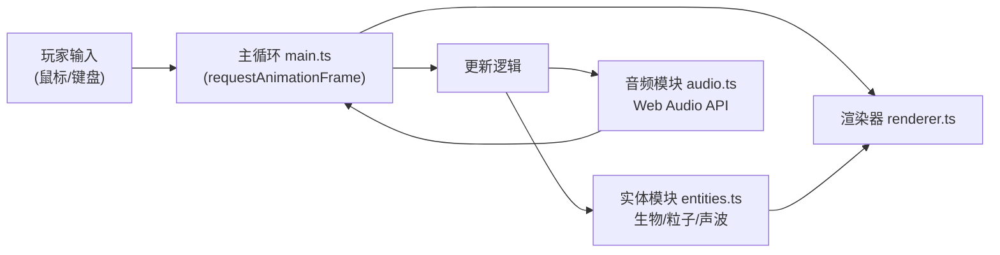

## 1. 架构设计



## 2. 技术说明

- **前端框架**：纯 TypeScript，无外部游戏引擎
- **构建工具**：Vite 5.x
- **渲染技术**：Canvas 2D API
- **音频技术**：Web Audio API（原生浏览器接口）
- **语言版本**：TypeScript 5.x，target ES2020，module ESNext

## 3. 项目文件结构

```
├── package.json              # 项目依赖与脚本
├── vite.config.js            # Vite 配置
├── tsconfig.json             # TypeScript 配置
├── index.html                # 入口 HTML
└── src/
    ├── main.ts               # 游戏主循环、输入处理、状态管理
    ├── audio.ts              # Web Audio API 音效与音轨合成
    ├── entities.ts           # 游戏实体类定义（生物、粒子、声波）
    └── renderer.ts           # Canvas 2D 渲染模块
```

## 4. 模块接口设计

### 4.1 audio.ts

```typescript
export interface AudioSystem {
  init(): void;
  playCollectSound(): void;
  updateTrackLayers(collected: number): void;
}

export function createAudioSystem(): AudioSystem;
```

- `init()`: 首次用户交互后初始化 AudioContext（浏览器策略要求）
- `playCollectSound()`: 播放随机音高的短促收集音效
- `updateTrackLayers(collected)`: 根据收集数量激活对应背景音轨层

### 4.2 entities.ts

```typescript
export interface Particle {
  x: number; y: number;
  vx: number; vy: number;
  size: number;
  alpha: number;
  baseAlpha: number;
  color: string;
  life: number; maxLife: number;
  brightTime: number;
}

export interface Creature {
  x: number; y: number;
  baseX: number; baseY: number;
  radius: number;
  color: string;
  vx: number; vy: number;
  phase: number;
  collected: boolean;
  spawnTrailParticle(): Particle;
  update(width: number, height: number): void;
}

export interface SoundWave {
  x: number; y: number;
  radius: number;
  maxRadius: number;
  lineWidth: number;
  color: string;
  age: number;
  maxAge: number;
  isDead(): boolean;
  update(): void;
}

export interface BurstParticle {
  x: number; y: number;
  vx: number; vy: number;
  color: string;
  alpha: number;
  life: number; maxLife: number;
}

export function createPlanktonParticles(count: number, width: number, height: number): Particle[];
export function createCreatures(count: number, width: number, height: number): Creature[];
export function createSoundWave(x: number, y: number, width: number, height: number): SoundWave;
export function createBurstParticles(x: number, y: number, color: string, count: number): BurstParticle[];
```

### 4.3 renderer.ts

```typescript
export interface GameState {
  width: number;
  height: number;
  plankton: Particle[];
  creatures: Creature[];
  soundWaves: SoundWave[];
  burstParticles: BurstParticle[];
  trailParticles: Particle[];
  collected: number;
  ridgePoints: { x: number; y: number }[];
}

export function createRenderer(ctx: CanvasRenderingContext2D): {
  render(state: GameState): void;
};
```

### 4.4 main.ts

负责：
- Canvas 初始化与尺寸自适应
- 游戏状态（state）管理
- 鼠标/键盘事件监听
- requestAnimationFrame 主循环（update + render）
- 声波碰撞检测与收集逻辑
- 粒子生命周期管理与数量控制

## 5. 核心算法与数据结构

### 5.1 碰撞检测
- 声波与生物：欧氏距离判断 `distance(wave.center, creature.center) < 20`
- 声波与浮游粒子：点在圆环内判断 `particle 在 [wave.radius - lineWidth, wave.radius + lineWidth] 范围内`

### 5.2 缓动函数
- 声波半径增长：ease-out cubic `r = maxR * (1 - (1 - t)^3)`
- 声波线宽衰减：线性 ease-out
- 粒子透明度过渡：ease-out

### 5.3 粒子对象池
- 浮游粒子：固定 600 个，循环使用
- 拖尾粒子：上限 ~800 个，超出时淘汰最旧
- 爆散粒子：每生物 12 个，到期自动回收
- 总粒子数控制在 1500 以内

## 6. 性能优化策略

1. **Canvas 渲染优化**：每帧仅清除必要区域，使用分层绘制
2. **粒子数量控制**：设置硬上限 1500，超出时移除最旧粒子
3. **声波数量限制**：最多同时 3 个声波，FIFO 策略
4. **数组操作优化**：使用 filter + push 而非频繁 splice
5. **颜色缓存**：预计算渐变色值，避免每帧重复计算
6. **避免 GC 压力**：复用粒子对象，减少临时对象创建
