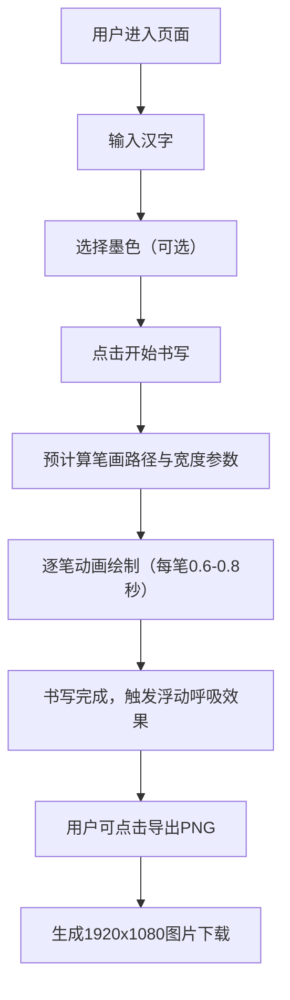

## 1. 产品概述
「笔锋诗痕」是一款浏览器端交互式汉字笔顺动画生成器，用户输入任意汉字即可观看以毛笔书法风格书写的笔顺动画，体验中国书法艺术之美。
- 核心目标：在浏览器中以原生Canvas API实现高保真毛笔书法效果，让用户直观感受汉字笔画的起承转合
- 目标用户：书法爱好者、汉语学习者、设计师、对中华文化感兴趣的普通用户
- 市场价值：将传统书法艺术与现代Web技术结合，创造兼具教育意义和美学体验的交互产品

## 2. 核心特性

### 2.1 用户角色
无需注册，所有用户均可直接使用全部功能。

### 2.2 功能模块
1. **主画布界面**：全屏Canvas画布、宣纸纹理背景、书法动画渲染
2. **输入控制面板**：汉字输入框、开始书写按钮、毛玻璃效果面板
3. **调色板系统**：五种预设墨色选择、选中状态高亮
4. **笔画动画引擎**：逐笔顺序绘制、笔锋宽度变化、墨迹扩散效果
5. **呼吸浮动效果**：书写完成后的正弦浮动、笔画边缘微动
6. **图片导出功能**：1920x1080分辨率PNG导出、自动添加深棕边框

### 2.3 页面详情
| 页面名称 | 模块名称 | 功能描述 |
|---------|---------|---------|
| 主画布 | Canvas渲染层 | 米黄色宣纸纹理背景，承载所有绘制内容 |
| 主画布 | 笔画绘制 | 深墨色毛笔书写效果，笔锋宽度渐变，末端墨渍扩散 |
| 主画布 | 浮动动画 | 书写完成后整体正弦波浮动，笔画边缘随机微动 |
| 控制面板 | 输入框 | 240x36px，接收用户输入的汉字，底部浅灰分割线 |
| 控制面板 | 书写按钮 | 点击触发笔顺动画播放 |
| 调色板 | 色块选择 | 五个48x48px色块横向排列，选中时2px深灰边框 |
| 工具栏 | 导出按钮 | 右下角位置，导出1920x1080 PNG图片带2px深棕边框 |

## 3. 核心流程
用户在输入框中输入汉字，选择墨色（可选），点击开始书写，系统逐笔绘制书法动画，完成后汉字轻微浮动呼吸，用户可点击导出按钮保存为高清图片。

## 4. 用户界面设计

### 4.1 设计风格
- **主色调**：米黄色宣纸 #f5f0e8 作为背景基调，深墨色 #1a1a1a 作为主要书写色
- **辅助色**：朱砂红 #c0392b、石青蓝 #2980b9、藤黄 #f1c40f、赭石 #8e44ad 作为墨色选择
- **按钮风格**：半透明毛玻璃面板，圆角12px，轻微阴影
- **字体**：优先使用楷体/宋体等中文书法字体，标题醒目清晰
- **布局风格**：极简留白，全屏画布为主视觉，控制元素悬浮于画布之上
- **质感**：宣纸纹理、墨迹洇开、笔锋粗细变化、毛玻璃半透明效果

### 4.2 页面设计概览
| 页面名称 | 模块名称 | UI元素 |
|---------|---------|--------|
| 主画布 | 画布背景 | 米黄色宣纸纹理 #f5f0e8，全屏铺满 |
| 主画布 | 控制面板 | 左上角，rgba(245,240,232,0.7)背景，blur(10px)，圆角12px |
| 主画布 | 调色板 | 画布下方横向排列，色块48x48px圆角8px |
| 主画布 | 导出按钮 | 右下角，悬浮按钮样式 |
| 主画布 | 书写动画 | 毛笔笔画，起笔4px→行笔2.5px→收笔1px，末端径向渐变墨渍 |

### 4.3 响应式
- 桌面端优先设计，Canvas自适应屏幕尺寸
- 控制面板在小屏幕可调整位置，保持可用性
- 色块和按钮尺寸在移动端保持触控友好

### 4.4 动效细节
- 单笔画书写动画：0.6-0.8秒，贝塞尔曲线模拟运笔
- 笔锋宽度变化：起笔重（4px）、行笔稳（2.5px）、收笔提（1px）
- 墨迹扩散：笔画末端径向渐变模拟墨渍在宣纸上洇开
- 浮动效果：书写完成后正弦波上下浮动，幅度3px，周期4秒
- 呼吸微动：笔画边缘0-2px随机偏移，模拟墨迹呼吸感
