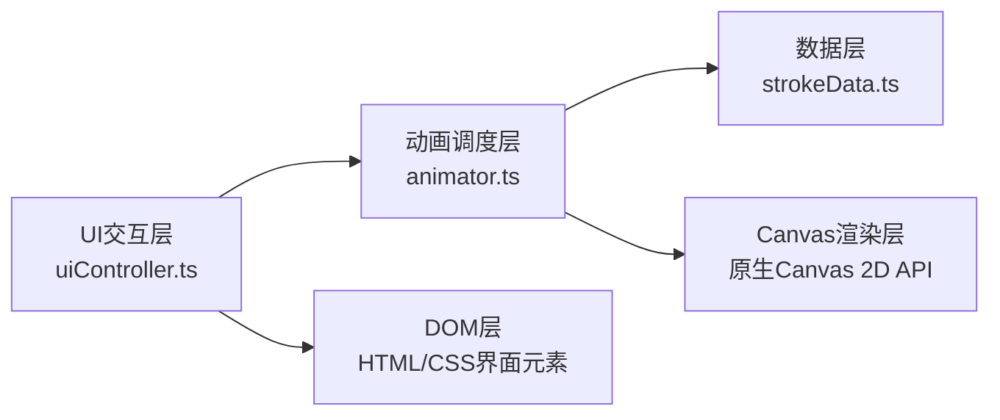

## 1. 架构设计



## 2. 技术选型说明
- **前端框架**：TypeScript + Vite，不依赖外部动画/图形库，仅使用原生Canvas API
- **构建工具**：Vite 5.x，端口5173，开启HMR热更新
- **语言标准**：TypeScript严格模式，target ES2020，module ESNext
- **渲染引擎**：HTML5 Canvas 2D Context，requestAnimationFrame驱动动画循环
- **性能优化**：所有笔画数据初始化时预计算，动画过程中只做绘制不做计算，目标60fps，单帧耗时≤6ms

## 3. 项目结构

```
auto255/
├── package.json
├── vite.config.js
├── tsconfig.json
├── index.html
└── src/
    ├── strokeData.ts       # 笔画数据存储与解析
    ├── animator.ts         # 动画调度与Canvas绘制
    └── uiController.ts     # DOM交互与状态管理
```

## 4. 模块详细设计

### 4.1 strokeData.ts - 笔画数据模块
**核心接口定义：**
```typescript
interface Point {
  x: number;
  y: number;
}

interface Stroke {
  startPoint: Point;
  endPoint: Point;
  controlPoints: Point[];  // 贝塞尔曲线控制点
  widthCurve: {
    start: number;    // 起笔宽度 4px
    middle: number;   // 行笔宽度 2.5px
    end: number;      // 收笔宽度 1px
  };
  direction: number;   // 方向角（弧度）
}

function getStrokes(character: string): Stroke[]
```

**职责：**
- 内置常用汉字（永、龙、梦等）的笔画路径数据
- 每个笔画包含：起点、终点、贝塞尔控制点、宽度渐变参数、方向角
- 提供 `getStrokes()` 函数查询指定汉字的笔画列表
- 对于未收录的汉字，提供基于笔画原理的降级数据

### 4.2 animator.ts - 动画调度与绘制模块
**核心接口定义：**
```typescript
type AnimatorState = 'idle' | 'writing' | 'floating';

class Animator {
  constructor(canvas: HTMLCanvasElement);
  setStrokes(strokes: Stroke[]): void;
  setInkColor(color: string): void;
  startWriting(): void;
  stop(): void;
  exportPNG(width: number, height: number, borderWidth?: number): string; // 返回dataURL
}
```

**内部状态：**
- 当前动画状态（idle / writing / floating）
- 当前笔画索引
- 当前笔画进度（0-1）
- 已完成的笔画列表
- 浮动动画相位

**动画循环：**
- 使用 `requestAnimationFrame` 驱动
- 书写阶段：逐笔绘制，每笔0.6-0.8秒，上一笔完成后开始下一笔
- 浮动阶段：正弦波上下浮动（幅度3px，周期4s）+ 笔画边缘0-2px随机微动
- 预计算：所有笔画的贝塞尔插值点和宽度值在 `startWriting()` 时一次性计算

**性能策略：**
- 预计算所有采样点存入缓存数组
- 动画帧内只做数组遍历和Canvas API调用
- 使用离屏Canvas缓存已完成笔画，避免每帧重绘

### 4.3 uiController.ts - UI交互模块
**核心职责：**
- 监听输入框事件，获取用户输入的汉字
- 绑定"开始书写"按钮点击事件，调用 Animator.startWriting()
- 管理调色板选中状态（5个色块，选中时2px深灰边框）
- 绑定导出按钮事件，调用 Animator.exportPNG(1920, 1080, 2) 并触发下载
- 管理整体界面状态

### 4.4 index.html - 页面结构
```
全屏Canvas (z-index: 0)
├── 左上角毛玻璃面板 (z-index: 10)
│   ├── 汉字输入框 (240x36px，底部浅灰分割线)
│   └── 开始书写按钮
├── 底部调色板 (z-index: 10)
│   └── 5个 48x48px 色块 (圆角8px，横向排列)
└── 右下角导出按钮 (z-index: 10)
```

## 5. 性能指标
- 帧率目标：60fps
- 单帧绘制耗时：≤6ms
- 笔画预计算：在动画开始前一次性完成，不阻塞渲染
- 内存占用：通过离屏Canvas缓存已绘制内容，避免重复计算

## 6. 色彩规范
| 名称 | 色值 | 用途 |
|------|------|------|
| 宣纸米黄 | #f5f0e8 | 画布背景 |
| 松烟黑 | #1a1a1a | 默认墨色 |
| 朱砂红 | #c0392b | 调色板选项 |
| 石青蓝 | #2980b9 | 调色板选项 |
| 藤黄 | #f1c40f | 调色板选项 |
| 赭石 | #8e44ad | 调色板选项 |
| 面板半透明 | rgba(245,240,232,0.7) | 控制面板背景 |
| 深棕边框 | #5c4033 | 导出图片边框 |
