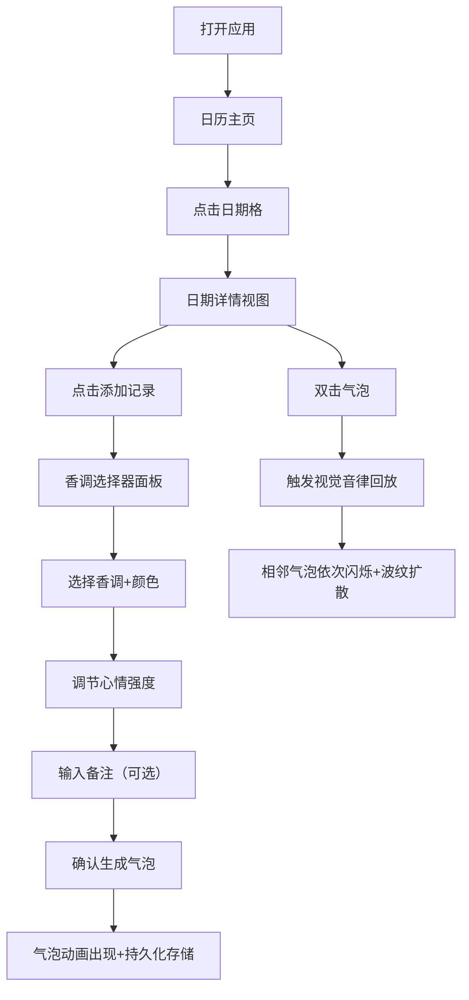

## 1. 产品概述

「气味日记」是一款视觉化的心情与嗅觉记忆记录应用，让用户通过香调和色彩气泡记录每日心情，并以动态视觉音律的方式回顾记忆。

- 主要用途：以独特的气泡可视化方式记录和回顾每日的心情与嗅觉记忆
- 目标用户：喜欢记录生活、追求独特视觉体验的用户
- 产品价值：将抽象的气味和情感转化为可触摸的视觉记忆，创造沉浸式的日记体验

## 2. 核心功能

### 2.1 功能模块
1. **日历时间线主页**：按月显示日历网格，每个日期格展示当天气泡缩略图
2. **日期详情视图**：展示当日所有气泡，支持气泡互动与视觉音律回放
3. **香调选择器**：12种香调选择、颜色映射、心情强度调节、备注输入
4. **气泡物理引擎**：气泡脉动、间距控制、波纹扩散动画、视觉音律效果
5. **本地数据持久化**：localStorage存储所有记录数据

### 2.2 页面详情
| 页面名称 | 模块名称 | 功能描述 |
|---------|---------|---------|
| 日历主页 | 月份切换导航 | 切换查看不同月份的记录 |
| 日历主页 | 日历网格 | 6x7日期格，显示气泡缩略图，点击进入详情 |
| 日期详情 | 气泡画布 | 随机散布气泡，支持双击触发视觉音律 |
| 日期详情 | 添加记录按钮 | 打开香调选择器面板 |
| 香调选择器 | 香调网格 | 3x4共12种香调图标与颜色选择 |
| 香调选择器 | 强度滑块 | 调节心情强度（影响气泡大小与脉动） |
| 香调选择器 | 备注输入 | 文本输入框记录当天备注 |

## 3. 核心流程

用户打开应用看到当月日历，点击某日期进入该日详情视图，在详情视图点击「添加记录」打开香调选择器，选择香调、调节强度、输入备注后确认生成气泡，气泡立即出现在画布上并保存到本地。双击任意气泡触发视觉音律回放，该气泡及其相邻气泡按创建顺序依次闪烁并释放波纹。

## 4. 用户界面设计

### 4.1 设计风格
- **主色调**：深色主题，背景径向渐变 #0f172a → #1e293b
- **辅助色**：日期格底色 #1e293b，选中态 #334155，气泡叠加层纯黑半透明
- **香调颜色映射**：柑橘(#fbbf24)、木质(#92400e)、花香(#ec4899)、草本(#22c55e)、辛香(#ef4444)、海洋(#0ea5e9)、奶香(#fef3c7)、焦糖(#d97706)、酒酿(#a855f7)、茶香(#14b8a6)、雨露(#7dd3fc)、雾霭(#94a3b8)
- **按钮样式**：圆角、毛玻璃效果、0.2-0.3s ease-out过渡
- **字体**：现代无衬线字体，简洁优雅
- **布局风格**：日历网格布局，气泡画布居中，毛玻璃浮层面板
- **图标**：Unicode符号表示各香调

### 4.2 页面设计概述
| 页面名称 | 模块名称 | UI元素 |
|---------|---------|--------|
| 日历主页 | 头部 | 月份显示、前后切换按钮、标题 |
| 日历主页 | 日历网格 | 日期格（含气泡缩略图）、选中态、0.3s过渡 |
| 日期详情 | 顶部栏 | 返回按钮、日期显示、添加记录按钮 |
| 日期详情 | 气泡画布 | 随机散布气泡、脉动动画、发光阴影 |
| 香调选择器 | 毛玻璃面板 | rgba(15,23,42,0.8)、backdrop-filter blur(16px)、圆角16px |
| 香调选择器 | 香调网格 | 3x4布局，图标+颜色块 |
| 香调选择器 | 底部操作 | 强度滑块、备注输入、确认/取消按钮 |

### 4.3 响应式设计
- **大屏幕（>1024px）**：日历网格每行7列，气泡视图居中900px宽度
- **中屏幕（768-1024px）**：日历切换为每行4列，自适应宽度
- **小屏幕（<768px）**：日历变为垂直列表，单列布局
- **触控优化**：按钮最小触控区域44x44px，双击手势适配
