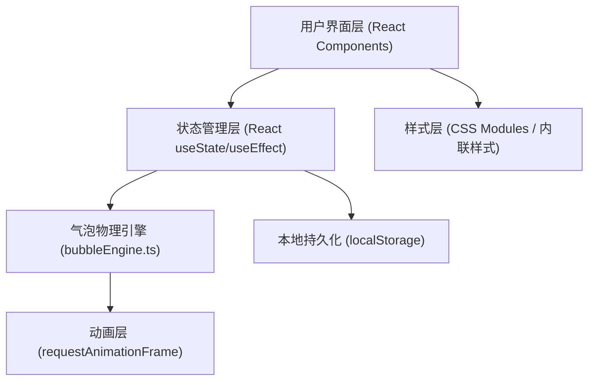

## 1. 架构设计



## 2. 技术描述

- **前端框架**：React 18 + TypeScript
- **构建工具**：Vite（端口5173，开启HMR）
- **语言版本**：TypeScript 严格模式，target ES2020，module ESNext
- **状态管理**：React Hooks（useState、useEffect、useRef、useCallback）
- **动画方案**：requestAnimationFrame驱动 + CSS过渡动画
- **数据存储**：localStorage（JSON序列化）
- **无后端服务**：纯前端应用，数据本地持久化

## 3. 项目文件结构

| 文件路径 | 用途 |
|---------|------|
| `package.json` | 项目依赖与脚本配置 |
| `vite.config.js` | Vite构建配置 |
| `tsconfig.json` | TypeScript编译配置 |
| `index.html` | 入口HTML页面 |
| `src/main.tsx` | React应用入口 |
| `src/App.tsx` | 顶层组件，路由与全局状态管理 |
| `src/components/BubbleTimeline.tsx` | 日历时间线组件 |
| `src/components/ScentSelector.tsx` | 香调选择器组件 |
| `src/utils/bubbleEngine.ts` | 气泡物理引擎工具 |
| `src/index.css` | 全局样式 |

## 4. 核心数据模型

### 4.1 类型定义

```typescript
// 香调类型
interface Scent {
  id: string;
  name: string;
  icon: string;
  color: string;
  gradient: [string, string];
}

// 气泡数据
interface Bubble {
  id: string;
  scentId: string;
  color: string;
  gradient: [string, string];
  intensity: number; // 0-1，心情强度
  note: string;
  createdAt: number;
  x: number;
  y: number;
  baseRadius: number; // 30-120px
}

// 日期记录
interface DayRecord {
  date: string; // YYYY-MM-DD
  bubbles: Bubble[];
}

// 波纹动画
interface Ripple {
  id: string;
  bubbleId: string;
  x: number;
  y: number;
  color: string;
  startTime: number;
  duration: number;
}
```

### 4.2 数据存储格式

localStorage键值结构：
- 键：日期字符串 `YYYY-MM-DD`
- 值：该日气泡数组的JSON序列化字符串

## 5. 组件职责

### 5.1 App.tsx
- 管理当前视图状态（日历视图/日期详情视图）
- 管理当前选中日期
- 管理全局气泡数据
- 处理数据持久化读写
- 渲染BubbleTimeline或日期详情视图

### 5.2 BubbleTimeline.tsx
- 渲染月份日历网格
- 日期格显示气泡缩略图
- 处理日期点击切换到详情
- 月份切换导航
- 详情视图下渲染气泡画布
- 处理气泡双击触发视觉音律

### 5.3 ScentSelector.tsx
- 渲染12种香调的3x4网格
- 处理香调选择
- 强度滑块控制
- 备注输入
- 确认/取消操作回调

### 5.4 bubbleEngine.ts
- `createBubble()`: 创建气泡数据，计算位置避免重叠
- `getPulsingRadius()`: 根据时间和强度计算脉动半径
- `findNeighborBubbles()`: 查找距离小于150px的相邻气泡
- `updateBubblePositions()`: 确保气泡间至少10px间距
- `animateRipple()`: 波纹扩散动画参数计算
- 所有动画使用requestAnimationFrame驱动

## 6. 性能优化策略

- 使用requestAnimationFrame统一驱动所有持续动画
- 避免使用setInterval/setTimeout做持续动画
- 气泡数量上限：每日期50个
- DOM操作批量执行以减少重排
- 目标重绘帧率：≥40fps
- 使用React.memo优化不必要的组件重渲染
- 使用useRef保存动画帧ID和可变数据
