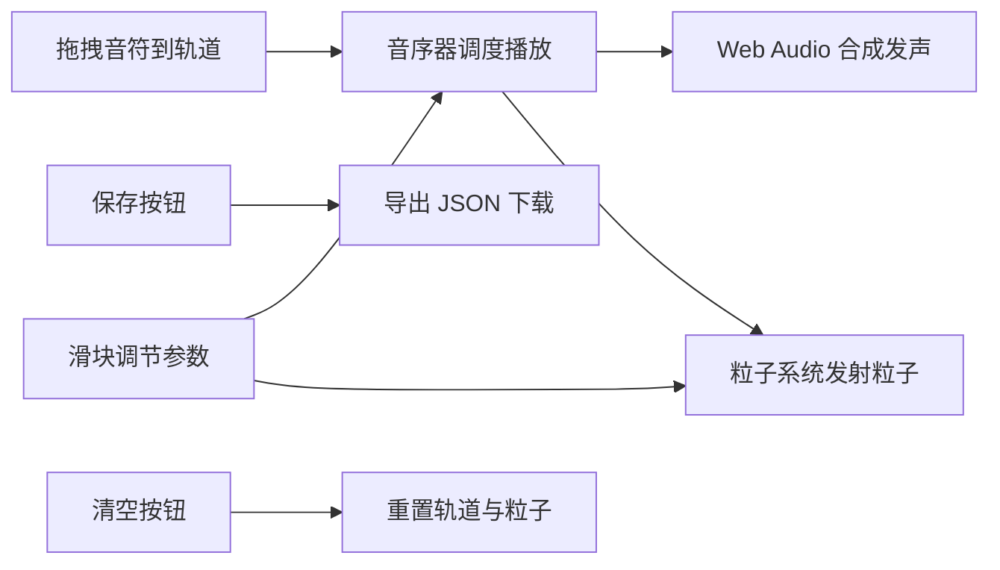

## 1. 产品概述
「声粒回廊」是一款在浏览器中运行的交互式音乐可视化编辑器，面向音乐爱好者和创意工作者，用户通过拖拽音乐元素到时间轨道上组合旋律，并以粒子动画形式实时呈现声音波形与节奏。
- 核心价值：低门槛音乐创作体验 + 沉浸式视觉反馈
- 差异化：无需外部音频/动画库，纯原生 Web Audio API + Canvas 实现

## 2. 核心功能

### 2.1 用户角色
| 角色 | 注册方式 | 核心权限 |
|------|----------|----------|
| 普通用户 | 无需注册，直接使用 | 拖拽音符、调节参数、保存/清空配置 |

### 2.2 功能模块
1. **主编辑区**：全屏 Canvas 粒子可视化区域，中央显示时间轨道
2. **左侧素材面板**：7 种音符块（C4-B4）+ 3 种节奏块，支持拖拽
3. **底部控制面板**：BPM 滑块、音量滑块、粒子密度滑块、音色下拉菜单
4. **操作按钮区**：保存（导出 JSON）、清空（重置轨道）

### 2.3 页面详情
| 页面名称 | 模块名称 | 功能描述 |
|----------|----------|----------|
| 主编辑页 | 粒子可视化区 | 全屏 Canvas，实时渲染音符触发的粒子动画 |
| 主编辑页 | 时间轨道 | 16 拍水平轨道，当前播放位金色高亮，自动滚动 |
| 主编辑页 | 素材面板 | 音符/节奏块展示，支持 HTML5 Drag and Drop |
| 主编辑页 | 控制面板 | 三个滑块实时调节 BPM/音量/粒子密度，音色切换即时生效 |
| 主编辑页 | 操作按钮 | 保存 JSON 下载、一键清空轨道与粒子 |

## 3. 核心流程
用户从左侧面板拖拽音符块到时间轨道的拍位上 → 点击或自动播放 → 音序器按时间调度 Web Audio 合成 → 同时触发粒子系统从对应拍位发射粒子 → 用户通过滑块实时调节参数 → 可保存配置为 JSON 或清空重来。

## 4. 用户界面设计

### 4.1 设计风格
- **主色调**：深色主题，背景 `#0f111a`，面板 `#1a1d2e`，高亮金 `#fbbf24`
- **音符配色**：7 个音阶对应 7 种 HSL 色相循环
- **字体**：现代无衬线字体（system-ui）
- **布局**：三栏式布局（左素材面板 + 中央轨道区 + 底部控制栏）
- **粒子效果**：小球 + 柔光边缘，环形/螺旋扩散，音高关联大小速度

### 4.2 页面设计概览
| 页面名称 | 模块名称 | UI 元素 |
|----------|----------|----------|
| 主编辑页 | 粒子可视化区 | 全屏 Canvas，深色背景，柔光粒子 |
| 主编辑页 | 时间轨道 | 半透明条带 `rgba(255,255,255,0.05)`，16 根拍位分隔线，金色发光播放头 |
| 主编辑页 | 素材面板 | 40×40px 彩色圆角方块音符，拖拽半透明影子 |
| 主编辑页 | 控制面板 | 自定义滑块、下拉菜单、圆角按钮 |

### 4.3 响应式
- 桌面端优先，最小宽度 800px
- 时间轨道自动撑满剩余宽度
- 控制面板固定底部，高度自适应
