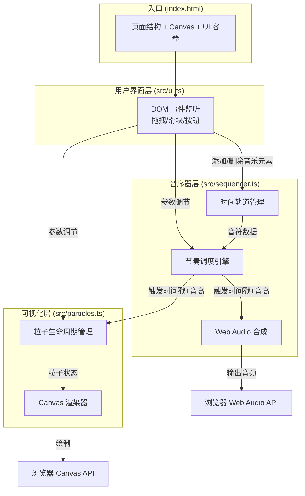

## 1. 架构设计



## 2. 技术描述
- **前端框架**：原生 TypeScript（无框架），通过 ESModule 组织
- **构建工具**：Vite 5.x（dev server + HMR，端口 5173）
- **音频引擎**：浏览器原生 Web Audio API（AudioContext、OscillatorNode、GainNode）
- **图形渲染**：浏览器原生 Canvas 2D API
- **交互方式**：HTML5 Drag and Drop API、原生 DOM 事件
- **类型系统**：TypeScript 严格模式，target ES2020，module ESNext

## 3. 模块划分与数据流向

### 3.1 src/sequencer.ts — 音序器核心
- **职责**：管理 16 拍轨道上的音乐元素、调度播放时序、合成音频
- **数据结构**：
  - `TrackElement`：{ beat: number, note: Note, duration: Duration, color: string }
  - `SequencerState`：{ elements: TrackElement[], bpm: number, volume: number, waveform: OscillatorType, isPlaying: boolean, currentBeat: number }
- **对外 API**：
  - `addElement(element)`：在指定拍位添加音乐元素
  - `removeElement(beat, index)`：移除拍位上的指定元素
  - `setBPM(bpm)`：实时设置 BPM（60-180）
  - `setVolume(vol)`：实时设置音量（0-1）
  - `setWaveform(type)`：设置音色（正弦/方波/锯齿/三角）
  - `play()` / `stop()` / `togglePlay()`：播放控制
  - `clear()`：清空所有元素
  - `on(event, callback)`：事件回调（'beat' 触发时回调 note 信息）
  - `serialize()` / `deserialize(json)`：序列化/反序列化配置
- **数据流向**：接收 ui.ts 的元素增删与参数调节 → 内部调度 → 触发音频合成 + 派发 beat 事件给 particles.ts

### 3.2 src/particles.ts — 粒子系统
- **职责**：接收音序器触发事件、管理粒子生命周期、Canvas 渲染
- **数据结构**：
  - `Particle`：{ x, y, vx, vy, size, color, alpha, life, maxLife }
  - `ParticleSystem`：{ particles: Particle[], density: number, ctx: CanvasRenderingContext2D }
- **对外 API**：
  - `emit(noteInfo)`：从指定拍位垂直位置发射粒子
  - `setDensity(n)`：设置粒子密度（10-100，影响每次发射数量）
  - `update()`：每帧更新粒子位置与透明度
  - `render()`：渲染当前所有粒子到 Canvas
  - `clear()`：清空所有粒子
- **数据流向**：从 sequencer.ts 接收 beat 事件（时间戳、音高、拍位索引）→ 计算粒子发射参数 → 更新粒子池 → Canvas 渲染

### 3.3 src/ui.ts — 交互界面
- **职责**：DOM 操作、拖拽事件、滑块/按钮事件、UI 状态同步
- **对外 API**：
  - `init(sequencer, particleSystem)`：初始化 UI，绑定 sequencer 和粒子系统
  - `renderTrack()`：重绘轨道上的音符块 DOM
- **数据流向**：监听 DOM 拖拽 → 计算吸附拍位 → 调用 sequencer.addElement() → 重绘轨道；监听滑块 input → 调用 sequencer.setBPM/setVolume 与 particleSystem.setDensity；监听保存按钮 → sequencer.serialize() → 触发 JSON 下载；监听清空按钮 → sequencer.clear() + particleSystem.clear()

## 4. 核心类型定义

```typescript
// 音符定义
type NoteName = 'C4' | 'D4' | 'E4' | 'F4' | 'G4' | 'A4' | 'B4';
type Duration = 'quarter' | 'eighth' | 'dotted';

interface Note {
  name: NoteName;
  frequency: number;  // Hz
  colorHue: number;    // 0-360
}

interface TrackElement {
  id: string;
  beat: number;        // 0-15
  note: Note;
  duration: Duration;
}

interface SequencerConfig {
  bpm: number;
  volume: number;
  waveform: OscillatorType;
  elements: TrackElement[];
}
```

## 5. 性能优化策略
- **粒子池复用**：粒子对象池化，避免频繁 GC
- **Canvas 批处理**：同色粒子合并路径绘制，减少 state 切换
- **requestAnimationFrame**：统一帧循环，粒子更新与渲染分离
- **事件节流**：滑块 input 事件高频触发直接同步（用户要求 <50ms 延迟）
- **最大粒子数上限**：粒子总数超过 500 时淘汰最旧粒子，保证 60fps

## 6. 性能指标
- 粒子数 ≤ 500 时 FPS ≥ 60
- 滑块交互响应延迟 < 50ms
- 启动加载 < 2s
