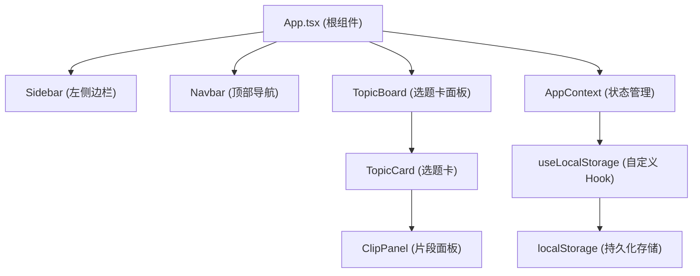
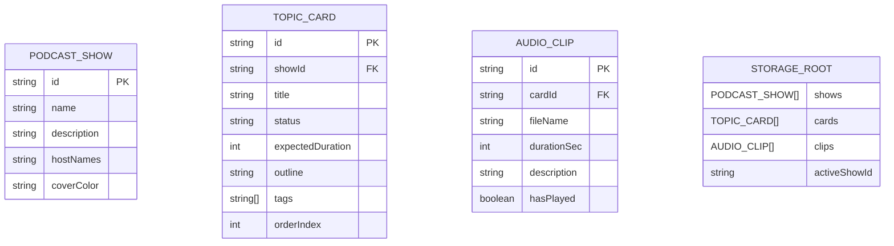

## 1. 架构设计



## 2. 技术说明

- **前端框架**：React 18 + TypeScript 5
- **构建工具**：Vite 5（端口 5173，HMR）
- **样式方案**：CSS Modules（不依赖外部 UI 组件库）
- **状态管理**：React Context + useReducer
- **持久化**：localStorage（自定义 useLocalStorage Hook 封装）
- **拖拽实现**：原生 HTML5 Drag and Drop API
- **数据格式**：JSON 导入/导出（Blob + URL.createObjectURL 下载）

## 3. 文件结构

```
src/
├── types.ts              # 类型定义
├── App.tsx               # 根组件 + Context + 布局
├── hooks/
│   └── useLocalStorage.ts # localStorage 读写 Hook
├── components/
│   ├── Sidebar.tsx       # 左侧节目列表 + 状态过滤
│   ├── Sidebar.module.css
│   ├── Navbar.tsx        # 顶部导航栏
│   ├── Navbar.module.css
│   ├── TopicBoard.tsx    # 卡片容器 + 拖拽排序
│   ├── TopicBoard.module.css
│   ├── TopicCard.tsx     # 单张选题卡 + 展开动画
│   ├── TopicCard.module.css
│   ├── ClipPanel.tsx     # 右侧滑出片段面板
│   ├── ClipPanel.module.css
│   ├── Modal.tsx         # 通用弹窗组件
│   ├── Modal.module.css
│   ├── Toast.tsx         # 轻量提示组件
│   └── Toast.module.css
└── styles/
    └── global.css        # 全局样式重置 + CSS 变量
```

## 4. 数据模型

### 4.1 数据模型定义



### 4.2 类型定义

```typescript
export enum Status {
  PENDING = '待讨论',
  PREPARING = '准备中',
  RECORDED = '已录制',
  PUBLISHED = '已发布',
}

export interface PodcastShow {
  id: string;
  name: string;
  description: string;
  hostNames: string[];
  coverColor: string;
}

export interface TopicCard {
  id: string;
  showId: string;
  title: string;
  status: Status;
  expectedDuration: number;
  outline: string;
  tags: string[];
  orderIndex: number;
}

export interface AudioClip {
  id: string;
  cardId: string;
  fileName: string;
  durationSec: number;
  description: string;
  hasPlayed: boolean;
}

export interface AppData {
  shows: PodcastShow[];
  cards: TopicCard[];
  clips: AudioClip[];
  activeShowId: string | null;
}
```

## 5. 核心 API（Context Actions）

| Action | 说明 |
|--------|------|
| ADD_SHOW | 新建节目 |
| UPDATE_SHOW | 更新节目名称/信息 |
| DELETE_SHOW | 删除节目及关联卡片/片段 |
| SET_ACTIVE_SHOW | 设置当前选中节目 |
| ADD_CARD | 添加选题卡 |
| UPDATE_CARD | 更新选题卡内容 |
| REORDER_CARDS | 拖拽后更新排序 |
| DELETE_CARD | 删除选题卡 |
| ADD_CLIP | 添加音频片段 |
| TOGGLE_CLIP_PLAYED | 切换片段播放状态 |
| IMPORT_DATA | 导入覆盖全部数据 |
