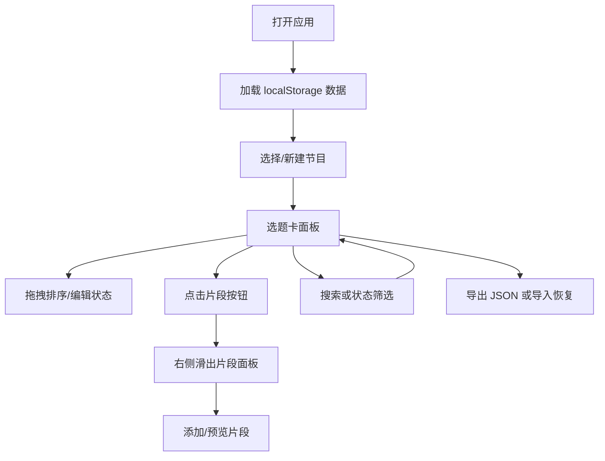

## 1. 产品概述

播客选题管理系统，帮助独立播客创作者管理节目选题、音频片段和发布排期，解决播客制作过程中内容碎片化、协作记录零散的问题。

- 目标用户：独立播客创作者、小型播客团队
- 核心价值：集中管理多档播客节目的选题全生命周期，从灵感到发布的一站式追踪

## 2. 核心功能

### 2.1 功能模块

1. **节目管理**：多节目创建/编辑/删除、封面色块生成、右键菜单
2. **选题卡面板**：无限网格背景、毛玻璃卡片、拖拽排序、展开/收起动画
3. **音频片段管理**：右侧滑出面板、片段列表、添加表单、点击高亮预览
4. **全局搜索与筛选**：实时搜索过滤、关键词高亮、状态筛选器
5. **数据导入导出**：JSON 文件导出/导入、导入成功提示

### 2.2 页面详情

| 页面名称 | 模块名称 | 功能描述 |
|---------|---------|---------|
| 主应用 | 顶部导航栏 | 导入/导出按钮、实时搜索框（200px 宽） |
| 主应用 | 左侧边栏（260px） | 节目列表（带封面色块）、右键菜单、状态过滤器 |
| 主应用 | 主内容区 | 节目信息展示、无限网格背景卡片容器 |
| 主应用 | 右侧滑出面板（420px） | 片段列表（两列布局）、添加片段表单、高亮预览 |
| 弹窗 | 节目删除确认 | 背景模糊遮罩、居中弹窗、取消/确认删除按钮 |
| 弹窗 | 导入成功提示 | 2.5 秒自动消失的 Toast |

## 3. 核心流程

用户打开应用 → 浏览/选择节目 → 管理选题卡（新增/拖拽排序/编辑状态）→ 为选题卡关联音频片段 → 通过搜索或筛选快速定位 → 导出数据备份或导入恢复

## 4. 用户界面设计

### 4.1 设计风格

- **主色调**：深色主题 `#1a1a2e` 背景，卡片区域 `#16213e`，按钮 `#0f3460`
- **辅助色**：文字主色 `#e0e0e0`，辅助文字 `#a0a0a0`，标签色（待讨论/准备中/已录制/已发布）
- **按钮样式**：圆角 8px，`#0f3460` 底色，hover 变亮 25%，0.2s 过渡，按下缩放 0.98
- **字体**：系统现代字体，标题 24px，卡片标题 18px，正文 14px
- **布局风格**：三栏式布局（左导航栏 260px + 主内容区 + 右滑面板 420px）
- **特效**：毛玻璃卡片（rgba(255,255,255,0.6)，blur 8px）、无限网格背景、平滑动画

### 4.2 页面设计概览

| 页面 | 模块 | UI 元素 |
|-----|-----|---------|
| 主应用 | 导航栏 | 56px 高，底部阴影 0 2px 8px rgba(0,0,0,0.3)，导入/导出按钮、搜索框 |
| 主应用 | 侧边栏 | 固定 260px 宽，节目列表条目（节目名 + 封面色块），底部状态过滤器，右部分割线 |
| 主应用 | 卡片容器 | 浅灰网格间隔 20px，淡出效果，毛玻璃卡片，圆角 16px |
| 主应用 | 选题卡 | 标题/标签/期望时长/提纲预览（最多3行截断），展开/收起按钮（0.3s ease），拖拽放大 1.05 |
| 右滑面板 | 片段面板 | 深色半透明 rgba(30,25,35,0.95)，从右滑入 0.4s ease-out，橙色/绿色圆点状态 |
| 交互反馈 | hover | list item 缩放 1.01 + 阴影，按钮变亮 25% |
| 交互反馈 | 点击 | 按下缩放 0.98 |

### 4.3 响应式设计

- 桌面端优先（≥768px）：三栏布局完整展示
- 移动端（<768px）：侧边栏折叠为汉堡菜单，从左侧滑出覆盖内容区，半透明遮罩 `#00000080`

### 4.4 动画与微交互

- 卡片展开/收起：0.3s ease 过渡
- 右滑面板：0.4s ease-out 滑入/滑出
- 拖拽卡片：scale 1.05，其他卡片自动让位动画
- 筛选结果：opacity 0→1，0.2s 淡入
- 状态过滤匹配：关键词黄色背景高亮，圆角 2px
