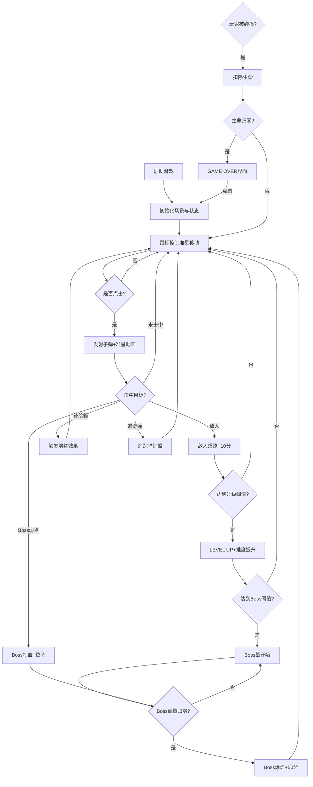

## 1. 产品概述

「霓虹射手」是一款复古街机风格的浏览器光枪射击游戏。玩家通过鼠标控制十字准星，射击屏幕上不断出现的霓虹色飞行敌人，收集随机掉落的补给箱以获得增益效果，每关挑战强大的Boss战。目标用户为复古游戏爱好者和休闲玩家，产品价值在于提供纯粹、紧张刺激的街机射击体验。

## 2. 核心功能

### 2.1 功能模块

1. **主游戏场景**：全屏Canvas渲染、深空背景渐变、静态星星分布
2. **玩家控制系统**：十字准星跟随鼠标、阻尼平滑、点击开火动画与光线效果
3. **敌人生成系统**：四边缘随机生成菱形敌人、霓虹色、匀速飞行+旋转
4. **补给箱系统**：定时掉落金色六边形补给箱、三选一增益效果（加速射击/护盾/分数翻倍）
5. **关卡升级系统**：积分阈值触发升级、难度递增、升级提示动画
6. **Boss战系统**：八角星Boss、弱点机制、追踪弹攻击、击败爆炸粒子
7. **HUD界面**：分数显示、关卡显示、生命值条、游戏结束界面

### 2.2 功能详情

| 模块名称 | 子模块 | 功能描述 |
|-----------|-------------|---------------------|
| 玩家控制 | 准星系统 | 24px白色空心十字准星，跟随鼠标平滑移动（Damping=0.85） |
| 玩家控制 | 开火反馈 | 点击时准星缩放动画（0.15s收缩弹开），发射10px白色光线（透明度0.7） |
| 敌人系统 | 生成规则 | 每400-800ms从屏幕四边缘随机生成一个 |
| 敌人系统 | 外观与运动 | 菱形（对角线20px），随机霓虹色，80-150px/s匀速飞行，每秒旋转30度 |
| 敌人系统 | 爆炸特效 | 被击中时产生6个三角形碎片，0.5秒渐隐扩散 |
| 补给箱系统 | 生成规则 | 每30秒从顶部掉落，60px/s下落，左右小幅摆动 |
| 补给箱系统 | 外观 | 金色六边形（边长12px），填充#ffd700，边框#ff8c00 |
| 补给箱系统 | 增益效果 | 加速射击（3秒射速翻倍）、护盾（5秒无敌+护盾环）、分数翻倍 |
| 补给箱系统 | 触发反馈 | 效果触发时屏幕边缘闪烁对应颜色边框0.3秒 |
| 关卡系统 | 升级触发 | 每积累100分触发升级，敌人10分，Boss50分 |
| 关卡系统 | 升级提示 | 屏幕中央显示"LEVEL UP"（48px monospace），1.2秒透明动画 |
| 关卡系统 | 难度递增 | 敌人生成间隔缩短50ms，移动速度增加15% |
| Boss系统 | 生成规则 | 每300分出现Boss关，从屏幕外飞入并减速至中央 |
| Boss系统 | Boss外观 | 八角星（外接圆60px），填充#ff0000，边框#800000，血量10点 |
| Boss系统 | 弱点机制 | 中心小圆弱点（半径12px），白色高亮闪烁（0.5秒频率），仅击中弱点扣血 |
| Boss系统 | 攻击模式 | 发射追踪弹（圆形半径5px，速度120px/s，颜色#ff4500），可射击摧毁 |
| Boss系统 | 击败特效 | 30个星形粒子旋转飞散，1.5秒渐隐 |
| HUD界面 | 背景 | 从#0a0a2e到#1a0a3e的深空蓝紫径向渐变，中心随鼠标偏移 |
| HUD界面 | 星星装饰 | 约120颗静态星星，大小1-3px，颜色#ffffff-#aaaacc，透明度0.3-0.8 |
| HUD界面 | 分数显示 | 左上角20px monospace白色字体，发光效果text-shadow: 0 0 6px #ffffff |
| HUD界面 | 关卡显示 | 右上角LV.N格式，20px monospace金色字体 |
| HUD界面 | 生命值条 | 底部中央300x12px半透明暗色背景圆角条，红色渐变填充，损失时闪烁0.2秒 |
| HUD界面 | 游戏结束 | 中央显示"GAME OVER"（64px红色发光），最终得分，点击重新开始提示 |

## 3. 核心流程

玩家启动游戏后，鼠标控制十字准星在游戏画面中移动。点击鼠标发射子弹，击中敌人获得积分。每30秒有补给箱从顶部掉落，点击获得增益效果。累计100分触发关卡升级，难度提升。累计300分触发Boss战，需击中Boss弱点10次方能击败。玩家有3条生命，被敌人或追踪弹触碰扣除生命，生命归零则游戏结束，点击可重新开始。

## 4. 用户界面设计

### 4.1 设计风格

- **主色调**：深空蓝紫渐变背景（#0a0a2e → #1a0a3e），霓虹色敌人（#ff007f、#00ff7f、#7f00ff、#ff7f00），金色补给箱（#ffd700），红色Boss（#ff0000）
- **字体**：全部使用 monospace 等宽字体，营造复古街机氛围
- **视觉效果**：发光（text-shadow/glow）、粒子爆炸、边框闪烁、透明度渐变动画
- **布局**：全屏Canvas沉浸体验，HUD元素分布四角和底部，不遮挡核心游戏区域

### 4.2 界面元素

| 元素名称 | 位置 | 规格与样式 |
|-----------|-------------|-------------|
| 分数显示 | 左上角 | 20px monospace，#ffffff，text-shadow: 0 0 6px #ffffff |
| 关卡显示 | 右上角 | 20px monospace，#ffd700，格式"LV.N" |
| 生命值条 | 底部中央 | 300x12px，背景rgba(0,0,0,0.5)，圆角6px，红色渐变填充 |
| LEVEL UP | 屏幕中央 | 48px monospace，透明度动画1.2秒 |
| GAME OVER | 屏幕中央 | 64px #ff0000，红色发光效果 |
| 十字准星 | 跟随鼠标 | 24px白色细线，中心空心，点击缩放动画 |
| 屏幕边框闪烁 | 全屏边缘 | 0.3秒对应颜色闪烁（补给效果触发时） |

### 4.3 响应性

桌面端全屏体验优先，Canvas随窗口大小自动调整（resize事件监听），所有游戏元素坐标基于Canvas尺寸动态计算。

## 5. 性能约束

- 帧率目标：≥50 FPS
- 粒子上限：150个，超出时优先移除最早粒子
- 动画驱动：全部使用 requestAnimationFrame，禁止使用 setInterval
- 渲染优化：按z序分层绘制，避免不必要的重绘
