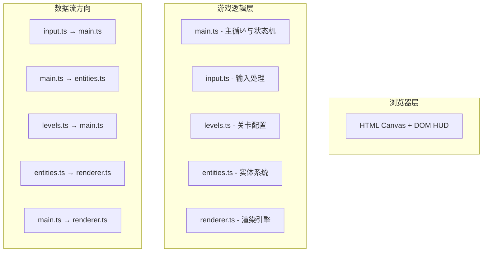

## 1. 架构设计



## 2. 技术描述

- **前端框架**：纯 TypeScript，无框架，使用原生 Canvas API
- **构建工具**：Vite 5.x（ES2020 target，ESNext module）
- **无外部游戏引擎依赖**：全部手写实现

## 3. 文件结构与调用关系

```
项目根目录/
├── package.json
├── vite.config.js
├── tsconfig.json
├── index.html
└── src/
    ├── main.ts        ← 游戏入口，主循环
    ├── entities.ts    ← 实体类定义
    ├── renderer.ts    ← Canvas渲染
    ├── input.ts       ← 鼠标输入
    └── levels.ts      ← 关卡数据
```

### 调用关系说明

| 模块 | 依赖/被调用 | 职责 | 数据流向 |
|------|------------|------|---------|
| `main.ts` | 调用 input / levels / entities / renderer | 游戏主循环、状态管理、碰撞检测、帧率控制 | 收集 input → 更新 entities → 调用 renderer |
| `entities.ts` | 被 main 调用 | 定义 Enemy/Player/Boss/SupplyBox 类及各自的运动、碰撞逻辑 | 接收 deltaTime 和输入 → 更新内部状态 → 暴露位置/碰撞框 |
| `renderer.ts` | 被 main 调用 | 所有 Canvas 绘制（背景、实体、粒子、HUD） | 接收 entities 状态数组 → 按 z 序绘制到 Canvas |
| `input.ts` | 被 main 调用 | 监听鼠标事件，转换游戏坐标 | 捕捉 DOM 事件 → 输出标准化坐标和点击状态 |
| `levels.ts` | 被 main 调用 | 关卡配置数据 | 被 main 按关卡调用 → 返回当前关卡配置 |

## 4. 核心数据结构

### 4.1 游戏状态 (GameState)

```typescript
type GameStatus = 'playing' | 'gameover';

interface GameState {
  status: GameStatus;
  score: number;
  level: number;
  hp: number;
  maxHp: number;
  nextLevelScore: number;
  nextBossScore: number;
  scoreMultiplier: number;
  rapidFireTimer: number;
  shieldTimer: number;
  borderFlashTimer: number;
  borderFlashColor: string;
  hpFlashTimer: number;
  levelUpTimer: number;
}
```

### 4.2 实体基类与子类

```typescript
interface Entity {
  x: number;
  y: number;
  active: boolean;
  update(dt: number): void;
  getBounds(): { x: number; y: number; r: number };
}

class Player implements Entity {
  x: number; y: number;           // 准星当前位置
  targetX: number; targetY: number; // 鼠标目标位置
  scale: number;                   // 准星缩放（点击动画）
  scaleTimer: number;
  firing: boolean;                 // 开火射线显示
  fireTimer: number;
}

class Enemy implements Entity {
  x: number; y: number;
  vx: number; vy: number;
  color: string;
  rotation: number;
  active: boolean;
}

class SupplyBox implements Entity {
  x: number; y: number;
  swayPhase: number;
  active: boolean;
}

class Boss implements Entity {
  x: number; y: number;
  targetX: number; targetY: number;
  entering: boolean;
  hp: number;
  maxHp: number;
  weakpointFlashTimer: number;
  fireTimer: number;
  active: boolean;
}

class HomingBullet implements Entity {
  x: number; y: number;
  vx: number; vy: number;
  active: boolean;
}

class Particle {
  x: number; y: number;
  vx: number; vy: number;
  life: number;
  maxLife: number;
  color: string;
  size: number;
  rotation: number;
  rotationSpeed: number;
  shape: 'triangle' | 'star' | 'spark';
}
```

## 5. 核心算法与常量

### 5.1 主要常量

```typescript
// 玩家
const CROSSHAIR_SIZE = 24;
const CROSSHAIR_DAMPING = 0.85;
const CROSSHAIR_ANIM_DURATION = 0.15;
const FIRE_RAY_DURATION = 0.08;
const FIRE_RAY_LENGTH = 10;

// 敌人
const ENEMY_SPAWN_MIN = 400;
const ENEMY_SPAWN_MAX = 800;
const ENEMY_SPEED_MIN = 80;
const ENEMY_SPEED_MAX = 150;
const ENEMY_ROTATION_SPEED = 30;  // deg/s
const ENEMY_NEON_COLORS = ['#ff007f', '#00ff7f', '#7f00ff', '#ff7f00'];

// 补给箱
const SUPPLY_SPAWN_INTERVAL = 30000;  // ms
const SUPPLY_FALL_SPEED = 60;

// Boss
const BOSS_TRIGGER_SCORE = 300;
const BOSS_HP = 10;
const BOSS_WEAKPOINT_RADIUS = 12;
const HOMING_BULLET_SPEED = 120;

// 关卡
const LEVEL_UP_SCORE = 100;
const SCORE_PER_ENEMY = 10;
const SCORE_PER_BOSS = 50;

// 性能
const MAX_PARTICLES = 150;
const STAR_COUNT = 120;
```

### 5.2 关键算法

1. **准星阻尼平滑**：`x = x + (targetX - x) * (1 - DAMPING)` 每帧应用
2. **碰撞检测**：圆形-圆形碰撞检测，`distance^2 < (r1 + r2)^2`
3. **粒子上限管理**：数组FIFO策略，超出时 splice(0, count) 移除最早粒子
4. **追踪弹引导**：每帧计算朝向玩家位置的方向向量并归一化
5. **径向渐变偏移**：`centerX = width/2 + (mouseX - width/2) * 0.1`

## 6. 性能优化策略

- 对象池模式复用粒子和敌人对象（可选，数组FIFO已足够）
- 所有绘制使用 Canvas 2D API，避免 DOM 操作
- 每帧仅清除并重绘必要区域（全屏重绘但使用单次 clearRect）
- 静态星星预计算位置，仅初始化时生成一次
- 使用 requestAnimationFrame + deltaTime 实现帧率无关的运动更新
