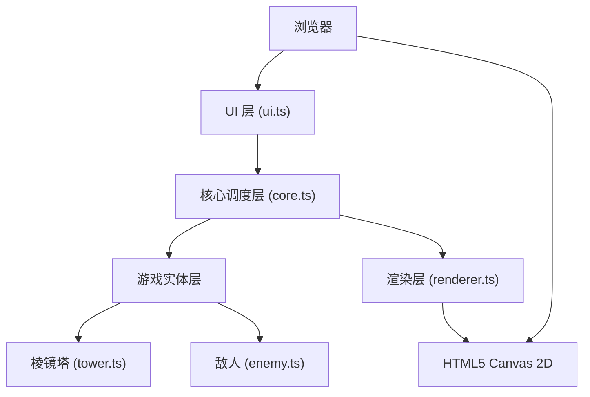

## 1. 架构设计

本项目为纯前端 Canvas 游戏，采用分层架构设计：



## 2. 技术描述

- **前端框架**：原生 TypeScript + Vite（无外部游戏引擎/UI框架）
- **渲染技术**：HTML5 Canvas 2D API
- **构建工具**：Vite 5.x
- **语言标准**：TypeScript 严格模式，target ES2020，module ESNext
- **包管理器**：npm

## 3. 项目文件结构

| 文件路径 | 用途 |
|---------|------|
| `package.json` | 依赖声明：typescript、vite；启动脚本：npm run dev |
| `index.html` | 入口文件，全屏 Canvas 和 Overlay 面板容器 |
| `vite.config.js` | Vite 基础配置，端口 5173，开启 HMR |
| `tsconfig.json` | TypeScript 严格模式配置 |
| `src/core.ts` | 游戏循环、时间步进、全局状态管理，每帧调度更新与渲染 |
| `src/tower.ts` | 棱镜塔类，管理位置、类型、等级、升级逻辑、激光发射、目标选择 |
| `src/enemy.ts` | 敌人基类及三个子类，管理路径、血量、移动、击中反馈、粒子爆炸生成 |
| `src/renderer.ts` | 所有图形绘制：网格、塔、激光、敌人、血条、粒子、浮窗 |
| `src/ui.ts` | 状态面板和塔信息浮窗，鼠标交互事件监听与处理 |

## 4. 核心数据模型

### 4.1 塔数据结构

```typescript
type TowerType = 'refract' | 'focus' | 'split';

interface Tower {
  id: number;
  type: TowerType;
  level: 1 | 2 | 3;
  hexQ: number;        // 六边形坐标 Q
  hexR: number;        // 六边形坐标 R
  pixelX: number;      // 像素坐标 X
  pixelY: number;      // 像素坐标 Y
  range: number;       // 射程（六边形单位）
  damage: number;      // 基础伤害
  fireRate: number;    // 每秒发射次数
  lastFireTime: number;
  deployProgress: number; // 部署动画进度 0-1
}
```

### 4.2 敌人数据结构

```typescript
type EnemyType = 'triangle' | 'diamond' | 'circle';

interface Enemy {
  id: number;
  type: EnemyType;
  x: number;
  y: number;
  hp: number;
  maxHp: number;
  speed: number;       // 像素/秒
  pathIndex: number;   // 当前路径点索引
  pathProgress: number; // 当前路径段进度 0-1
  damageFlash: number; // 受伤闪烁效果 0-1
  size: number;
}
```

### 4.3 激光与粒子

```typescript
interface LaserBeam {
  id: number;
  startX: number;
  startY: number;
  endX: number;
  endY: number;
  color: string;
  width: number;
  life: number;        // 剩余生命时间（秒）
  hasTrail: boolean;   // 是否有粒子尾迹
}

interface Particle {
  id: number;
  x: number;
  y: number;
  vx: number;
  vy: number;
  color: string;
  size: number;
  life: number;        // 剩余生命 0-1
  decay: number;       // 每秒衰减速率
}
```

### 4.4 全局状态

```typescript
interface GameState {
  wave: number;
  energy: number;
  kills: number;
  towers: Tower[];
  enemies: Enemy[];
  lasers: LaserBeam[];
  particles: Particle[];
  selectedHex: { q: number; r: number } | null;
  hoveredTower: Tower | null;
  time: number;        // 游戏时间（秒）
}
```

## 5. 六边形坐标系统

采用 axial 坐标系（q, r），pointy-top 六边形布局：
- 六边形大小：32px（中心到顶点距离）
- 像素坐标转换：`x = size * sqrt(3) * (q + r/2)`, `y = size * 3/2 * r`
- 网格范围：约 15×11 个六边形铺满屏幕

## 6. 性能优化策略

| 策略 | 说明 |
|-----|------|
| 激光束上限 | 同时活跃激光不超过 20 条，超出时回收最早的 |
| 粒子池 | 同时活跃粒子不超过 200 个，FIFO 回收机制 |
| 离屏渲染 | 静态六边形网格预渲染到离屏 Canvas |
| 时间步进 | 固定时间步长更新，插值渲染 |
| FPS 监控 | 维持 55-60 FPS，超时时跳过非关键渲染 |
