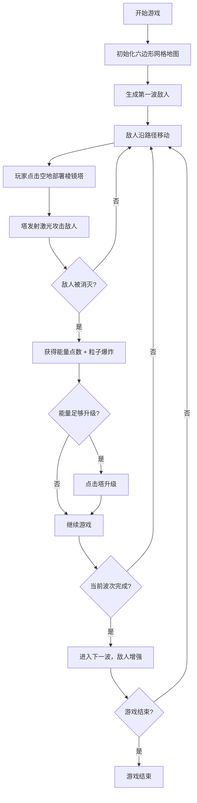

## 1. 产品概述

光棱战车是一款基于六边形网格的塔防策略游戏，玩家通过部署和升级三种能量棱镜塔来反射、聚焦和分裂激光，消灭入侵的几何敌人。游戏核心体验在于动态光路传播与华丽粒子特效的结合。

- 核心玩法：塔防策略 + 激光物理反射
- 目标用户：喜欢策略游戏和视觉特效的玩家
- 产品价值：提供沉浸式的塔防体验，结合策略深度与视觉冲击力

## 2. 核心功能

### 2.1 功能模块

1. **游戏主界面**：全屏 Canvas 游戏区域 + 右上角状态面板
2. **塔防系统**：三种棱镜塔（折射、聚焦、分裂），每塔3级升级路径
3. **敌人系统**：三种几何敌人（三角、菱形、圆形），波次递进机制
4. **激光系统**：激光发射、反射、聚焦、分裂的物理传播
5. **粒子特效**：敌人爆炸、激光光晕、塔部署动画
6. **UI 交互**：塔部署、升级、信息浮窗

### 2.2 页面详情

| 页面名称 | 模块名称 | 功能描述 |
|---------|---------|----------|
| 游戏主界面 | Canvas 游戏区域 | 六边形网格地图、塔部署、敌人移动、激光传播、粒子特效渲染 |
| 游戏主界面 | 状态面板 | 显示当前波次、能量点数、敌人击杀数（毛玻璃半透明效果） |
| 游戏主界面 | 塔信息浮窗 | 鼠标悬停塔时显示类型、等级、射程范围（虚线圆圈） |
| 游戏主界面 | 塔部署交互 | 点击空地高亮网格并弹出塔类型选择 |

## 3. 核心流程

玩家进入游戏后看到六边形网格地图，敌人从边缘沿路径入侵。玩家点击空地选择塔类型进行部署，塔自动发射激光攻击范围内敌人。击杀敌人获得能量点数，用于升级塔。每波敌人血量和数量递增，玩家需合理布局塔阵防御。

## 4. 用户界面设计

### 4.1 设计风格

- **主色调**：深空蓝 #0b0d17（背景）
- **点缀色**：亮蓝 #4a90ff、紫色 #7b61ff
- **整体风格**：深色科幻主题，毛玻璃面板，霓虹光晕效果
- **字体**：无衬线等宽字体，科技感
- **字号**：面板文字 14px，颜色 #c8d6e5

### 4.2 页面设计概览

| 页面名称 | 模块名称 | UI 元素 |
|---------|---------|---------|
| 游戏主界面 | Canvas 区域 | 深空蓝背景，暗色六边形网格线（#1a1f3d），脉动透明度动画 |
| 游戏主界面 | 状态面板 | 半透明毛玻璃（rgba(11,13,23,0.8)，模糊8px，圆角10px），固定右上角 |
| 游戏主界面 | 塔模型 | 六边形塔基，等级颜色渐变（淡蓝→深紫），部署展开动画 |
| 游戏主界面 | 激光束 | 塔身颜色到白色渐变，宽度3-5px，尾部闪烁光晕 |
| 游戏主界面 | 敌人 | 三种几何形状，血条（绿→红渐变），受伤颜色变暗 |
| 游戏主界面 | 粒子特效 | 敌人爆炸粒子（颜色对应敌人类型），0.8秒渐隐 |

### 4.3 响应式设计

- 桌面端优先设计，最小宽高比 16:9
- 窗口比例不足时上下留黑边，游戏区域保持等比缩放
- Canvas 自适应窗口大小，DPR 高清渲染

### 4.4 视觉特效

- **网格脉动**：每3秒透明度从 0.1 → 0.3 → 0.1 渐变
- **塔部署动画**：0.3秒从中心小圆放大至完整六边形
- **激光效果**：渐变光束 + 尾部光晕脉动（alpha 0.3-0.6）
- **击中效果**：0.2秒爆炸闪光（直径20px，白色到透明）
- **敌人死亡**：10-20个碎片粒子，随机方向扩散，0.8秒渐隐
