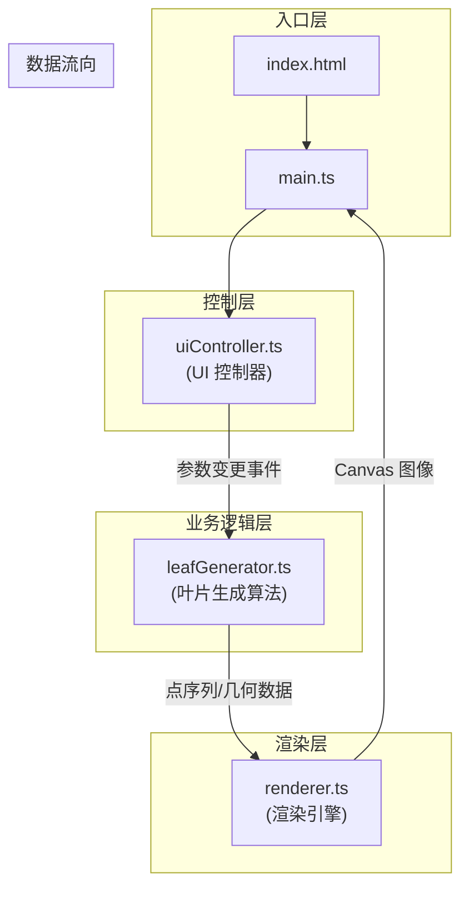

## 1. 架构设计



## 2. 技术描述

- **前端框架**：TypeScript + Vite（纯前端，无框架）
- **渲染技术**：Canvas 2D（不依赖外部图形库）
- **构建工具**：Vite 5.x（端口 5173，开启 HMR）
- **语言标准**：TypeScript 严格模式，target ES2020，module ESNext

### 文件结构与职责

| 文件路径 | 职责描述 | 调用关系 |
|-----------|-------------|-------------|
| `package.json` | 项目依赖与脚本配置 | - |
| `vite.config.js` | Vite 开发服务器配置 | - |
| `tsconfig.json` | TypeScript 编译配置 | - |
| `index.html` | 入口页面，包含 Canvas 和控制面板容器 | 加载 main.ts |
| `src/main.ts` | 应用初始化，创建 Canvas，启动动画循环，事件中转 | 调用 uiController / leafGenerator / renderer |
| `src/leafGenerator.ts` | 叶片形态算法，计算叶脉路径和轮廓点 | 被 main.ts 调用 |
| `src/renderer.ts` | 渲染引擎，绘制纹理、渐变、动画 | 被 main.ts 调用，使用 leafGenerator 输出 |
| `src/uiController.ts` | UI 控制面板，生成滑块和颜色选择器 | 被 main.ts 调用，回调触发参数变更 |

## 3. 数据模型

### 3.1 叶片参数 (LeafParams)

```typescript
interface LeafParams {
  length: number;        // 叶片长度 (5-20)
  width: number;         // 叶片宽度 (2-8)
  veinDensity: number;   // 叶脉密度 - 主脉数量 (3-12)
  serrationDepth: number;// 叶缘锯齿深度 (0-5)
  petioleLength: number; // 叶柄长度 (1-5)
  primaryColor: string;  // 主色 (#RRGGBB)
  secondaryColor: string;// 副色 (#RRGGBB)
}
```

### 3.2 叶片几何数据 (LeafGeometry)

```typescript
interface Point {
  x: number;
  y: number;
}

interface Vein {
  start: Point;
  end: Point;
  width: number;        // 起点宽度
  endWidth: number;     // 终点宽度
}

interface LeafGeometry {
  outlinePoints: Point[];   // 叶片轮廓点序列
  midrib: Point[];          // 主脉（中脉）点序列
  secondaryVeins: Vein[];   // 次级叶脉集合
  petioleEnd: Point;        // 叶柄末端（锚点）
  petioleStart: Point;      // 叶柄起始点
  spots: { x: number; y: number; radius: number }[]; // 斑点位置
}
```

### 3.3 摆动状态 (SwingState)

```typescript
interface SwingState {
  amplitude: number;    // 摆幅 2-4px
  frequency: number;    // 频率 0.8-1.2Hz
  phase: number;        // 当前相位
  noiseOffset: number;  // 随机噪声偏移
}
```

## 4. 核心算法说明

### 4.1 叶片轮廓生成
- 使用贝塞尔曲线生成基础叶形
- 沿轮廓均匀采样并叠加锯齿扰动
- 参数：长度、宽度、锯齿深度

### 4.2 叶脉生成
- 主脉：沿叶片中轴从叶基到叶尖
- 侧脉：从主脉按角度分叉，对称分布于两侧
- 数量由 veinDensity 控制
- 线宽渐变：1.5px → 0.5px

### 4.3 摆动动画
- 基础曲线：`y = A * sin(2π * f * t + φ)`
- 噪声叠加：使用 Perlin-like 伪随机函数
- 变换中心：叶柄末端点为锚点做旋转变换
