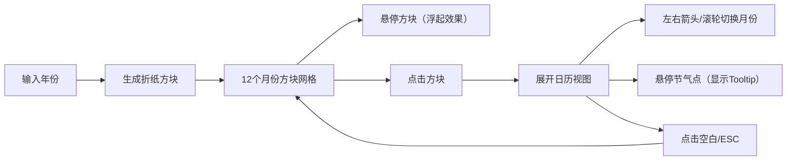

## 1. 产品概述
「时光纸艺」是一款交互式折纸风格日历生成器，以立体折纸艺术形式展示全年日历。用户输入年份后，12个月份以彩色折纸方块呈现，点击可展开查看完整日历与二十四节气。
- 核心价值：将传统折纸美学与现代日历功能结合，为用户提供兼具艺术感与实用性的日历体验
- 目标用户：喜爱手工艺品、传统文化和创意交互设计的用户群体

## 2. 核心功能

### 2.1 功能模块
1. **主页面**：年份输入、12个折纸方块日历网格
2. **日历展开视图**：月份详细日历、节气标注、日期显示
3. **月份导航**：左右箭头切换、滚轮切换、ESC/空白处收起

### 2.2 页面详情
| 页面名称 | 模块名称 | 功能描述 |
|-----------|-------------|---------------------|
| 主页面 | 年份输入区 | 输入框（默认当前年份）+ 生成按钮，支持回车提交 |
| 主页面 | 折纸方块网格 | 3行4列布局展示12个月，支持悬停浮起效果，点击展开 |
| 日历展开视图 | 日历格子 | 7列x5行日期网格，周末红色，节气圆点标注 |
| 日历展开视图 | 节气Tooltip | 悬停节气圆点显示节气名称，毛玻璃效果 |
| 日历展开视图 | 月份导航 | 左右箭头按钮切换相邻月份，滚轮切换支持 |

## 3. 核心流程
用户输入年份 → 点击生成/回车 → 画布渲染12个折纸方块（带动画）→ 悬停方块显示浮起效果 → 点击方块展开日历（展开动画0.5秒）→ 查看日期与节气 → 点击箭头/滚轮切换月份 → 点击空白处/ESC键收起 → 返回方块网格视图

## 4. 用户界面设计

### 4.1 设计风格
- **主色调**：暖白背景 #faf6f0，月份渐变色（1月冷蓝#4a7cba → 6月暖黄#f0c27a → 12月深蓝#2c3e50）
- **辅助色**：周末红色 #e74c3c，节气绿色圆点，折痕线（主色加深20%）
- **字体**：月份数字使用 Georgia（serif），正文使用系统无衬线字体
- **按钮风格**：圆形导航按钮（直径36px，半透明白色背景，悬停变纯白）
- **布局风格**：居中网格布局，折纸方块带立体阴影与折痕效果
- **特殊效果**：纸角淡黄色泛光（径向渐变），毛玻璃Tooltip，阴影过渡动画

### 4.2 页面设计概述
| 页面名称 | 模块名称 | UI元素 |
|-----------|-------------|-------------|
| 主页面 | 年份输入区 | 简洁输入框 + 生成按钮，顶部居中，浅棕色边框 |
| 主页面 | 折纸方块网格 | 3行4列/2列6行响应式布局，方块带折叠纸角、折痕线、阴影，悬停浮起3px |
| 日历展开视图 | 日历格子 | 极浅灰#fcfcfc背景，2px圆角，12px日期字体，周末红色 |
| 日历展开视图 | 节气标注 | 6px绿色圆点（日期格左上角），悬停显示毛玻璃Tooltip |
| 日历展开视图 | 导航按钮 | 圆形按钮，左右箭头，半透明背景 |

### 4.3 响应式
- Desktop-first 设计，最小支持 1024×650px
- 窗口宽度 < 1200px 时，方块布局从 3列4行 变为 2列6行
- Canvas 自动适配窗口大小，resize 时重新计算布局

### 4.4 动画与交互
- 悬停动画：方块向上浮起3px，阴影增强（0.3秒 ease-out）
- 展开动画：从中心向外展开（0.5秒）
- 收起动画：反向折叠（0.4秒）
- 月份切换：侧向滑出/滑入（0.3秒 ease-in-out）
- 所有动画使用 requestAnimationFrame 驱动，保持 60FPS
