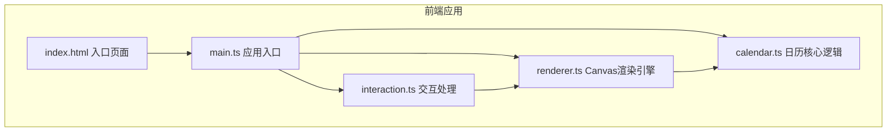

## 1. 架构设计



## 2. 技术说明
- **前端框架**: 原生 TypeScript + Canvas 2D API（无外部UI框架）
- **构建工具**: Vite 5.x
- **语言**: TypeScript 5.x（严格模式，target ES2020，module ESNext）
- **动画**: 原生 requestAnimationFrame，无外部动画库
- **样式**: 原生 CSS（内联 + index.html 内嵌样式）

## 3. 文件结构

| 文件路径 | 作用 |
|---------|------|
| `/package.json` | 项目依赖与启动脚本 |
| `/vite.config.js` | Vite 基础配置（端口5173，HMR开启） |
| `/tsconfig.json` | TypeScript 编译配置（严格模式） |
| `/index.html` | 入口页面，包含 Canvas 与 UI 控件 |
| `/src/main.ts` | 应用入口，初始化画布与事件绑定 |
| `/src/calendar.ts` | 日历核心逻辑（节气计算、方块布局、颜色生成） |
| `/src/renderer.ts` | Canvas 2D 渲染引擎（折纸绘制、动画、日历格子） |
| `/src/interaction.ts` | 鼠标/键盘交互处理（状态机管理） |

## 4. 核心数据模型

### 4.1 CalendarMonth 接口
```typescript
interface CalendarMonth {
  year: number;
  month: number; // 1-12
  days: number; // 当月天数
  firstDayWeek: number; // 1号是星期几 (0=周日)
  color: string; // 月份主色（HEX）
  foldColor: string; // 折痕线颜色（主色加深20%）
  position: { x: number; y: number }; // 方块画布坐标
  size: number; // 方块边长
  solarTerms: Map<number, string>; // 日期 -> 节气名称
  foldProgress: number; // 折叠动画进度 0-1 (0=完全折叠, 1=完全展开)
  hoverProgress: number; // 悬停浮起进度 0-1
  slideOffset: number; // 侧向滑出偏移量（切换月份用）
}
```

### 4.2 应用状态机
```typescript
type AppState = 'grid' | 'expanding' | 'expanded' | 'collapsing' | 'switching';
```

## 5. 节气算法
- 使用简化版二十四节气计算公式（基于太阳黄经）
- 预计算全年节气数据并缓存，避免重复计算
- 支持的节气：大寒、小寒、立春、雨水、惊蛰、春分、清明、谷雨、立夏、小满、芒种、夏至、小暑、大暑、立秋、处暑、白露、秋分、寒露、霜降、立冬、小雪、大雪、冬至

## 6. 渲染流程
1. **主循环**: requestAnimationFrame 驱动，每帧调用 renderer.render()
2. **分层渲染**: 背景 → 方块阴影 → 折纸方块本体 → 折痕线 → 纸角泛光 → 月份数字 → 展开日历 → 节气圆点 → Tooltip
3. **动画缓动**: 所有过渡使用 ease-out / ease-in-out 缓动函数
4. **性能优化**: 脏矩形重绘、数据预计算、动画帧时间戳差值计算

## 7. 响应式布局
- Canvas 尺寸：100vw × 100vh，最小 1024×650px
- 宽度 ≥ 1200px：3列 × 4行 方块布局
- 宽度 < 1200px：2列 × 6行 方块布局
- 方块尺寸：根据可用空间动态计算，保持正方形
- resize 事件：防抖处理，重新计算所有方块位置与尺寸
