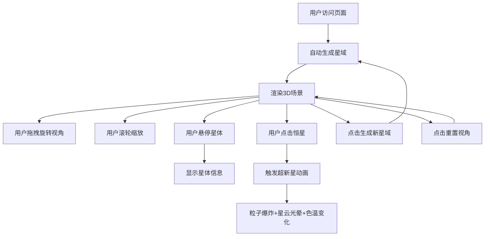

## 1. 产品概述

「星轨绘卷」是一款基于浏览器的3D动态星图探索应用，用户可在三维空间中自由探索随机生成的恒星系统。每颗恒星拥有独特的物理属性，周围环绕着按轨道运行的行星。应用支持超新星爆发动画效果，提供沉浸式的宇宙探索体验。

- 主要用途：天文爱好者进行宇宙可视化探索，提供教育性与娱乐性的交互体验
- 目标用户：天文爱好者、学生、对3D可视化感兴趣的普通用户
- 产品价值：将抽象的宇宙概念以直观、美观的3D交互形式呈现，降低天文学知识的认知门槛

## 2. 核心功能

### 2.1 功能模块
1. **主场景渲染**：全屏Three.js 3D渲染窗口，深邃太空背景，动态光照
2. **恒星系统生成**：随机生成30+颗恒星及各自的行星系统
3. **视角控制**：鼠标拖拽旋转、滚轮缩放、惯性阻尼效果
4. **星体交互**：悬停信息显示、点击超新星爆发
5. **控制面板**：新星域生成、视角重置、恒星计数器
6. **特效系统**：超新星粒子爆炸、星云光晕、全局色温调整

### 2.2 页面详情
| 页面名称 | 模块名称 | 功能描述 |
|-----------|-------------|---------------------|
| 主页面 | 3D渲染窗口 | 全屏Three.js场景，显示随机生成的星域 |
| 主页面 | 毛玻璃控制面板 | 左上角半透明面板，包含操作按钮和计数器 |
| 主页面 | 信息展示区 | 左下角显示悬停/点击星体的详细数据 |
| 主页面 | 背景星点层 | 300颗静态闪烁背景星点 |

## 3. 核心流程

用户打开应用后，自动生成随机星域。用户可通过拖拽鼠标旋转视角，滚轮缩放距离。鼠标悬停在星体上时，左下角显示详细信息。点击恒星触发超新星爆发动画。用户可通过控制面板生成全新星域或重置视角。

## 4. 用户界面设计

### 4.1 设计风格
- **主色调**：深邃太空蓝(#0a0e27) → 紫黑色(#0a0a15)渐变背景
- **强调色**：橙红色(#ff6b35)、恒星白、行星蓝绿色调
- **面板风格**：毛玻璃效果(backdrop-filter: blur 12px)，半透明(rgba(10,14,39,0.7))，圆角16px，细边框
- **字体**：等宽字体(monospace)用于数据展示，13px，颜色#c8d6e5，行高1.6
- **动效**：数字淡入淡出切换、粒子渐隐、星云缓慢旋转

### 4.2 页面设计概述
| 页面名称 | 模块名称 | UI元素 |
|-----------|-------------|-------------|
| 主页面 | 3D渲染窗口 | 全屏Canvas，背景渐变，300颗闪烁星点 |
| 主页面 | 控制面板 | 左上角，毛玻璃，2个按钮+1个计数器 |
| 主页面 | 信息展示区 | 左下角，等宽字体数据展示 |
| 主页面 | 超新星特效 | 橙红色调粒子爆炸，旋转星云光晕 |

### 4.3 响应式
- Desktop优先设计，全屏自适应
- 支持窗口resize自动调整渲染器尺寸

### 4.4 3D场景指导
- **环境**：深邃太空渐变背景，300颗静态闪烁星点营造宇宙纵深
- **光照**：柔和环境光(#404060, 强度0.3) + 动态方向光(随视角轻微调整)
- **相机**：PerspectiveCamera，拖拽惯性阻尼(0.92)，缩放范围5-50单位
- **构图**：恒星系统随机分布在球形空间内，中心区域密度较高
- **交互**：拖拽旋转、滚轮缩放、悬停高亮、点击爆发
- **后处理**：超新星时全局色温偏向橙红色
- **性能**：60FPS流畅运行，粒子峰值≤200
