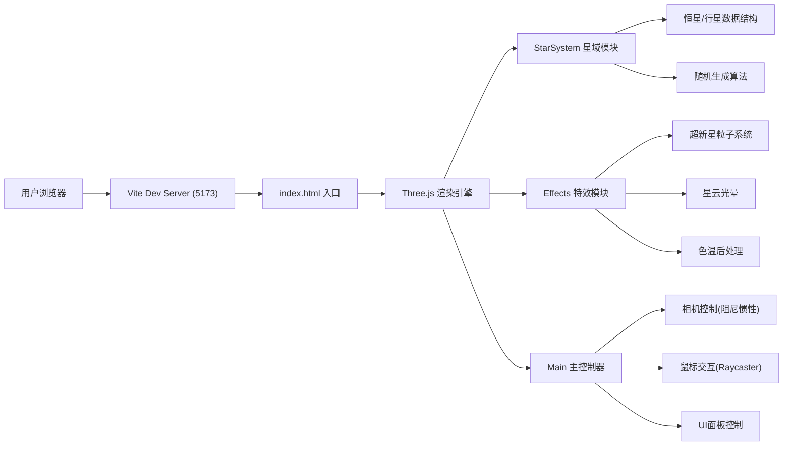

## 1. 架构设计



## 2. 技术说明
- **前端框架**：TypeScript (严格模式) + Three.js 0.160 + Vite 5
- **初始化工具**：Vite vanilla-ts 模板
- **后端**：无后端，纯前端静态应用
- **数据库**：无数据库，全部数据运行时随机生成

## 3. 项目文件结构
| 文件路径 | 用途 |
|-------|---------|
| package.json | 项目依赖与脚本配置 |
| vite.config.js | Vite构建配置(端口5173, HMR) |
| tsconfig.json | TypeScript配置(ES2020, 严格模式) |
| index.html | 入口HTML，全屏Canvas + UI结构 |
| src/main.ts | 场景/相机/渲染器初始化、事件处理、动画循环 |
| src/starSystem.ts | 恒星行星接口定义、随机星域生成、Mesh更新 |
| src/effects.ts | 超新星粒子系统、星云光晕、色温后处理 |

## 4. 核心数据模型

### 4.1 恒星数据结构
```typescript
interface StarData {
  id: string;           // 唯一标识
  name: string;         // 名称 (如 HD-0347)
  type: 'mainSequence' | 'redGiant' | 'whiteDwarf';
  color: number;        // 颜色 (hex)
  temperature: number;  // 表面温度 (K)
  mass: number;         // 质量 (太阳倍数)
  size: number;         // 半径大小
  rotationSpeed: number;// 自转角速度
  position: THREE.Vector3;
  planets: PlanetData[];
}
```

### 4.2 行星数据结构
```typescript
interface PlanetData {
  id: string;
  name: string;
  orbitRadius: number;      // 轨道半径 3-10
  orbitInclination: number; // 轨道倾角 -30° ~ 30°
  orbitSpeed: number;       // 公转角速度 (随半径增大而减小)
  orbitAngle: number;       // 当前轨道角度
  rotationSpeed: number;    // 自转角速度
  size: number;
  color: number;            // 表面颜色
  parentStar: StarData;
}
```

### 4.3 超新星特效状态
```typescript
interface SupernovaEffect {
  active: boolean;
  position: THREE.Vector3;
  startTime: number;
  particles: THREE.Points;
  nebula: THREE.Mesh;
  colorTemperature: number; // 0~1 色温偏移
}
```

## 5. 核心算法

### 5.1 恒星位置生成
- 在半径40单位的球体内随机分布
- 中心区域(半径<15)概率更高，形成聚集效果
- 避免恒星过近(最小距离5单位)

### 5.2 行星轨道参数
- 轨道半径: 3~10 单位随机
- 轨道倾角: -30°~30° 随机
- 公转速度: 与轨道半径的1.5次方成反比(开普勒第三定律近似)
  - `speed = baseSpeed / Math.pow(orbitRadius, 1.5)`

### 5.3 相机惯性阻尼
```
currentVelocity *= 0.92  // 每帧衰减
if (|velocity| < threshold) velocity = 0
```
松开鼠标后继续转动0.5~1秒停止。

### 5.4 粒子爆炸模拟
- 粒子数量: 120~200
- 初始速度: 1~4 单位/秒，方向随机均匀分布
- 颜色渐变: 亮白 → 橙红(#ff6b35) → 暗红(#8e44ad)
- 大小衰减: 0.5 → 0 线性缩小
- 生命周期: 2秒
- 星云光晕: 半径1→5扩展，透明度0.9→0衰减，角速度0.3 rad/s，持续3秒
