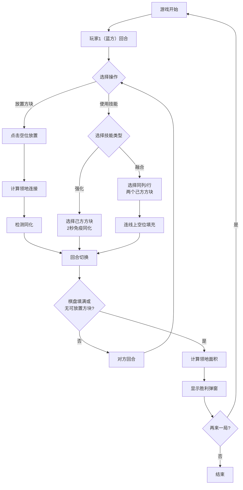

## 1. 产品概述
「色界攻防」是一款基于颜色混合与区域占领的双人对战棋盘策略游戏，玩家通过轮流放置彩色方块扩展领地，利用同化机制和特殊技能获得战略优势，最终占领大部分棋盘获胜。

- 主要目的：提供一款易于上手但策略深度丰富的双人本地对战游戏
- 目标用户：解谜游戏爱好者、休闲游戏玩家、策略游戏玩家
- 市场价值：填补浏览器端轻量级双人颜色策略游戏的空白，适合朋友之间快速对战

## 2. 核心功能

### 2.1 用户角色
本游戏为本地双人对战，无需注册系统，两位玩家在同一设备上轮流操作。

| 角色 | 操作方式 | 核心权限 |
|------|----------|----------|
| 玩家1（蓝方） | 鼠标点击放置方块/使用技能 | 放置蓝色方块、使用强化/融合技能 |
| 玩家2（红方） | 鼠标点击放置方块/使用技能 | 放置红色方块、使用强化/融合技能 |

### 2.2 功能模块
1. **游戏主界面**：8x8棋盘、顶部信息栏、技能按钮区、胜利弹窗
2. **核心游戏逻辑**：棋盘状态管理、颜色占领、领地计算、同化机制、回合切换、胜负判定
3. **视觉渲染系统**：Canvas 2D绘制、网格/方块/动画/粒子特效
4. **用户交互系统**：鼠标事件监听、坐标映射、悬停/选中反馈
5. **技能系统**：强化技能（防同化）、融合技能（连线填充）

### 2.3 页面详情
| 页面名称 | 模块名称 | 功能描述 |
|---------|----------|---------|
| 游戏主界面 | 顶部信息栏 | 显示当前回合玩家、双方领地数量、回合数，颜色随当前玩家渐变 |
| 游戏主界面 | 8x8棋盘 | 可点击放置方块，悬停放大，选中显示虚线描边，同化/放置动画 |
| 游戏主界面 | 技能按钮区 | 强化技能按钮（金色边框）、融合技能按钮（银色边框），显示剩余次数 |
| 游戏主界面 | 胜利弹窗 | 居中毛玻璃弹窗，显示获胜者、领地面积对比图、再来一局按钮 |

## 3. 核心流程

### 游戏流程
1. 游戏开始，棋盘为空，玩家1（蓝方）先手
2. 当前玩家选择操作：放置方块 或 使用技能（强化/融合）
3. 放置方块：点击空位放置己方颜色，自动连接同色领地，触发同化检测
4. 使用技能：
   - 强化：点击己方领地内方块，2秒内不可被同化
   - 融合：点击同一行/列两个己方方块，连线上空位自动填充
5. 回合切换，回到步骤2由对方操作
6. 当棋盘填满或一方无可放置方块时，计算双方领地面积
7. 显示胜利弹窗，可选择再来一局

## 4. 用户界面设计

### 4.1 设计风格
- **主色调**：深灰色背景 #2C3E50，蓝方 #4A90D9，红方 #E74C3C
- **辅助色**：金色 #F1C40F（强化边框）、银色 #BDC3C7（融合边框）、绿色 #27AE60（胜利按钮）
- **按钮风格**：圆角矩形（技能按钮8px圆角、胜利按钮12px圆角），悬停背景变暗/变亮
- **字体**：现代无衬线字体，标题加粗，信息清晰易读
- **布局风格**：棋盘居中，信息栏顶部固定，技能按钮底部排列，弹窗居中覆盖
- **动效**：颜色渐变过渡0.3s ease，同化动画0.4s，放置动画粒子飞散

### 4.2 页面设计概述
| 页面名称 | 模块名称 | UI元素 |
|---------|----------|--------|
| 游戏主界面 | 顶部信息栏 | 深色背景条，左右两侧显示玩家颜色标识和领地数，中间显示当前回合文字，颜色随玩家渐变过渡 |
| 游戏主界面 | 棋盘区域 | 8x8网格，每格40x40px间距2px，外围白色半透明边框2px，方块颜色随所属玩家，悬停scale 1.05+亮度滤镜，选中2px白色虚线描边 |
| 游戏主界面 | 技能按钮区 | 左右各一组（蓝方/红方），强化按钮金色边框，融合按钮银色边框，显示剩余次数，禁用时灰色半透明 |
| 游戏主界面 | 胜利弹窗 | 毛玻璃背景rgba(0,0,0,0.7) backdrop-filter:blur(6px)，白色圆角卡片padding 24px，获胜者名称大号文字，领地对比条形图，绿色"再来一局"按钮 |

### 4.3 响应式
- 桌面端：棋盘原尺寸（40px每格），居中显示
- 移动端（<768px）：棋盘按比例缩放，适配屏幕宽度，按钮区域调整为纵向排列

### 4.4 性能要求
- 主循环60FPS，requestAnimationFrame驱动
- Canvas局部重绘优化，仅更新变化区域
- 粒子数量控制在100以内，自动回收过期粒子
