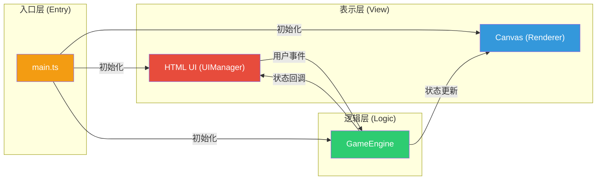
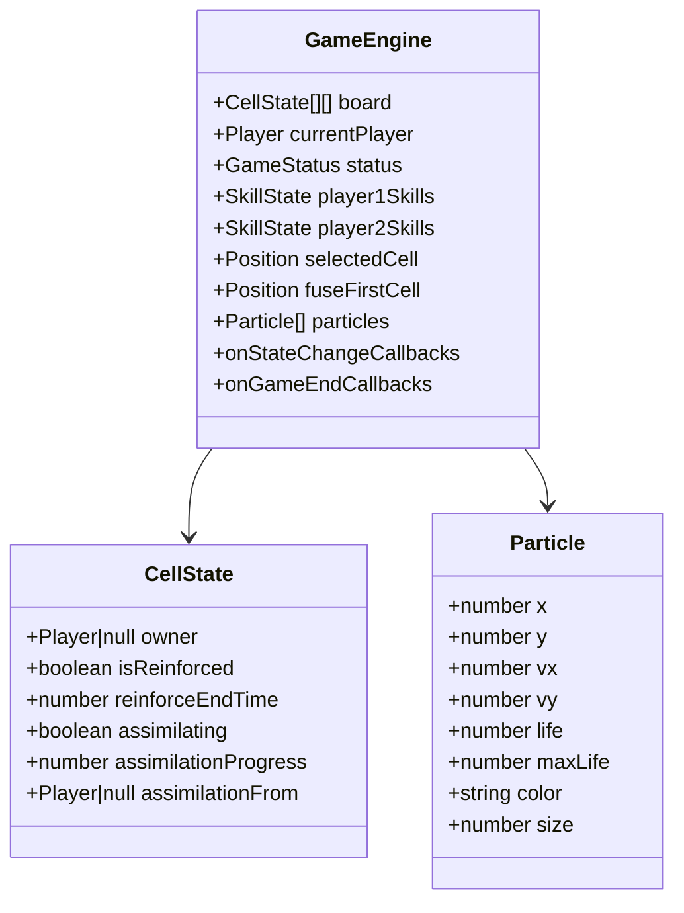

## 1. 架构设计

本项目采用纯前端架构，所有逻辑在浏览器端运行，无后端依赖。采用模块化分层设计，各模块职责清晰，数据单向流动。



### 数据流向说明
1. **main.ts** 作为应用入口，创建 GameEngine、Renderer、UIManager 实例并建立关联
2. **UIManager** 监听鼠标/触摸事件，解析坐标后调用 GameEngine 的方法
3. **GameEngine** 处理游戏逻辑，更新内部状态后通过回调通知 Renderer 和 UIManager
4. **Renderer** 从 GameEngine 读取最新状态，在 Canvas 上进行增量绘制
5. **UIManager** 根据 GameEngine 状态更新 HTML UI 元素（信息栏、技能按钮、弹窗）

## 2. 技术说明

- **前端框架**: 原生 TypeScript（无React/Vue），轻量级无额外运行时开销
- **构建工具**: Vite 5.x，提供快速HMR和构建
- **渲染技术**: Canvas 2D API，直接操作像素级渲染
- **开发语言**: TypeScript 5.x，严格模式
- **动画驱动**: requestAnimationFrame，保持60FPS
- **样式**: 原生CSS（内联在index.html中），无需CSS预处理器

### 依赖清单
| 包名 | 版本 | 用途 |
|------|------|------|
| typescript | ^5.4.0 | 类型系统支持 |
| vite | ^5.2.0 | 构建工具与开发服务器 |

## 3. 项目文件结构

```
e:\solo\VersionFast\tasks\auto269\
├── package.json              # 项目依赖与脚本配置
├── vite.config.js            # Vite配置（端口5173，HMR）
├── tsconfig.json             # TypeScript配置（严格模式, ES2020）
├── index.html                # 入口HTML页面
└── src/
    ├── main.ts               # 应用入口，初始化与主循环
    ├── GameEngine.ts         # 核心游戏逻辑引擎
    ├── Renderer.ts           # Canvas渲染器
    └── UIManager.ts          # 用户交互与HTML UI管理
```

## 4. 模块职责与API定义

### 4.1 GameEngine.ts - 核心游戏引擎

#### 类型定义
```typescript
type Player = 1 | 2; // 1=蓝方, 2=红方
type CellState = {
  owner: Player | null;
  isReinforced: boolean;
  reinforceEndTime: number;
  assimilating: boolean;
  assimilationProgress: number;
  assimilationFrom: Player | null;
};
type Position = { x: number; y: number };
type GameStatus = 'playing' | 'ended';
type SkillType = 'reinforce' | 'fuse';
type SkillState = { reinforce: number; fuse: number };
```

#### 核心API
```typescript
class GameEngine {
  // 状态获取
  getBoard(): CellState[][];
  getCurrentPlayer(): Player;
  getScore(): { player1: number; player2: number };
  getStatus(): GameStatus;
  getWinner(): Player | null;
  getSkills(player: Player): SkillState;
  getSelectedCell(): Position | null;
  getFuseFirstCell(): Position | null;
  
  // 游戏操作
  placeStone(x: number, y: number): boolean;
  selectCell(x: number, y: number): boolean;
  useReinforceSkill(x: number, y: number): boolean;
  useFuseSkill(x: number, y: number): boolean;
  resetGame(): void;
  
  // 订阅回调
  onStateChange(callback: () => void): void;
  onGameEnd(callback: (winner: Player | null, scores: {p1:number;p2:number}) => void): void;
}
```

#### 内部核心算法
- **领地连接**: BFS/DFS遍历8邻域同色方块，计算连通分量
- **同化检测**: 遍历所有边缘异色方块，检查8邻域是否全部被对方领地包围
- **胜负判定**: 统计双方领地面积，面积大者胜（平局返回null）

### 4.2 Renderer.ts - Canvas渲染器

#### 渲染职责
1. 绘制8x8棋盘网格（背景、边框、间距）
2. 绘制方块颜色（含同化渐变色插值）
3. 绘制选中高亮（白色虚线描边）
4. 绘制悬停效果（scale 1.05 + 亮度滤镜）
5. 绘制强化效果（金色光环）
6. 管理并绘制粒子特效（放置/同化时的彩色飞散点）
7. 局部重绘优化（dirty rectangles）

#### 核心API
```typescript
class Renderer {
  constructor(canvas: HTMLCanvasElement, engine: GameEngine);
  render(hoverCell: Position | null, selectedCell: Position | null): void;
  spawnParticles(x: number, y: number, color: string, count: number): void;
  resize(scale: number): void;
}
```

### 4.3 UIManager.ts - 用户交互管理

#### 交互职责
1. Canvas鼠标/触摸事件监听与坐标映射（像素→棋盘格坐标）
2. 顶部信息栏渲染与动画（回合文字颜色渐变）
3. 技能按钮状态管理（可用性、剩余次数、悬停效果）
4. 胜利弹窗显示与"再来一局"按钮
5. 响应式棋盘缩放

#### 核心API
```typescript
class UIManager {
  constructor(
    canvas: HTMLCanvasElement,
    engine: GameEngine,
    renderer: Renderer,
    uiContainer: HTMLElement
  );
  bindEvents(): void;
  updateUI(): void;
  showVictoryModal(winner: Player | null, scores: {p1:number;p2:number}): void;
  hideVictoryModal(): void;
}
```

### 4.4 main.ts - 应用入口

```typescript
// 1. 获取DOM元素
// 2. 创建GameEngine实例
// 3. 创建Renderer实例
// 4. 创建UIManager实例并绑定事件
// 5. 启动requestAnimationFrame主循环
//    - 更新GameEngine中的时效状态（强化计时、同化动画进度）
//    - 调用Renderer.render()
//    - 调用UIManager.updateUI()
```

## 5. 数据模型

### 棋盘状态模型


## 6. 性能优化策略

1. **增量渲染**: 维护dirty cells集合，每帧只重绘状态变化的格子及其周围
2. **粒子池**: 粒子对象复用，避免频繁GC，上限100个
3. **离屏缓存**: 静态棋盘网格绘制到离屏Canvas，每帧只绘制动态层
4. **节流防抖**: 鼠标移动事件节流，避免频繁触发重绘
5. **CSS Transform**: UI动画使用transform/opacity，触发GPU合成
