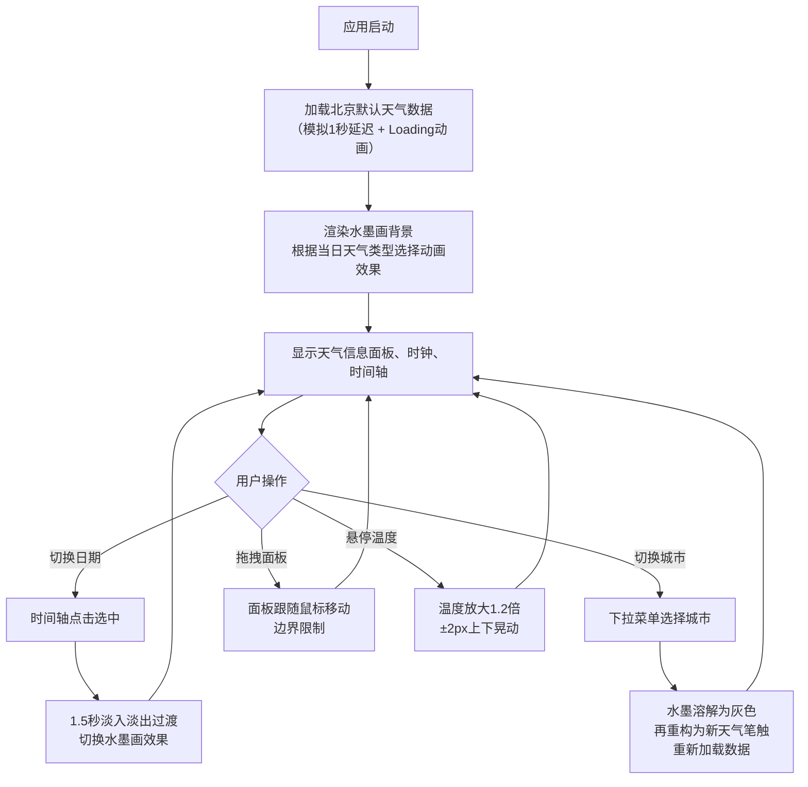

## 1. 产品概述

「墨迹天气」是一款以中国传统水墨画风格为核心视觉语言的交互式天气可视化应用。用户通过选择城市或开启定位，查看未来一周的天气数据，并以动态水墨画风格呈现每种天气的独特视觉氛围。

- 主要目的：将天气预报数据转化为具有艺术美感的沉浸式视觉体验
- 目标用户：追求审美体验、喜欢传统文化与现代科技结合的年轻用户群体
- 市场价值：打破传统天气应用千篇一律的界面风格，提供差异化的视觉享受

## 2. 核心功能

### 2.1 用户角色

| 角色 | 注册方式 | 核心权限 |
|------|----------|----------|
| 普通用户 | 无需注册 | 浏览天气数据、切换城市、选择日期 |

### 2.2 功能模块

1. **主界面**：全屏Canvas动态水墨画背景、浮动天气信息面板、实时时钟
2. **城市切换**：右上角下拉菜单，支持北京、上海、广州、成都四城
3. **时间轴**：底部水平滚动条，展示未来7天天气预览，支持点击切换
4. **加载动画**：数据加载时的过渡动画

### 2.3 页面详情

| 页面名称 | 模块名称 | 功能描述 |
|----------|----------|----------|
| 主界面 | 水墨画Canvas | 根据天气类型实时渲染动态水墨效果（晴/雨/雪/多云） |
| 主界面 | 天气信息面板 | 毛玻璃半透明面板，显示日期、温度、天气类型、风速、湿度，支持拖拽 |
| 主界面 | 实时时钟 | 左上角精确到秒的时间显示，等宽字体 |
| 主界面 | 城市切换 | 右上角毛玻璃下拉菜单，切换城市触发水墨溶解过渡动画 |
| 主界面 | 时间轴 | 底部水平滚动，7天天气缩略预览，高亮当前选中，点击切换日期 |

## 3. 核心流程

## 4. 用户界面设计

### 4.1 设计风格

- **主色调**：深灰(#1a1a2e)到深蓝(#16213e)径向渐变背景
- **水墨色**：黑、灰、白为主，辅以天气点缀色（晴天淡金、雨天冷灰、雪天淡蓝）
- **文字颜色**：#e0e0e0 或 rgba(255,255,255,0.8)
- **字体**：优先 'Inter', 'Segoe UI', sans-serif，时钟使用 monospace 等宽字体
- **毛玻璃效果**：rgba(255,255,255,0.15) 背景，backdrop-filter: blur(10px)，圆角16px
- **动画过渡**：ease-in-out，持续0.3-0.5秒

### 4.2 页面设计概览

| 页面名称 | 模块名称 | UI元素 |
|----------|----------|--------|
| 主界面 | 水墨画Canvas | 全屏自适应，30fps+动画，4种天气动态效果 |
| 主界面 | 天气信息面板 | 半透明毛玻璃，圆角16px，可拖拽，温度悬停放大动画 |
| 主界面 | 实时时钟 | 左上角，monospace字体，白色半透明，阴影加深 |
| 主界面 | 城市切换 | 右上角，毛玻璃下拉菜单，与面板风格统一 |
| 主界面 | 时间轴 | 底部80px高，水平滚动，高亮选中，7天缩略卡片 |

### 4.3 响应式设计

- **桌面端（≥768px）**：左侧浮动天气面板，右上角城市菜单，底部80px时间轴
- **移动端（<768px）**：顶部全宽横条天气面板，底部城市菜单，时间轴高度60px，触摸友好

### 4.4 视觉氛围

- **晴天**：淡金色墨点缓慢上升扩散，中心亮斑脉动
- **雨天**：灰色墨滴垂直下落，落地溅起微小墨点
- **雪天**：白色墨点随机飘落，落地缓慢消失
- **多云**：灰色墨团缓慢旋转融合，淡入淡出
- **切换过渡**：城市切换时全部溶解为灰色墨水，再重构为新天气笔触
