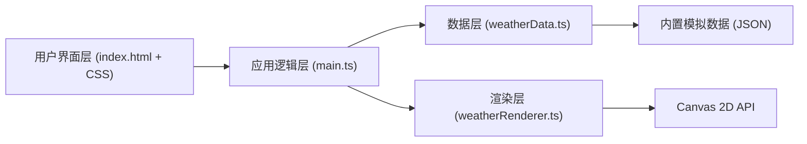

## 1. 架构设计



## 2. 技术描述

- **前端框架**：原生 TypeScript + Vite（无React/Vue，用户明确要求纯TS实现）
- **构建工具**：Vite 5.x，端口5173，开启HMR热更新
- **语言**：TypeScript，严格模式，target ES2020，module ESNext
- **渲染**：HTML5 Canvas 2D API，手动实现水墨动画（无第三方图表/动画库）
- **样式**：内联CSS，毛玻璃效果使用backdrop-filter
- **数据**：内置模拟JSON数据，模拟1秒延迟加载，无需网络请求

## 3. 文件结构

| 文件路径 | 用途 |
|----------|------|
| package.json | 依赖配置（typescript, vite），启动脚本 |
| vite.config.js | Vite基础配置，端口5173，HMR |
| tsconfig.json | TypeScript严格模式配置 |
| index.html | 入口页面，全屏Canvas + 浮动控制面板 + 时间轴 + 城市选择 |
| src/weatherData.ts | 模拟天气API，返回7天数据数组 |
| src/weatherRenderer.ts | Canvas水墨渲染器，4种天气动画效果 |
| src/main.ts | 应用初始化，数据获取，渲染调度，事件监听 |

## 4. 数据模型

### 4.1 WeatherDay 接口

```typescript
interface WeatherDay {
  date: string;          // 日期 YYYY-MM-DD
  weekday: string;       // 星期几
  temperature: number;   // 温度（摄氏度）
  tempLow: number;       // 最低温度
  tempHigh: number;      // 最高温度
  weatherType: 'sunny' | 'rainy' | 'snowy' | 'cloudy';
  windSpeed: number;     // 风速 km/h
  humidity: number;      // 湿度 %
}
```

### 4.2 城市数据

| 城市 | 标识 |
|------|------|
| 北京 | beijing |
| 上海 | shanghai |
| 广州 | guangzhou |
| 成都 | chengdu |

## 5. 渲染引擎架构

### 5.1 Particle 粒子系统基类

```
BaseParticle
├── x, y: 位置
├── vx, vy: 速度
├── life, maxLife: 生命周期
├── size, opacity: 大小与透明度
├── update(): 更新一帧
└── draw(ctx): 绘制到Canvas
```

### 5.2 天气粒子派生类

- **SunnyParticle**：上升墨点，淡金色，扩散效果，含中心亮斑
- **RainyParticle**：下落墨滴，灰色，落地溅射粒子
- **SnowyParticle**：飘落雪点，白色，落地淡出
- **CloudyParticle**：漂浮云团，灰色，旋转融合

### 5.3 渲染调度

- 使用 requestAnimationFrame 驱动
- 目标帧率 ≥ 30fps
- 双缓冲策略（离屏Canvas）优化性能
- 粒子对象池复用，避免频繁GC

## 6. 性能优化策略

1. **粒子池化**：预创建粒子对象数组，循环复用避免内存抖动
2. **分层渲染**：背景渐变色一次性绘制，粒子层叠加
3. **节流控制**：窗口resize使用requestAnimationFrame节流
4. **离屏Canvas**：静态背景预渲染到离屏画布
5. **帧率监控**：内部统计FPS，动态调整粒子数量
