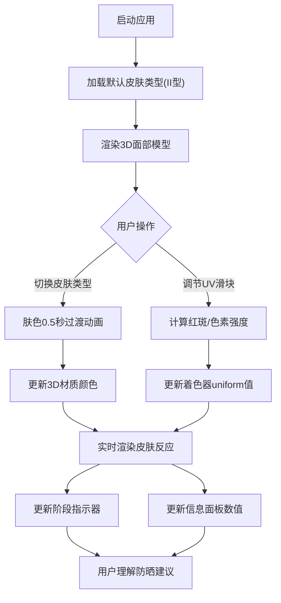

## 1. 产品概述

皮肤紫外线反应模拟器是一款面向皮肤科医生和患者的3D可视化教育工具，通过交互式3D面部模型直观展示不同皮肤类型在紫外线照射下的生理反应，解决传统文字描述过于抽象、患者难以理解并配合防晒措施的痛点问题。

- 目标用户：皮肤科医生、皮肤疾病患者、医美从业者、普通大众
- 核心价值：将抽象的紫外线伤害转化为可视化的3D模型表现，提升防晒意识和医学教育效率

## 2. 核心功能

### 2.1 用户角色
| 角色 | 注册方式 | 核心权限 |
|------|---------|---------|
| 普通用户 | 无需注册，直接使用 | 体验所有模拟功能、查看皮肤反应 |

### 2.2 功能模块
1. **主模拟界面**：3D面部模型展示、粒子背景、环境光照
2. **皮肤类型选择**：6种Fitzpatrick皮肤类型（I-VI型）快速切换
3. **UV指数滑块**：0-11 UV指数无级调节，实时反馈
4. **阶段指示器**：4阶段（安全/预警/危险/灼伤）可视化状态显示
5. **实时信息面板**：皮肤参数、晒伤预估时间、状态百分比实时显示

### 2.3 页面详情
| 页面名称 | 模块名称 | 功能描述 |
|---------|---------|---------|
| 主模拟页 | 3D面部模型 | 低多边形类人面部，支持单指旋转、双指缩放，肤色动态过渡 |
| 主模拟页 | 皮肤类型选择 | 6个圆形肤色按钮，选中发光，0.5秒颜色过渡动画 |
| 主模拟页 | UV指数滑块 | 横向四色渐变轨道，拖拽实时更新UV值和皮肤反应 |
| 主模拟页 | 阶段指示器 | 垂直4阶段图标（盾牌/感叹号/火焰/骷髅），呼吸动画放大 |
| 主模拟页 | 实时信息面板 | 半透明毛玻璃效果，显示皮肤类型、UV值、泛红面积、色素加深、晒伤时间 |

## 3. 核心流程

用户打开应用 → 选择皮肤类型（默认II型）→ 3D模型平滑过渡肤色 → 拖拽UV滑块调节强度 → 实时观察红斑/色素沉着变化 → 查看阶段指示器和信息面板 → 理解紫外线伤害程度 → 采取相应防晒措施

## 4. 用户界面设计

### 4.1 设计风格
- **主色调**：深蓝灰(#1a1a2e) → 深紫灰(#16213e)径向渐变背景
- **强调色**：绿色#4CAF50(安全)、黄色#FFC107(预警)、橙色#FF9800(危险)、红色#F44336(灼伤)
- **材质风格**：半透明毛玻璃面板(模糊8px，圆角10px)
- **按钮风格**：圆形，选中白色外发光，悬停放大1.05倍，点击水波纹反馈
- **字体**：深色医学可视化风格，无衬线字体，清晰易读
- **图标风格**：emoji图标（🛡️/⚠️/🔥/💀），24px大小，呼吸动画

### 4.2 页面设计概览
| 页面名称 | 模块名称 | UI元素 |
|---------|---------|--------|
| 主模拟页 | 3D场景 | 居中低多边形面部模型，100个漂浮白色半透明粒子，fov45透视相机 |
| 主模拟页 | 底部控制面板 | 80%宽度玻璃面板，上排6个皮肤类型按钮，下排UV滑块+数值+文字提醒 |
| 主模拟页 | 右侧阶段指示器 | 距右20px，垂直间距40px，4个彩色阶段图标，当前激活放大1.2倍+呼吸动画 |
| 主模拟页 | 左下信息面板 | 毛玻璃背景(rgba(20,20,30,0.6))，皮肤类型/UV/状态/晒伤时间，每帧更新 |

### 4.3 响应式
- 桌面端优先，自适应窗口大小
- 移动端支持触摸手势（单指旋转模型，双指缩放）
- 控制面板在小屏幕上自适应堆叠

### 4.4 3D场景指导
- **环境**：径向渐变深蓝紫背景，营造医学可视化专业氛围
- **光照**：环境光强度0.4 + 方向光强度0.8(方向向量5,10,7)，开启阴影
- **相机**：PerspectiveCamera(fov45, aspect自适应, near0.1, far1000)，模型居中默认面向相机
- **交互**：单指/鼠标绕Y轴±60度旋转，双指/滚轮缩放
- **动画**：肤色easeInOutCubic 0.5秒过渡、阶段图标0.6-0.8秒呼吸、粒子缓慢漂浮、红斑粒子闪烁跳动、脱皮纹理动态剥落
- **后期**：无额外后期处理，保持性能在中档GPU(GTX 1060)稳定60FPS
- **性能预算**：模型顶点≤1000，粒子≤200，着色器每帧≤0.5ms
