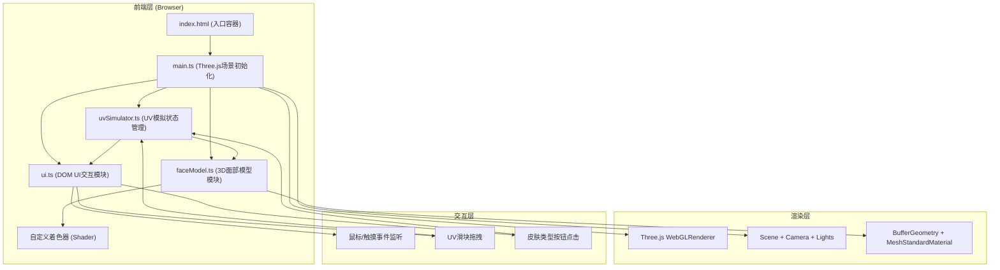

## 1. 架构设计



## 2. 技术说明
- **前端框架**：无框架，原生TypeScript + DOM操作（保持轻量，满足性能要求）
- **3D引擎**：Three.js@0.160.0（低多边形面部模型、着色器材质、粒子系统）
- **构建工具**：Vite@5（HMR热更新，端口5173，路径别名@→src）
- **语言**：TypeScript@5（严格模式，target ES2020，module ESNext）
- **样式**：原生CSS（CSS变量、类切换动画、毛玻璃backdrop-filter）

## 3. 路由定义
| 路由 | 用途 |
|------|------|
| / | 主模拟页面（唯一页面，单页应用） |

## 4. 文件结构
```
e:\solo\VersionFast\tasks\auto271\
├── index.html              # 入口HTML，全屏容器，禁止滚动
├── package.json            # 依赖：three@0.160.0, @types/three, vite, typescript
├── vite.config.js          # Vite配置：端口5173, HMR, @别名
├── tsconfig.json           # TS严格模式配置
└── src/
    ├── main.ts             # 主入口：初始化场景/相机/渲染器/灯光/动画循环
    ├── faceModel.ts        # 面部模型：低多边形几何体生成、着色器材质、皮肤效果
    ├── uvSimulator.ts      # 状态管理：皮肤类型数据、UV计算、阶段判断逻辑
    └── ui.ts               # UI层：DOM元素创建、事件监听、动画效果
```

## 5. 核心数据模型

### 5.1 皮肤类型 (SkinType)
```typescript
interface SkinType {
  id: number;          // 1-6
  name: string;        // "I型" ~ "VI型"
  description: string; // 描述
  baseColor: string;   // 基准肤色hex，如I型#FCE4D6, VI型#3E2723
  sensitivity: number; // UV敏感度系数 1.0→0.2 递减
  pigmentTendency: number; // 色素沉着倾向 0.1→0.9 递增
}
```

### 5.2 反应阶段 (Stage)
```typescript
enum Stage {
  SAFE = 'safe',       // 安全：UV 0-2
  WARNING = 'warning', // 预警：UV 3-5
  DANGER = 'danger',   // 危险：UV 6-7
  BURN = 'burn'        // 灼伤：UV 8-11
}
```

### 5.3 UV模拟状态
```typescript
interface UVSimulatorState {
  currentSkinType: SkinType;
  uvIndex: number;           // 0-11
  erythemaIntensity: number; // 红斑强度 0-1
  pigmentationLevel: number; // 色素沉着 0-1
  currentStage: Stage;
  estimatedBurnTime: number; // 预估晒伤时间(分钟)
}
```

## 6. 核心算法

### 6.1 红斑强度计算
```typescript
// 浅色皮肤(I/II型) UV>5时激活
// intensity = max(0, (uvIndex - 5) / 6) * skinType.sensitivity
```

### 6.2 色素沉着计算
```typescript
// 深色皮肤(V/VI型)更明显
// level = (uvIndex / 11) * skinType.pigmentTendency
// 颜色加深范围：5%-15%
```

### 6.3 阶段判断
```typescript
// UV 0-2 → SAFE
// UV 3-5 → WARNING
// UV 6-7 → DANGER
// UV 8-11 → BURN
```

### 6.4 预估晒伤时间
```typescript
// burnTime = 基础时间(200分钟) / (uvIndex * sensitivity)
// 最小值：5分钟，最大值：无限(表示安全)
```

## 7. 着色器设计

### 7.1 顶点着色器
- 传递UV坐标和顶点法线到片元着色器
- 支持模型矩阵变换

### 7.2 片元着色器（核心）
- **基础肤色**：MeshStandardMaterial基础颜色
- **红斑效果**：Perlin噪声纹理叠加，阈值控制，随UV强度线性增加密度
- **色素沉着**：颜色加深混合，emissive增强(≤0.15)
- **脱皮纹理**：危险阶段以上，鳞片状网格动画剥落
- **刺痛粒子**：红斑区域表面闪烁红色粒子跳动

## 8. 性能优化策略
- 面部模型顶点数控制在~800（≤1000），使用BufferGeometry
- 粒子数量100个（≤200），使用Points + BufferGeometry
- 着色器使用预计算uniform，避免每帧复杂运算（≤0.5ms）
- 动画循环使用requestAnimationFrame，状态脏检查减少重绘
- 避免频繁创建对象，复用Geometry和Material实例
