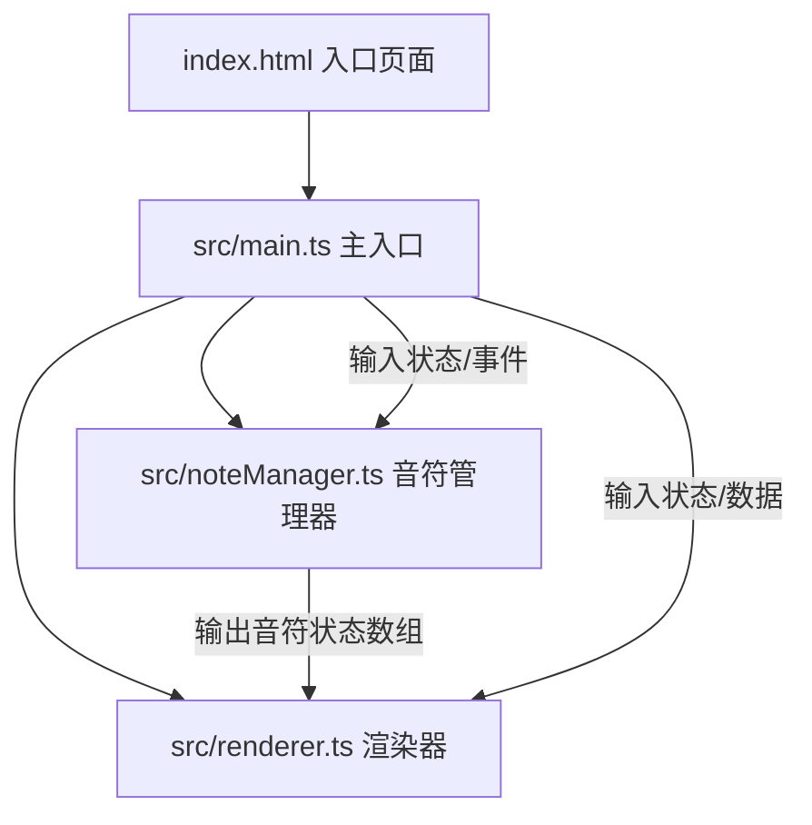

## 1. 架构设计



采用分层模块化架构：
- **入口层 (index.html)**：提供全屏Canvas容器和HUD DOM结构
- **主控制层 (main.ts)**：游戏循环、事件绑定、状态管理、模块协调
- **逻辑层 (noteManager.ts)**：音符生成、运动计算、判定逻辑
- **渲染层 (renderer.ts)**：所有Canvas绘制工作，纯渲染无业务逻辑

## 2. 技术栈描述

- **前端框架**：原生 TypeScript + HTML5 Canvas（无框架依赖，轻量高性能）
- **构建工具**：Vite 5.x（开发服务器、HMR、TypeScript编译）
- **语言标准**：TypeScript 严格模式，target ES2020，module ESNext
- **渲染方式**：Canvas 2D API，requestAnimationFrame 驱动
- **状态管理**：main.ts 中维护全局游戏状态对象

## 3. 项目文件结构

```
auto274/
├── index.html              # 入口页面，Canvas容器+HUD界面
├── package.json            # 依赖配置和脚本
├── vite.config.js          # Vite配置（端口5173，HMR）
├── tsconfig.json           # TypeScript配置
└── src/
    ├── main.ts             # 应用入口，游戏循环、事件绑定
    ├── noteManager.ts      # 音符生成、下落、判定逻辑
    └── renderer.ts         # Canvas渲染：轨道、音符、粒子、背景
```

## 4. 核心数据模型

### 4.1 游戏状态 (GameState)
```typescript
interface GameState {
  score: number;
  combo: number;
  maxCombo: number;
  consecutiveMisses: number;
  phase: 1 | 2 | 3;
  phaseTime: number;
  gameOver: boolean;
  notes: Note[];
  particles: Particle[];
  effects: Effect[];
  keyStates: Record<string, boolean>;
}
```

### 4.2 音符 (Note)
```typescript
type NoteType = 'basic' | 'hold' | 'special';
type NoteLane = 0 | 1 | 2 | 3; // A S D F 四轨
type JudgeResult = 'perfect' | 'good' | 'normal' | 'miss' | null;

interface Note {
  id: number;
  type: NoteType;
  lane: NoteLane;
  y: number;
  speed: number;
  color: string;
  label: string;
  holdDuration?: number;      // 长按持续时间(ms)
  holdProgress?: number;      // 长按已持续时间
  holdActive?: boolean;       // 长按是否正在进行
  judged: boolean;            // 是否已判定
  judgeResult?: JudgeResult;
  createdAt: number;
}
```

### 4.3 粒子 (Particle)
```typescript
interface Particle {
  id: number;
  x: number;
  y: number;
  vx: number;
  vy: number;
  color: string;
  size: number;
  life: number;      // 剩余生命(ms)
  maxLife: number;
}
```

### 4.4 特效 (Effect)
```typescript
type EffectType = 'flash' | 'judge' | 'star' | 'lightbeam';

interface Effect {
  id: number;
  type: EffectType;
  x: number;
  y: number;
  life: number;
  maxLife: number;
  value?: string | number;    // 判定文字/分数值
  color?: string;
  rotation?: number;          // 星星旋转角度
}
```

## 5. 核心算法逻辑

### 5.1 音符生成算法
- 基础音符：按当前阶段间隔时间生成，随机分配到4个轨道
- 长按音符：每10个基础音符后随机插入，第二阶段开始出现
- 特殊音符：每20个音符随机生成，第三阶段开始出现

### 5.2 判定算法
判定线位置：轨道垂直中心点
- Perfect：音符y在判定线±10px范围内
- Good：音符y在判定线±20px范围内
- Normal：音符y在判定线±30px范围内
- Miss：音符超出判定线下方30px且未按键

### 5.3 难度递进
- 阶段1 (0-30s)：速度60px/s，间隔1.2s，仅基础音符
- 阶段2 (30-60s)：速度80px/s，间隔0.9s，出现长按音符
- 阶段3 (60s+)：速度100px/s，间隔0.6s，出现特殊音符

## 6. 渲染层设计

Renderer 暴露核心方法：
- `render(ctx, state, time)`：主渲染入口，按层级绘制
- 绘制顺序：背景渐变 → 星空 → 轨道区域光束 → 五线谱 → 判定线 → 音符 → 粒子 → HUD特效 → 判定文字
