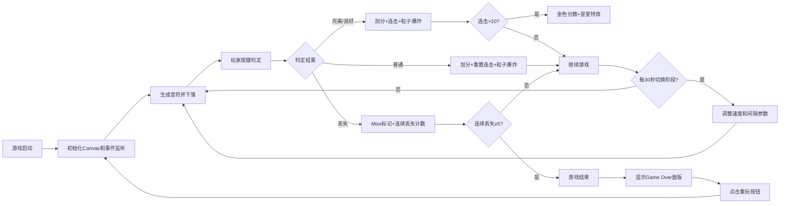

## 1. 产品概述

「弦音织梦」是一款基于键盘操作的节奏音乐游戏，玩家通过在五线谱轨道上准确击中下落音符来获得分数。游戏融合了粒子特效、动态视觉和递进式难度，为玩家带来沉浸式的音乐节奏体验。

- 目标用户：喜欢音乐节奏类游戏的玩家
- 核心价值：通过精准操作和视觉反馈获得流畅的游戏体验

## 2. 核心功能

### 2.1 功能模块

1. **主游戏界面**：五线谱轨道、下落音符、判定系统、粒子特效、HUD信息展示
2. **音符管理系统**：音符生成、下落运动、类型判定（基础/长按/特殊）
3. **键盘交互系统**：A/S/D/F四键对应、实时判定、视觉反馈
4. **分数与连击系统**：计分规则、连击加成、特殊奖励
5. **难度递进系统**：三阶段难度切换、参数动态调整
6. **视觉氛围系统**：动态背景、星空粒子、光束特效

### 2.2 页面详情

| 页面名称 | 模块名称 | 功能描述 |
|---------|---------|---------|
| 主游戏界面 | 五线谱轨道 | 五条平行线纵向滚动，中央高亮判定线 |
| 主游戏界面 | 音符渲染 | 基础音符（蓝色圆形）、长按音符（橙色长条+尾迹）、特殊音符（紫色圆形） |
| 主游戏界面 | HUD面板 | 左上角分数连击显示、右上角阶段进度条、底部按键提示 |
| 主游戏界面 | 判定反馈 | 完美/良好/普通/丢失判定文字闪烁、粒子爆炸、屏幕闪光 |
| 游戏结束界面 | 结算面板 | Game Over大字、最终分数、重玩按钮 |

## 3. 核心流程

## 4. 用户界面设计

### 4.1 设计风格

- **主色调**：深蓝(#0a0a2e) → 紫色(#2a0a3a) 动态渐变背景
- **辅助色**：蓝色(#4488ff)、橙色(#ff8844)、紫色(#aa66ff)、绿色(#00ff88)、红色(#ff2244)、金色(#ffd700)
- **字体**：无衬线字体，大字48px粗体分数、中字20px连击、小字按键提示
- **视觉风格**：深邃梦幻，星空粒子背景配合霓虹发光效果
- **动效风格**：粒子爆炸、渐隐渐显、流光特效、平滑过渡

### 4.2 页面设计概述

| 页面名称 | 模块名称 | UI元素 |
|---------|---------|--------|
| 主游戏界面 | 背景层 | 动态渐变、星空粒子(50个)、两侧光束 |
| 主游戏界面 | 轨道层 | 五条灰色平行线、中央白色发光判定线 |
| 主游戏界面 | 音符层 | 彩色圆形音符、长条长按音符+渐变色尾迹 |
| 主游戏界面 | 特效层 | 粒子爆炸(8-16微粒)、屏幕闪光、彩色流光、星星光晕 |
| 主游戏界面 | HUD层 | 毛玻璃分数面板、阶段进度条、按键提示条 |
| 游戏结束界面 | 结算层 | 红色阴影大字、最终分数、蓝色圆角重玩按钮 |

### 4.3 响应式设计

- 采用桌面优先设计，Canvas全屏自适应
- 轨道区域始终居中，根据视口宽高比调整水平位置
- 字体大小使用视口单位(vw)进行自适应缩放
- 按键提示条在底部水平居中排列

### 4.4 性能要求

- 游戏循环基于 requestAnimationFrame，目标60FPS
- 粒子数量上限200个，超出优先淘汰最旧粒子
- Canvas渲染优化，避免不必要的重绘区域
