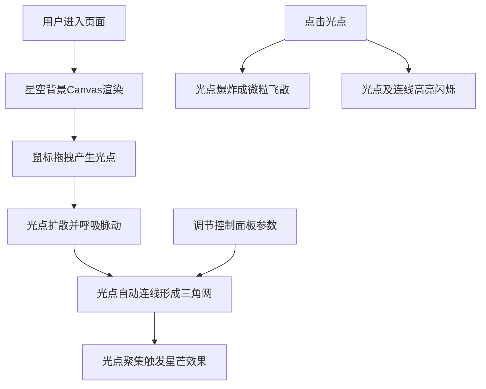

## 1. 产品概述
「幻境织影」是一款基于浏览器的交互式光影形态生成器，用户通过鼠标在画布上自由拖拽，创造出由彩色光点、动态几何光网和闪烁星芒组成的沉浸式视觉艺术作品。
- 目标用户：艺术创作者、视觉爱好者、休闲娱乐用户
- 产品价值：提供低门槛、高观赏性的交互式光影艺术创作体验

## 2. 核心功能

### 2.1 用户角色
| 角色 | 注册方式 | 核心权限 |
|------|----------|----------|
| 普通用户 | 无需注册，直接访问 | 使用全部光影创作功能 |

### 2.2 功能模块
1. **画布交互区**：鼠标拖拽生成光点、光点点击爆炸、光网动态渲染
2. **控制面板**：脉动频率调节、连线衰减距离调节、星芒触发阈值调节

### 2.3 页面详情
| 页面名称 | 模块名称 | 功能描述 |
|----------|----------|----------|
| 主页 | 画布交互区 | 全屏星空渐变背景，鼠标拖拽产生彩色光点轨迹，光点自动连接形成三角网，节点呼吸脉动，连线冷暖渐变，光点聚集触发星芒 |
| 主页 | 控制面板 | 右下角毛玻璃风格面板，三个滑块实时调节光网参数，带数字显示和颜色动画 |

## 3. 核心流程
用户打开页面后看到深邃星空背景，通过鼠标拖拽在画布上留下彩色光点，光点自动连接成动态光网。用户可通过控制面板实时调节光网形态参数，点击光点触发爆炸效果和连锁高亮闪烁。

## 4. 用户界面设计

### 4.1 设计风格
- **主色调**：深空蓝紫渐变背景（#0a0e27 → #1a1a3e）
- **强调色**：6种霓虹光色（#ff6b6b珊瑚红、#ffd93d向日葵黄、#6bcb77翡翠绿、#4d96ff电光蓝、#ff6bcb玫紫、#c084fc薰衣草紫）
- **视觉风格**：高饱和度霓虹感、深色星际主题、毛玻璃控制面板
- **控制面板**：背景rgba(255,255,255,0.1)，模糊8px，圆角10px
- **布局方式**：Flex居中布局，画布占满视口，控制面板固定右下角z-index:10

### 4.2 页面设计概览
| 页面名称 | 模块名称 | UI元素 |
|----------|----------|--------|
| 主页 | 画布交互区 | 全屏Canvas、星空渐变背景、彩色光点、三角连线光网、呼吸脉动动画、星芒闪烁、爆炸微粒 |
| 主页 | 控制面板 | 毛玻璃容器、3个参数滑块（脉动频率/连线距离/星芒阈值）、实时数值显示、颜色动画反馈 |

### 4.3 响应式设计
- 桌面优先设计，适配1366×768至1920×1080分辨率
- Canvas自适应视口尺寸（100vw × 100vh）
- 控制面板固定右下角，不随画布缩放变形
- 所有动画帧率保持60fps
