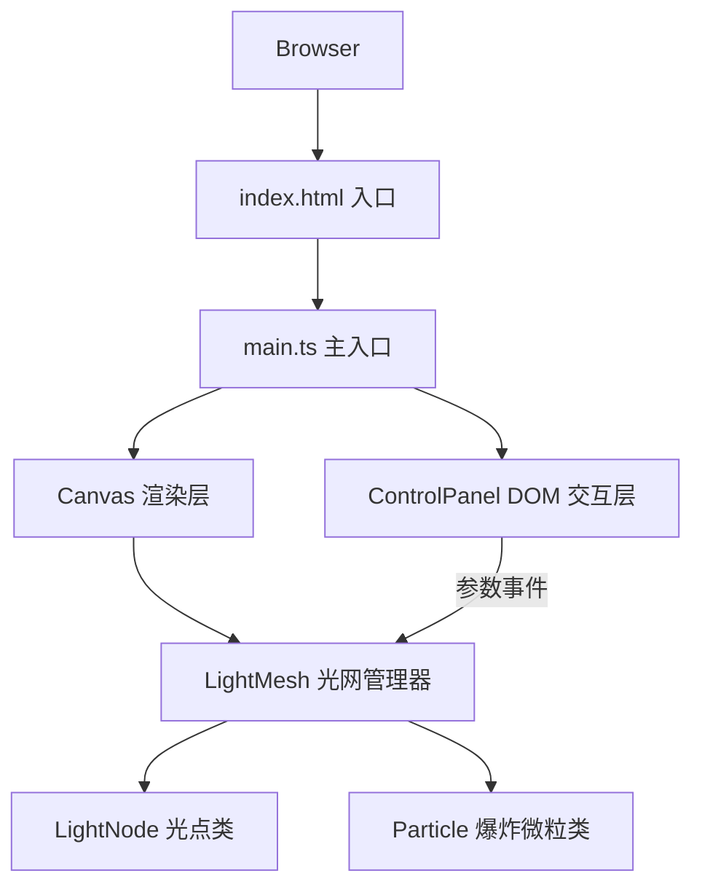

## 1. 架构设计



## 2. 技术说明
- **前端框架**：纯 TypeScript + HTML5 Canvas（无框架依赖，专注于Canvas 2D渲染性能）
- **构建工具**：Vite 5.x，端口5173，开启HMR热更新
- **语言标准**：TypeScript 严格模式，target ES2020，module ESNext
- **渲染技术**：Canvas 2D API，requestAnimationFrame 60fps动画循环
- **样式方案**：内联CSS，使用CSS变量、backdrop-filter实现毛玻璃效果

## 3. 文件结构
```
auto275/
├── package.json
├── vite.config.js
├── tsconfig.json
├── index.html
└── src/
    ├── main.ts          # 初始化Canvas、绑定事件、启动动画循环
    ├── lightNode.ts     # 光点类（位置、颜色、半径、脉动、连接关系）
    ├── lightMesh.ts     # 光网管理（光点添加、三角网连接、星芒检测、粒子爆炸）
    ├── controlPanel.ts  # 控制面板DOM交互（参数调节、事件派发）
    └── particle.ts      # 爆炸微粒类（位置、速度、颜色、生命周期）
```

## 4. 核心类设计

### 4.1 LightNode（光点类）
| 属性 | 类型 | 说明 |
|------|------|------|
| x | number | 横坐标 |
| y | number | 纵坐标 |
| color | string | 颜色值（6色之一） |
| baseRadius | number | 基础半径（8-16px随机） |
| currentRadius | number | 当前渲染半径 |
| targetRadius | number | 扩散目标半径（基础半径×2） |
| pulsePhase | number | 脉动相位 |
| connections | LightNode[] | 已连接的其他光点 |
| highlightTime | number | 高亮剩余时间（点击爆炸时） |

| 方法 | 说明 |
|------|------|
| update(dt, pulseFreq) | 每帧更新：脉动、扩散、高亮衰减 |
| draw(ctx) | 绘制光点（带光晕） |

### 4.2 Particle（爆炸微粒类）
| 属性 | 类型 | 说明 |
|------|------|------|
| x, y | number | 位置 |
| vx, vy | number | 速度向量 |
| color | string | 继承自光点的颜色 |
| size | number | 大小（3-5px） |
| life | number | 剩余生命周期（0.8s） |
| maxLife | number | 初始生命周期 |

| 方法 | 说明 |
|------|------|
| update(dt) | 更新位置、衰减生命周期 |
| draw(ctx) | 绘制微粒 |

### 4.3 LightMesh（光网管理器）
| 属性 | 类型 | 说明 |
|------|------|------|
| nodes | LightNode[] | 所有光点集合 |
| particles | Particle[] | 活跃爆炸微粒集合 |
| pulseFrequency | number | 脉动频率（0.5-3Hz，默认1） |
| connectionDistance | number | 连线衰减距离（50-200px，默认120） |
| starThreshold | number | 星芒触发阈值距离（默认30px） |

| 方法 | 说明 |
|------|------|
| addNode(x, y) | 在指定位置添加新光点 |
| updateConnections() | 基于距离重新计算三角网连线 |
| detectStarBurst() | 检测聚集光点并渲染星芒 |
| explodeNode(node) | 点击光点：生成6个微粒、触发高亮 |
| handleClick(x, y) | 处理画布点击，检测命中的光点 |
| update(dt) | 每帧更新所有光点、微粒、连线 |
| draw(ctx) | 渲染连线、星芒、光点、微粒 |

### 4.4 ControlPanel（控制面板）
| 事件 | 回调参数 | 说明 |
|------|----------|------|
| onPulseChange | number: freq | 脉动频率变化 |
| onDistanceChange | number: dist | 连线距离变化 |
| onThresholdChange | number: threshold | 星芒阈值变化 |

## 5. 渲染管线
每帧执行顺序：
1. 清空画布，绘制星空渐变背景
2. LightMesh.update() → 更新所有光点脉动/扩散/高亮、微粒飞散
3. LightMesh.updateConnections() → 基于距离阈值计算连线
4. 绘制连线（两端颜色渐变混合，2px粗细）
5. LightMesh.detectStarBurst() → 检测并绘制星芒
6. 绘制所有光点（带发光效果）
7. 绘制所有爆炸微粒

## 6. 性能优化
- 距离计算使用平方距离比较，避免开方运算
- 连线计算采用O(n²)但限制最大光点数量（视觉上自然约束）
- Canvas使用devicePixelRatio适配高清屏
- 微粒生命周期结束立即从数组中移除
