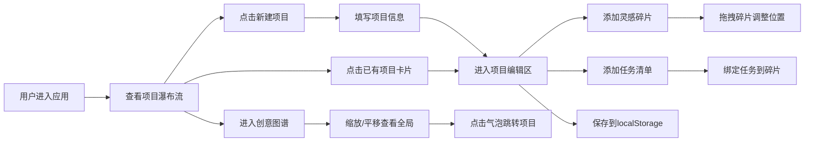

## 1. 产品概述

插画师创意管理工具，帮助独立插画师系统化管理创作灵感碎片、素材分类和项目进度，通过可视化创意地图呈现创作脉络。

- 核心问题：灵感碎片分散难以追溯、素材归类混乱、项目进度模糊
- 目标用户：独立插画师、视觉创作者、创意工作者
- 产品价值：将零散的创作过程结构化，通过可视化方式激发更多创意联想

## 2. 核心功能

### 2.1 功能模块

1. **项目管理页面**：瀑布流项目卡片展示、项目创建与编辑
2. **项目编辑页面**：灵感碎片自由拼贴、任务清单管理、碎片关联绑定
3. **创意图谱页面**：全项目可视化气泡网络、缩放平移交互、快速跳转

### 2.2 页面详情

| 页面名称 | 模块名称 | 功能描述 |
|---------|---------|---------|
| 项目管理 | 瀑布流卡片网格 | 以3列瀑布流展示项目卡片，随机柔和色系背景，悬停上浮阴影动画 |
| 项目管理 | 新建项目按钮 | 弹窗创建新项目（名称、描述、截止日期） |
| 项目编辑 | 灵感碎片画布 | 自由拼贴布局，支持拖拽移动（30px网格吸附）、颜色标记、图片路径 |
| 项目编辑 | 碎片连接线 | 碎片间细线连接，颜色取两者混合值，粗细随相关性(1-5)变化 |
| 项目编辑 | 任务列表面板 | 任务名、优先级（高/中/低）、状态（待办/进行中/已完成）、勾选切换 |
| 项目编辑 | 碎片任务绑定 | 任务关联碎片ID，绑定碎片显示任务图标，点击查看绑定数量 |
| 创意图谱 | Canvas气泡网络 | 气泡半径由关联任务数决定（最多5个任务时半径30px），网状连接线 |
| 创意图谱 | 悬停高亮交互 | 相邻气泡放大1.2倍，连接线变粗 |
| 创意图谱 | 缩放与平移 | 滚轮缩放（0.5-3倍），拖拽背景平移，平滑过渡动画 |

## 3. 核心流程

## 4. 用户界面设计

### 4.1 设计风格

- **主色调**：柔和暖灰背景 #f7f7f7，卡片白色 #ffffff，深灰导航栏 #2d3748
- **色系**：12种预设柔和色系用于项目卡片随机分配
- **字体**：Google Fonts - Inter，清晰现代无衬线字体
- **布局**：左侧固定导航栏（220px）+ 主体自适应区域
- **圆角与阴影**：卡片3px圆角，box-shadow: 0 2px 8px rgba(0,0,0,0.06)
- **动效**：所有交互元素 0.2-0.3s ease 过渡动画

### 4.2 页面设计概览

| 页面名称 | 模块名称 | UI 元素 |
|---------|---------|---------|
| 项目管理 | 瀑布流卡片 | 彩色圆角背景、项目名称/描述/日期、悬停上浮transition:0.3s |
| 项目编辑 | 碎片画布 | 自由拼贴、半透明拖拽、网格吸附、连接线混合色 |
| 项目编辑 | 任务列表 | 高优先级红色左边框、已完成灰色删除线、勾选框切换 |
| 创意图谱 | Canvas画布 | 气泡颜色标记、悬停高亮放大、滚轮缩放、拖拽平移 |

### 4.3 响应式设计

- 桌面端（≥1024px）：左侧固定导航栏（220px），瀑布流3列
- 平板（768px-1023px）：导航栏收起到顶部（60px高度），瀑布流2列
- 移动端（<768px）：瀑布流1列，触控优化拖拽与缩放

### 4.4 性能要求

- 动画帧率稳定在50fps以上
- 碎片数量≤200时拖拽和缩放无卡顿
- localStorage读写操作异步化避免阻塞UI
