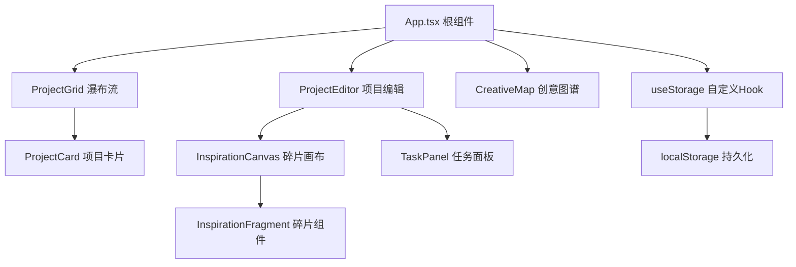
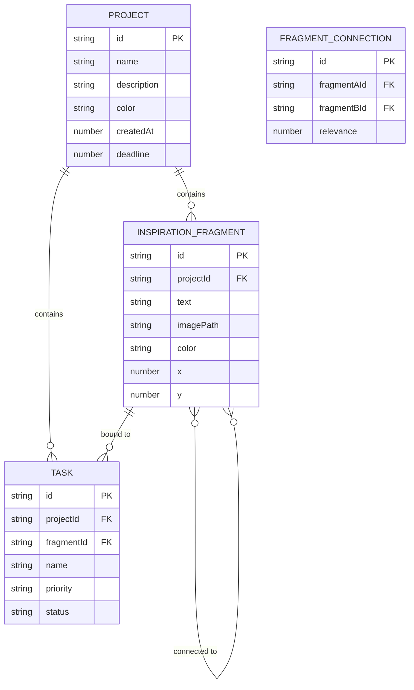

## 1. 架构设计



## 2. 技术选型说明

- **前端框架**：React 18 + TypeScript，Vite构建工具
- **状态管理**：React Hooks (useState, useEffect) + 自定义 useStorage
- **渲染方案**：
  - 项目卡片和编辑区：React DOM + CSS
  - 创意图谱：Canvas 2D API 渲染气泡网络
- **数据持久化**：localStorage（键名：`creative-studio-data`）
- **唯一ID**：uuid 库
- **图标**：lucide-react
- **动画**：CSS transitions 0.2-0.3s ease，Canvas requestAnimationFrame

## 3. 路由与视图

| 路由/视图 | 对应组件 | 用途 |
|-----------|---------|------|
| projects | ProjectGrid | 项目瀑布流首页 |
| editor/:projectId | ProjectEditor | 单个项目编辑区 |
| map | CreativeMap | 全局创意图谱 |

使用简单的状态切换（非 react-router）管理视图，符合用户要求的轻量级实现。

## 4. 数据模型

### 4.1 ER 图



### 4.2 TypeScript 类型定义

```typescript
interface Project {
  id: string;
  name: string;
  description: string;
  color: string;
  createdAt: number;
  deadline: number;
}

interface InspirationFragment {
  id: string;
  projectId: string;
  text: string;
  imagePath: string;
  color: string;
  x: number;
  y: number;
}

type Priority = 'high' | 'medium' | 'low';
type TaskStatus = 'todo' | 'in-progress' | 'done';

interface Task {
  id: string;
  projectId: string;
  fragmentId: string | null;
  name: string;
  priority: Priority;
  status: TaskStatus;
}

interface FragmentConnection {
  id: string;
  fragmentAId: string;
  fragmentBId: string;
  relevance: number; // 1-5
}

interface AppData {
  projects: Project[];
  fragments: InspirationFragment[];
  tasks: Task[];
  connections: FragmentConnection[];
}
```

## 5. 文件结构

```
src/
├── App.tsx                  # 根组件，路由与全局状态
├── types.ts                 # TypeScript 类型定义
├── constants.ts             # 12种柔和色系、色盘等常量
├── hooks/
│   └── useStorage.ts        # localStorage 封装 Hook
├── utils/
│   └── colors.ts            # 颜色混合等工具函数
└── components/
    ├── ProjectGrid.tsx      # 瀑布流网格
    ├── ProjectCard.tsx      # 单个项目卡片
    ├── ProjectEditor.tsx    # 项目编辑区
    ├── InspirationCanvas.tsx # 碎片画布
    ├── InspirationFragment.tsx # 碎片组件
    ├── TaskPanel.tsx        # 任务面板
    ├── CreativeMap.tsx      # Canvas 创意图谱
    └── Sidebar.tsx          # 左侧导航栏
```

## 6. 性能优化策略

1. **碎片拖拽**：使用 requestAnimationFrame 同步位置更新，避免每像素触发 re-render
2. **Canvas 渲染**：创意图谱使用 requestAnimationFrame 循环，仅在必要时重绘
3. **Memo 优化**：React.memo 包裹碎片和卡片组件，减少不必要重渲染
4. **节流防抖**：localStorage 保存操作使用 debounce（500ms）
5. **虚拟 DOM**：React 18 并发特性确保 50fps 以上帧率
6. **CSS 优化**：使用 transform 而非 top/left 实现拖拽动画，触发 GPU 加速
