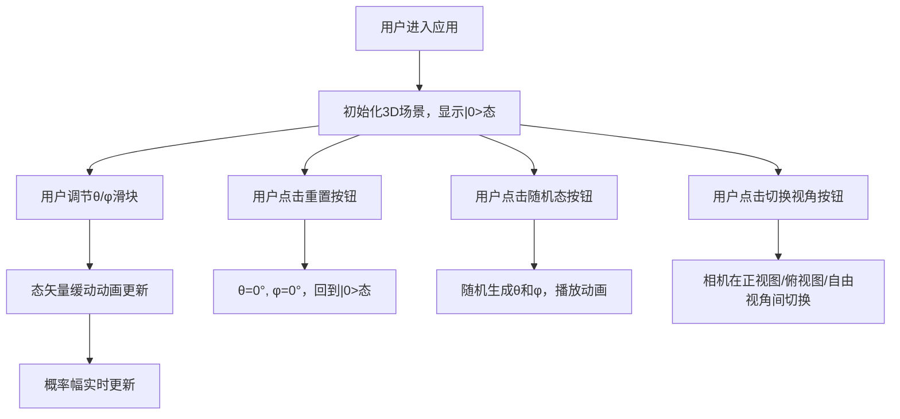

## 1. 产品概述

「量子流形」是一款交互式3D量子态可视化应用，帮助用户直观理解量子比特的叠加态概念。用户可在三维空间中观察Bloch球表示，并通过调节参数实时改变态矢量方向和概率幅分布。

- 目标用户：物理学学习者、量子计算爱好者、教育工作者
- 产品价值：将抽象的量子力学概念通过视觉化方式呈现，降低理解门槛

## 2. 核心功能

### 2.1 功能模块

1. **主场景页面**：Bloch球3D渲染、态矢量展示、概率幅可视化、控制面板

### 2.2 页面详情

| 页面名称 | 模块名称 | 功能描述 |
|---------|---------|---------|
| 主场景页面 | Bloch球渲染 | 三维球体模型，含坐标轴、赤道环、经线网格 |
| 主场景页面 | 态矢量展示 | 带渐变色彩的箭头，带缓动动画，颜色随θ变化 |
| 主场景页面 | 概率幅可视化 | 2D圆形图，左右半圆分别展示|0>和|1>概率 |
| 主场景页面 | 参数控制面板 | θ和φ滑块、重置/随机态/切换视角按钮 |

## 3. 核心流程

用户进入应用后，看到默认|0>态的Bloch球表示。可通过滑块调节θ和φ角度，态矢量实时更新并播放缓动动画，概率幅同步变化。用户可点击重置回到初始状态、生成随机量子态，或切换不同视角观察。

## 4. 用户界面设计

### 4.1 设计风格

- 主色调：深空渐变背景（#0a0e27 → #1a1a3e），营造科技感与宇宙氛围
- 强调色：X轴红#ff6b6b、Y轴绿#6bcb77、Z轴蓝#4d96ff、概率|0>#ffd93d、概率|1>#6bcb77
- 按钮：圆角设计，背景#2d2d2d，hover#4d4d4d，点击scale(0.95)
- 字体：现代无衬线字体，字号14px，控制面板文字#e0e0e0
- 面板：毛玻璃效果（backdrop-filter: blur(10px)），背景rgba(30,30,60,0.7)，圆角12px

### 4.2 页面设计概览

| 页面名称 | 模块名称 | UI元素 |
|---------|---------|--------|
| 主场景页面 | 3D渲染区域 | Three.js全屏画布，深空背景 |
| 主场景页面 | 控制面板 | 毛玻璃效果面板，滑块、按钮、标签 |
| 主场景页面 | 概率幅显示 | 右下角圆形概率图，左右半圆带百分比文字 |
| 主场景页面 | 视角控制按钮 | 右上角三个功能按钮 |

### 4.3 响应式设计

- 桌面端（≥768px）：控制面板固定在屏幕侧边/底部，展开全部控件
- 移动端（<768px）：控制面板折叠为底部固定栏（高60px），点击展开
- 触控优化：滑块支持触控拖动，按钮放大触控区域

### 4.4 3D场景指南

- 环境：深空渐变背景，环境光+方向光组合
- 光照：AmbientLight(0xffffff, 0.6) + DirectionalLight(0xffffff, 0.8)
- 相机：PerspectiveCamera，初始视角为45°斜视，可通过OrbitControls自由交互
- 动画：态矢量采用0.5s easeOutCubic缓动，相机切换0.8s动画
- 性能：帧率≥55fps，动画与requestAnimationFrame同步
