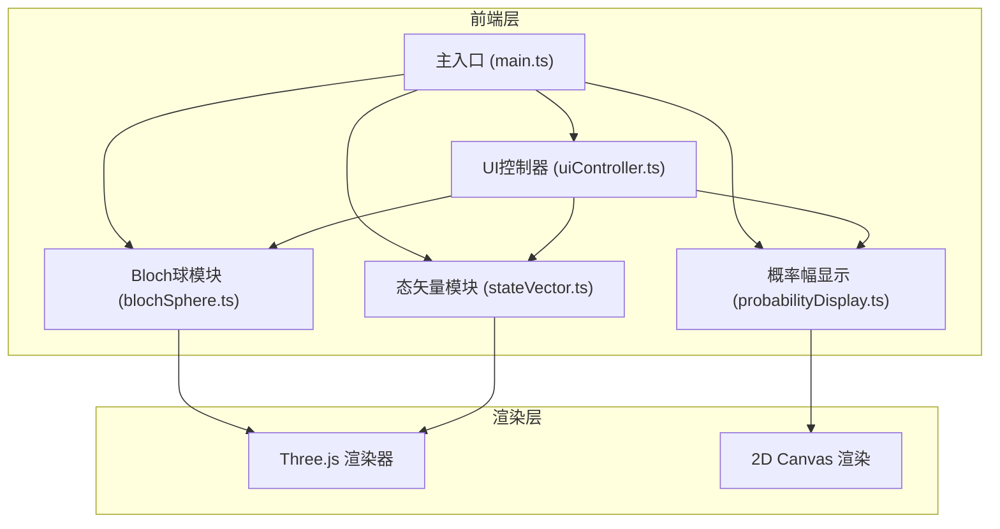

## 1. 架构设计



## 2. 技术描述

- 前端框架：TypeScript + Vite
- 3D渲染：three@0.160.0
- 类型定义：@types/three
- 构建工具：Vite（端口5173，开启HMR）
- 后端：无（纯前端应用）

## 3. 路由定义

| 路由 | 用途 |
|-----|------|
| / | 主应用页面，包含3D场景和控制面板 |

## 4. 文件结构

```
.
├── package.json
├── vite.config.js
├── tsconfig.json
├── index.html
└── src/
    ├── main.ts              # 应用入口：场景、相机、渲染器初始化
    ├── blochSphere.ts       # Bloch球体：坐标轴、赤道环、经线网格
    ├── stateVector.ts       # 态矢量：箭头几何体、颜色渐变、缓动动画
    ├── probabilityDisplay.ts # 概率幅：2D Canvas圆形图渲染
    └── uiController.ts      # UI控制：滑块监听、按钮事件、参数传递
```

## 5. 模块职责与接口

### 5.1 BlochSphere 类

```typescript
class BlochSphere {
  constructor(scene: THREE.Scene)
  updateStateVector(theta: number, phi: number): void
}
```
- 创建半径2单位的球体参考模型
- 三个正交坐标轴（X红、Y绿、Z蓝），长度3单位，带箭头和Sprite标签
- 赤道环（半径2，半透明白色，opacity 0.3）
- 12条经线（LineSegments，白色，opacity 0.15）

### 5.2 StateVector 类

```typescript
class StateVector {
  constructor(scene: THREE.Scene)
  update(theta: number, phi: number): void
  animate(delta: number): void
}
```
- 箭头：CylinderGeometry箭杆（高随|0>概率变化）+ ConeGeometry箭尖
- 颜色：θ=0°时#ff6b6b，θ=180°时#4d96ff，HSL插值
- 缓动：0.5s easeOutCubic动画

### 5.3 ProbabilityDisplay 类

```typescript
class ProbabilityDisplay {
  constructor(container: HTMLElement)
  update(theta: number): void
}
```
- Canvas 2D渲染圆形概率图
- 左半圆|0>（#ffd93d），右半圆|1>（#6bcb77）
- 中央显示百分比文字

### 5.4 UIController 类

```typescript
class UIController {
  constructor(
    blochSphere: BlochSphere,
    stateVector: StateVector,
    probabilityDisplay: ProbabilityDisplay
  )
  onReset(callback: () => void): void
  onRandom(callback: (theta: number, phi: number) => void): void
  onViewChange(callback: (view: ViewType) => void): void
}
```
- 监听θ滑块（0-180°）和φ滑块（0-360°）
- 重置、随机态、切换视角按钮
- 滑块背景渐变色：θ用红→蓝，φ用紫→橙

## 6. 性能优化

- 所有动画与requestAnimationFrame同步
- 仅在参数变化时触发重新计算
- 几何体复用，避免频繁创建销毁
- 概率图Canvas仅在θ变化时重绘
- 使用类型化数组优化Three.js性能
