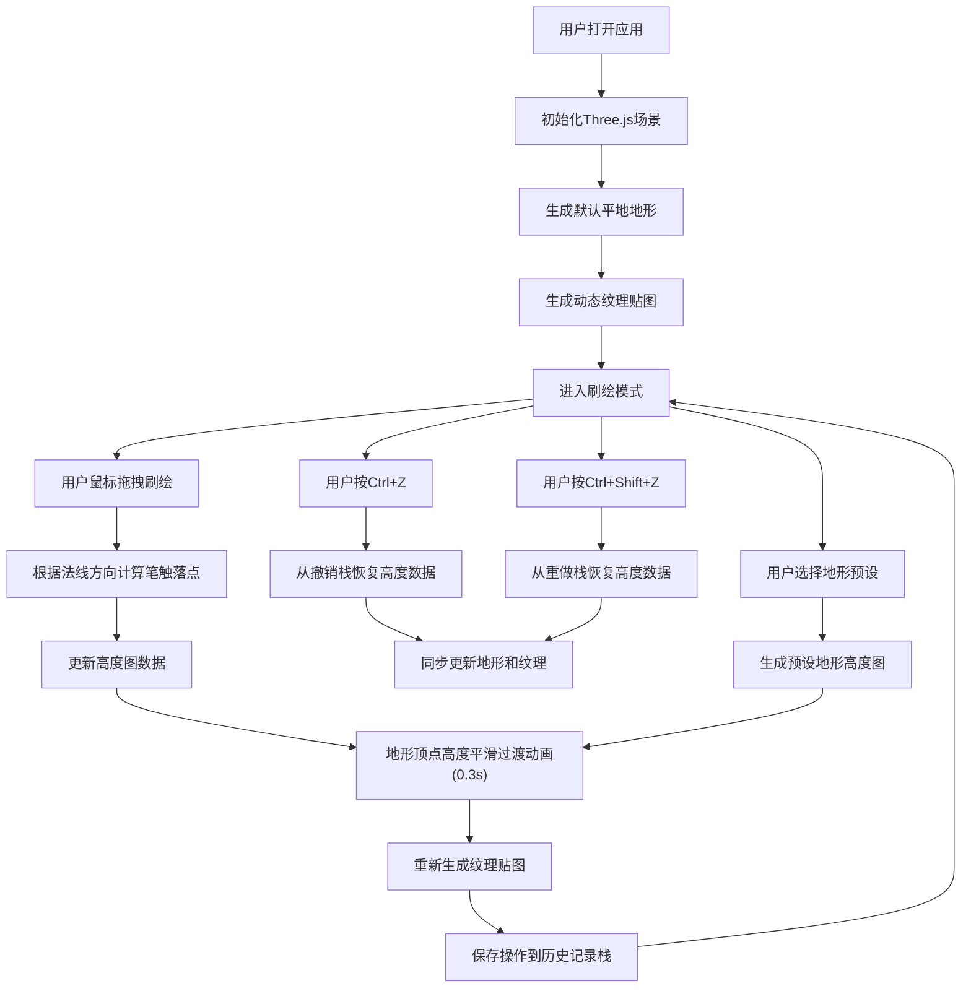

## 1. 产品概述
3D地貌纹理刷绘沙盘应用，为数字地形艺术家提供实时刷绘并自动生成逼真地形细节的工具。用户可在浏览器中通过鼠标拖拽绘画，实时生成3D地形网格和动态纹理。

## 2. 核心功能

### 2.1 用户角色
| 角色 | 注册方式 | 核心权限 |
|------|----------|----------|
| 数字地形艺术家 | 无需注册 | 使用所有刷绘和纹理生成功能 |

### 2.2 功能模块
1. **主视口模块**: 3D地形渲染、实时刷绘交互、笔刷预览
2. **工具栏模块**: 刷子大小滑块、强度滑块、地形预设按钮、撤销重做按钮
3. **纹理生成模块**: 根据高度动态生成草地/岩石/雪地纹理
4. **历史记录模块**: 撤销/重做操作管理

### 2.3 页面详情
| 页面名称 | 模块名称 | 功能描述 |
|----------|----------|----------|
| 主视口 | 3D场景渲染 | 使用Three.js渲染地形网格，支持OrbitControls视角控制 |
| 主视口 | 实时刷绘 | 鼠标拖拽在地形上刷出隆起/凹陷，圆形渐变笔触，法线贴合 |
| 主视口 | 笔刷预览 | 半透明蓝色圆环跟随鼠标，实时显示刷子大小 |
| 主视口 | 帧率显示 | 右上角显示实时FPS（绿色14px数字） |
| 左侧工具栏 | 刷子大小滑块 | 半径5-50像素调节 |
| 左侧工具栏 | 刷子强度滑块 | 0.1-1.0强度调节 |
| 左侧工具栏 | 地形预设按钮 | 山地/丘陵/盆地三种预设，一键生成初始地形 |
| 左侧工具栏 | 撤销重做按钮 | 撤销最近5步(Ctrl+Z)，重做最近3步(Ctrl+Shift+Z) |

## 3. 核心流程

## 4. 用户界面设计

### 4.1 设计风格
- **主色调**: 深色背景 `#1a1a1a`，文字 `#e0e0e0`，强调色 `#4a9eff`
- **按钮风格**: 毛玻璃半透明背景，悬停缩放0.95倍，阴影加深
- **字体**: 无衬线字体，FPS显示使用等宽字体14px
- **布局风格**: 左侧垂直工具栏(60px宽) + 主视口全屏
- **图标风格**: 简洁线性图标，使用emoji替代图标

### 4.2 页面设计概述
| 页面名称 | 模块名称 | UI元素 |
|----------|----------|--------|
| 主视口 | 3D场景 | 全屏Three.js Canvas，深色背景，十字准星光标 |
| 主视口 | FPS显示 | 右上角绿色#00ff00数字，14px等宽字体 |
| 主视口 | 笔刷预览 | 半透明蓝色圆环，跟随鼠标移动 |
| 左侧工具栏 | 容器 | 宽度60px，毛玻璃半透明(backdrop-filter: blur)，背景rgba(26,26,26,0.8) |
| 左侧工具栏 | 大小滑块 | 垂直滑块，渐变色填充动画，悬停高亮 |
| 左侧工具栏 | 强度滑块 | 垂直滑块，渐变色填充动画，悬停高亮 |
| 左侧工具栏 | 预设按钮 | 山地⛰️/丘陵🏔️/盆地🏞️，悬停缩放效果 |
| 左侧工具栏 | 撤销重做 | ↩️撤销/↪️重做按钮，悬停缩放效果 |

### 4.3 响应性
- 桌面端优先设计，主视口自适应窗口大小
- 工具栏固定左侧60px宽度
- 触摸设备优化（可选）

### 4.4 3D场景指导
- **环境**: 深色雾效背景，营造沉浸感
- **光照**: 环境光 + 方向光模拟太阳光，产生地形阴影
- **相机设置**: PerspectiveCamera，初始45度俯视角度，支持OrbitControls旋转/缩放/平移
- **构图**: 地形居中，占据视口主要区域
- **交互**: 鼠标左键刷绘，右键旋转视角，滚轮缩放
- **后处理**: 轻微抗锯齿，确保地形边缘平滑
- **性能**: 地形网格不超过10000三角面，纹理2048x2048
