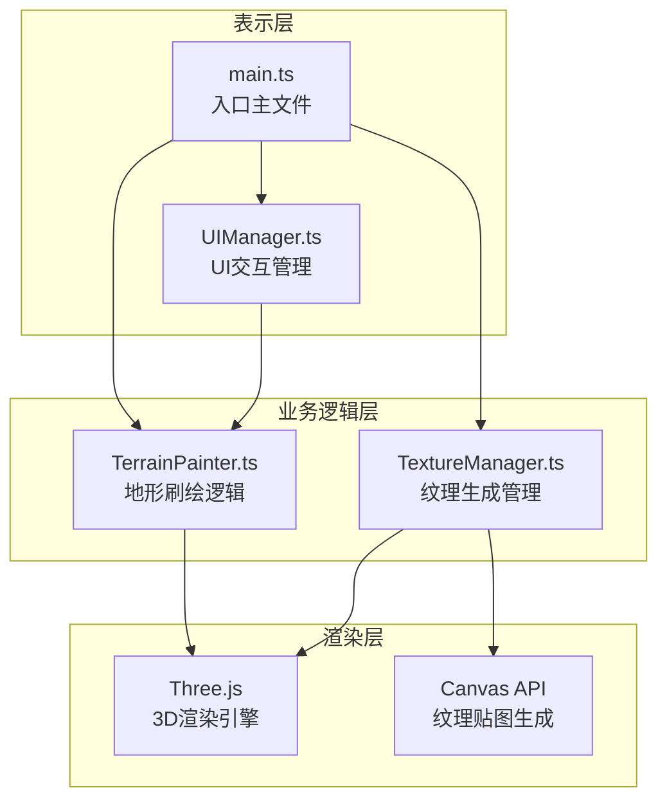
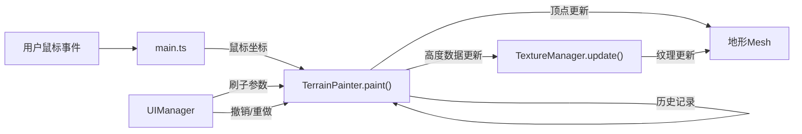

## 1. 架构设计



## 2. 技术描述
- **前端**: TypeScript + Three.js + Canvas API
- **构建工具**: Vite
- **项目类型**: 纯前端3D应用，无后端

## 3. 文件结构与调用关系

| 文件路径 | 职责 | 输入 | 输出 | 依赖 |
|---------|------|------|------|------|
| `package.json` | 项目依赖配置 | - | - | three, @types/three, vite, typescript |
| `vite.config.js` | Vite构建配置 | - | - | - |
| `tsconfig.json` | TypeScript编译配置 | - | - | - |
| `index.html` | 应用入口HTML | - | - | main.ts |
| `src/main.ts` | 应用入口，场景初始化 | 刷子事件 | Three.js场景 | TerrainPainter, TextureManager, UIManager |
| `src/TerrainPainter.ts` | 地形网格生成与刷绘 | 刷子参数, 高度数据 | 地形Mesh, 高度图Float32Array | three |
| `src/TextureManager.ts` | 纹理贴图生成 | 高度数据 | Canvas纹理 | Canvas API |
| `src/UIManager.ts` | UI控件管理 | 用户交互事件 | 刷子参数, 操作指令 | - |

## 4. 数据流向



## 5. 核心数据结构

### 5.1 TerrainPainter 数据结构
```typescript
interface BrushParams {
    size: number;      // 刷子半径 (5-50)
    strength: number;     // 刷子强度 (0.1-1.0)
    position: THREE.Vector3;  // 刷子世界坐标
    normal: THREE.Vector3;    // 法线方向
}

interface TerrainData {
    heights: Float32Array;       // 高度图数据
    gridSize: number;           // 网格分辨率
    size: number;             // 地形尺寸
}

interface HistoryState {
    heights: Float32Array;       // 快照高度数据
    timestamp: number;
}
```

### 5.2 TextureManager 数据结构
```typescript
interface HeightZone {
    min: number;           // 最小高度百分比
    max: number;           // 最大高度百分比
    baseColor: [number, number, number];  // RGB基础色
}
```

## 6. 性能优化策略

1. **网格优化**: 使用100x100顶点网格 = 10000三角面以内
2. **纹理优化**: 2048x2048 Canvas纹理，按需重绘仅在高度变化时
3. **动画优化**: 使用requestAnimationFrame，高度过渡使用线性插值(0.3s)
4. **内存优化**: 历史记录使用Float32Array共享内存，限制撤销5步/重做3步
5. **渲染优化**: 启用Three.js抗锯齿，按需更新顶点而非重建网格
