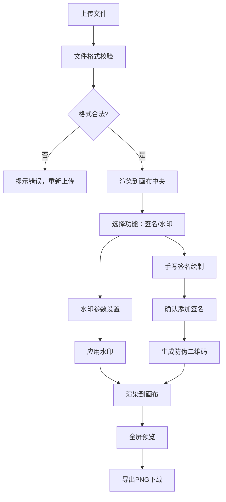

## 1. 产品概述
「霓虹签章」是一款面向个人与企业用户的电子签名与文档水印管理Web应用，提供便捷的PDF/图片文件签名、水印添加、防伪校验能力，解决传统纸质签章效率低、易伪造的痛点。
- 核心目标：让用户无需安装专业软件即可在浏览器中完成文件签名与水印添加，生成带防伪信息的电子文件
- 目标用户：商务人士、设计师、法务人员、个体经营者等需要电子签章的用户群体

## 2. 核心功能

### 2.1 用户角色
| 角色 | 注册方式 | 核心权限 |
|------|----------|----------|
| 普通用户 | 无需注册，直接使用 | 文件上传、创建签名、添加水印、预览导出 |

### 2.2 功能模块
1. **文件上传模块**：拖拽/点击上传，PDF（首页）/PNG/JPG格式支持，自动缩放适配画布
2. **手写签名模块**：独立签名面板绘制，路径实时显示，撤销操作，位置/缩放/旋转调整
3. **水印管理模块**：文字水印/图片水印，密铺/单例模式，透明度/密度/旋转设置
4. **防伪校验模块**：签名路径SHA-256哈希计算，二维码防伪叠加，防篡改验证
5. **预览导出模块**：全屏预览，放大查看，PNG格式导出下载

### 2.3 页面详情
| 页面名称 | 模块名称 | 功能描述 |
|----------|----------|----------|
| 主编辑页面 | 顶部工具栏 | 文件上传、签名工具、水印工具、预览、导出、撤销/重做 |
| 主编辑页面 | 文件上传区 | 拖拽上传区域，点击选择文件，格式提示 |
| 主编辑页面 | 画布编辑区 | 文件画布展示，签名拖拽，水印编辑 |
| 主编辑页面 | 签名绘制面板 | 微米黄色纸张质感背景，手写绘制，撤销，确认/取消 |
| 主编辑页面 | 水印设置侧边栏 | 文字/图片水印切换，参数设置，密铺/单例模式 |
| 主编辑页面 | 全屏预览层 | 原始尺寸展示，缩放查看，关闭返回 |

## 3. 核心流程
用户上传文件 → 选择签名/水印工具 → 在画布上编辑签名位置/水印参数 → 系统自动生成防伪信息 → 预览最终效果 → 导出PNG下载

## 4. 用户界面设计

### 4.1 设计风格
- **主题色彩**：深色主题，背景#1a1a2e，主面板#16213e，工具栏霓虹蓝渐变#0f3460→#e94560，签名面板#f5f0e1微米黄
- **按钮风格**：圆角按钮，悬停呼吸光效（box-shadow脉冲动画），霓虹边框发光效果
- **字体**：标题使用醒目现代字体，正文使用高可读性无衬线字体
- **布局风格**：卡片式布局，顶部工具栏+中央画布+侧边抽屉，签名面板为模态弹窗
- **动效**：侧边抽屉0.3s ease滑入，按钮悬停transition光效，拖拽半透明跟随反馈

### 4.2 页面设计概览
| 页面名称 | 模块名称 | UI元素 |
|----------|----------|--------|
| 主编辑页面 | 顶部工具栏 | 渐变背景，图标按钮组，悬停光效，响应式汉堡菜单 |
| 主编辑页面 | 文件上传区 | 虚线边框，上传图标，拖拽提示文字，高亮反馈 |
| 主编辑页面 | 画布编辑区 | 深色背景衬托，文件居中显示，拖拽轮廓线反馈 |
| 主编辑页面 | 签名绘制面板 | 微米黄纸张质感，柔和阴影拖尾，绘制画笔平滑 |
| 主编辑页面 | 水印设置侧边栏 | 右侧滑入，表单控件，实时预览缩略图 |
| 主编辑页面 | 全屏预览层 | 黑色半透明遮罩，居中展示，缩放控制 |

### 4.3 响应式设计
- 桌面端（>768px）：顶部工具栏完整展示，画布居中，侧边抽屉从右侧滑入
- 平板/移动端（<768px）：工具栏折叠为汉堡菜单，画布自适应宽度，侧边抽屉全屏覆盖
- 所有拖拽交互提供视觉反馈：拖拽对象半透明+跟随光标移动的轮廓线

## 5. 性能要求
- 签名绘制帧率≥50fps
- 水印密铺渲染≤200ms
- 导出PNG响应时间≤2秒
- 画布最大尺寸限制：800x1200像素
