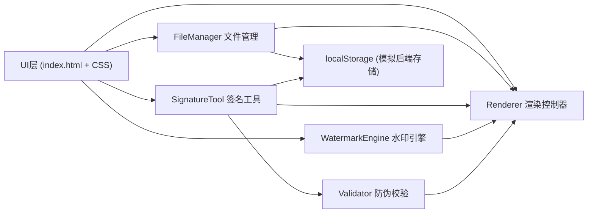

## 1. 架构设计



## 2. 技术描述
- **前端框架**：原生 TypeScript（无UI框架），基于 Canvas 2D API
- **构建工具**：Vite 5.x，端口5173，开启HMR热更新
- **语言标准**：TypeScript 严格模式，target ES2020，module ESNext
- **数据存储**：localStorage 模拟后端数据库与文件存储
- **样式方案**：原生 CSS，CSS 变量管理主题，CSS 动画实现交互反馈

## 3. 项目文件结构
| 文件 | 职责 |
|------|------|
| package.json | 项目依赖与启动脚本（vite, typescript） |
| vite.config.js | Vite 基础配置，端口5173，HMR开启 |
| tsconfig.json | TS严格模式，ES2020+ESNext |
| index.html | 入口页面，上传区/画布/预览区/工具栏 |
| src/fileManager.ts | 文件上传、类型检测、PDF首页提取、ArrayBuffer输出 |
| src/signatureTool.ts | 手写签名路径、撤销栈、位置/缩放/旋转管理 |
| src/watermarkEngine.ts | 文字/图片水印渲染、密铺算法、透明度控制 |
| src/validator.ts | SHA-256哈希模拟、防伪QR码Canvas生成、篡改校验 |
| src/renderer.ts | 画布合成、预览渲染、PNG Blob导出 |

## 4. 核心数据模型

### 4.1 文件元数据
```typescript
interface FileMeta {
  id: string;
  name: string;
  type: 'pdf' | 'png' | 'jpg';
  size: number;
  width: number;
  height: number;
  dataUrl: string;
  uploadedAt: number;
}
```

### 4.2 签名数据
```typescript
interface SignatureData {
  id: string;
  paths: Point[][];
  x: number;
  y: number;
  scale: number;
  rotation: number;
  hash: string;
  qrDataUrl: string;
  createdAt: number;
}

interface Point {
  x: number;
  y: number;
  pressure?: number;
}
```

### 4.3 水印配置
```typescript
interface WatermarkConfig {
  id: string;
  type: 'text' | 'image';
  mode: 'tile' | 'single';
  text?: string;
  fontSize?: number;
  color?: string;
  imageDataUrl?: string;
  imageWidth?: number;
  opacity: number;
  rotation: number;
  density?: number;
  x?: number;
  y?: number;
}
```

## 5. 核心模块API定义

### 5.1 FileManager
```typescript
class FileManager {
  static validateFile(file: File): boolean;
  static async processFile(file: File): Promise<{
    meta: FileMeta;
    buffer: ArrayBuffer;
    image: HTMLImageElement;
  }>;
  static saveToStorage(meta: FileMeta): void;
  static loadFromStorage(id: string): FileMeta | null;
}
```

### 5.2 SignatureTool
```typescript
class SignatureTool {
  constructor(canvas: HTMLCanvasElement);
  startDrawing(e: MouseEvent | TouchEvent): void;
  draw(e: MouseEvent | TouchEvent): void;
  stopDrawing(): void;
  undo(): boolean;
  clear(): void;
  getSignatureData(): { paths: Point[][]; width: number; height: number };
  confirmSignature(baseX: number, baseY: number): SignatureData;
}
```

### 5.3 WatermarkEngine
```typescript
class WatermarkEngine {
  static renderTextWatermark(
    ctx: CanvasRenderingContext2D,
    config: WatermarkConfig,
    canvasWidth: number,
    canvasHeight: number
  ): void;
  static renderImageWatermark(
    ctx: CanvasRenderingContext2D,
    config: WatermarkConfig,
    canvasWidth: number,
    canvasHeight: number
  ): void;
}
```

### 5.4 Validator
```typescript
class Validator {
  static computeHash(paths: Point[][]): Promise<string>;
  static generateQRCode(hash: string, size?: number): HTMLCanvasElement;
  static verifySignature(signature: SignatureData): Promise<boolean>;
}
```

### 5.5 Renderer
```typescript
class Renderer {
  constructor(
    canvas: HTMLCanvasElement,
    previewCanvas?: HTMLCanvasElement
  );
  setBackground(image: HTMLImageElement): void;
  addSignature(signature: SignatureData): void;
  removeSignature(id: string): void;
  updateSignature(id: string, updates: Partial<SignatureData>): void;
  setWatermark(config: WatermarkConfig | null): void;
  render(): void;
  exportPNG(): Promise<Blob>;
  enterFullscreenPreview(): void;
  exitFullscreenPreview(): void;
}
```

## 6. 性能优化策略
- 签名绘制采用离屏Canvas预渲染，减少重绘区域
- 水印密铺使用缓存Canvas，重复模式下复用绘制结果
- 导出时使用 Canvas.toBlob() 异步处理，避免阻塞主线程
- 拖拽交互使用 requestAnimationFrame 节流，确保60fps流畅度
- 文件上传时限制最大尺寸，超出则自动压缩至画布最大800x1200
