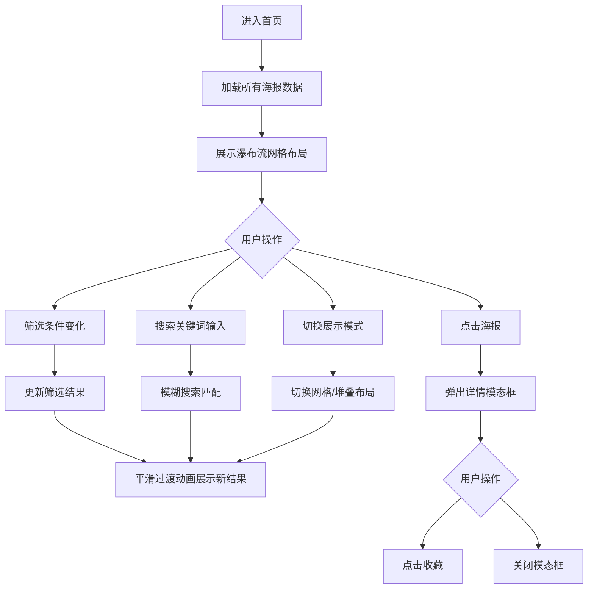

## 1. 产品概述

「帧藏馆」是一款面向独立电影爱好者的沉浸式电影海报画廊Web应用，用户可在其中浏览、筛选不同年代和国别的经典电影海报，并能以实体相册般的体验切换海报展示方式。

- 目标用户：电影爱好者、海报收藏家、电影文化研究者
- 产品价值：提供沉浸式的经典电影海报浏览体验，支持多维度筛选和多种展示模式

## 2. 核心功能

### 2.1 功能模块
1. **首页海报展示**：瀑布流网格布局展示电影海报，支持悬停动效
2. **多维度筛选系统**：年代范围、国家、类型三大筛选维度
3. **展示模式切换**：网格模式与堆叠模式自由切换
4. **海报详情模态框**：点击海报查看详情，支持收藏功能
5. **实时模糊搜索**：支持按标题和剧情描述关键词搜索

### 2.2 页面详情
| 页面名称 | 模块名称 | 功能描述 |
|-----------|-------------|---------------------|
| 首页 | 顶部筛选栏 | 搜索框、年代/国家/类型筛选、展示模式切换 |
| 首页 | 海报网格区域 | 瀑布流布局展示海报卡片 |
| 首页 | 详情模态框 | 海报放大预览、电影信息展示、收藏按钮 |

## 3. 核心流程

用户进入首页 → 浏览默认展示的所有海报 → 通过筛选栏或搜索框过滤海报 → 切换网格/堆叠模式 → 点击海报查看详情 → 收藏或关闭

## 4. 用户界面设计

### 4.1 设计风格
- **主色调**：暗色主题，背景 #121212，文字 #e0e0e0
- **辅助色**：20种柔和低饱和渐变色（随机分配给海报卡片）
- **强调色**：暖黄色高亮光晕（搜索匹配时使用）
- **按钮/卡片**：圆角设计，平滑过渡动画
- **字体**：系统无衬线字体（Segoe UI、PingFang SC 等）
- **布局风格**：卡片式布局，顶部固定半透明导航栏

### 4.2 页面设计概述
| 页面名称 | 模块名称 | UI元素 |
|-----------|-------------|-------------|
| 首页 | 顶部筛选栏 | 磨砂玻璃效果半透明背景，搜索框、三个下拉选择器、模式切换按钮 |
| 首页 | 海报卡片 | 渐变圆角卡片、年代标签、评分星级、悬停上浮动画 |
| 首页 | 详情模态框 | 全屏深色模糊背景、白色圆角卡片、左右分栏布局、动画过渡 |

### 4.3 响应式
- **桌面端**（≥768px）：网格模式四列等宽，筛选栏完整展示
- **移动端**（<768px）：网格模式两列，筛选栏折叠为汉堡菜单
- **超宽屏**（≥1920px）：保持间距比例，内容居中展示

### 4.4 动画与交互
- 卡片悬停：上浮8px + 深色阴影，0.4s ease-out
- 筛选切换：旧海报淡出，新海报从下方淡入，0.5s
- 模态框：卡片缩放至屏幕中央 + 背景覆盖层，关闭时缩放+淡出
- 堆叠模式：鼠标悬停时海报上浮至最前，弹性缓动0.6s
- 下拉菜单：淡入 + 从顶部滑入，0.2s
