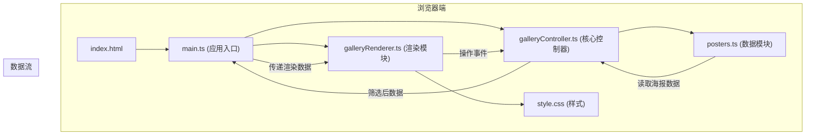

## 1. 架构设计



## 2. 技术选型说明

- **前端框架**：原生 TypeScript（用户明确要求不使用框架）
- **构建工具**：Vite@5（端口 5173，开启 HMR）
- **语言版本**：TypeScript 严格模式，Target ES2020，Module ESNext
- **数据来源**：内嵌 JSON 格式数据（posters.ts），不依赖外部 API
- **样式方案**：原生 CSS，CSS 变量，CSS 动画关键帧

## 3. 文件结构与调用关系

```
├── package.json
├── vite.config.js
├── tsconfig.json
├── index.html
└── src/
    ├── main.ts              # 入口，初始化路由和事件绑定
    ├── galleryController.ts # 核心控制器，管理数据和状态
    ├── posters.ts           # 海报数据模块
    ├── galleryRenderer.ts   # 渲染模块
    └── style.css            # 全局样式
```

**调用关系与数据流向：**
1. `main.ts` → 调用 `GalleryController` 加载首页数据
2. `galleryController.ts` → 读取 `posters.ts` 数据，提供筛选/搜索方法
3. `main.ts` → 将筛选后的数据传递给 `galleryRenderer.ts` 渲染
4. `galleryRenderer.ts` → 处理用户交互事件，回调通知 `galleryController.ts`

## 4. 数据模型

### 4.1 海报数据模型

```typescript
interface Poster {
  id: number;
  title: string;
  year: number;
  country: string;
  genre: string;
  posterUrl: string;      // 渐变背景描述，模拟海报
  rating: number;         // 1-5 星
  description: string;    // 剧情简介
  gradient: string;       // CSS 渐变字符串
}
```

### 4.2 筛选条件模型

```typescript
interface FilterOptions {
  yearRange: string | null;  // 如 "1960-1970"
  country: string | null;
  genre: string | null;
  searchQuery: string;
}
```

### 4.3 展示模式

```typescript
type DisplayMode = 'grid' | 'stack';
```

## 5. 性能优化策略

- **筛选性能**：纯内存数组操作，确保 50ms 内完成
- **动画性能**：使用 CSS transform 和 opacity，启用 GPU 加速
- **渲染优化**：使用 DocumentFragment 批量 DOM 操作
- **搜索防抖**：200ms 延迟触发，避免频繁重渲染
- **响应式优化**：CSS 媒体查询，避免不必要的 JS 计算
