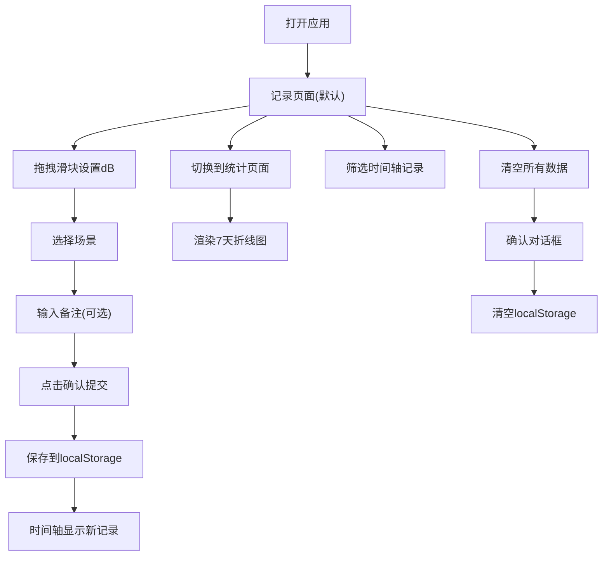

## 1. 产品概述
噪声暴露记录与可视化应用，帮助城市居民量化日常生活中的噪声环境，评估健康影响。
- 目标用户：关注生活环境噪声与健康关联的普通城市居民
- 解决问题：普通人缺乏专业设备，难以量化个人噪声暴露及健康风险
- 产品价值：提供简单易用的噪声记录工具和直观的健康影响可视化

## 2. 核心功能

### 2.1 功能模块
1. **记录页面（首页）**：分贝滑块、场景选择、备注输入、记录时间轴
2. **统计图表页面**：7天分贝变化折线图、数据可视化
3. **通用功能**：本地数据持久化、数据筛选、清空数据

### 2.2 页面详情
| 页面名称 | 模块名称 | 功能描述 |
|-----------|-------------|---------------------|
| 记录页面 | 噪声等级圆环 | 半透明渐变圆环进度条(绿→黄→红)，显示当前dB值与健康等级，拖拽滑块实时更新 |
| 记录页面 | 场景选择器 | 4个预设场景(家/办公室/交通工具/街头)，配不同图标，脉冲选择动画 |
| 记录页面 | 备注输入 | 弹窗输入框，最多100字，提交后以卡片形式保存 |
| 记录页面 | 记录时间轴 | 垂直时间线展示最近20条记录，含时间/场景/dB/等级标签，支持筛选 |
| 统计页面 | 7天折线图 | Canvas 2D绘制，X轴日期/Y轴dB值，折线按梯度变色，悬停显示数值 |
| 全局 | 数据管理 | localStorage持久化、清空确认对话框(红色警告边框)、按场景/日期筛选 |

## 3. 核心流程
用户打开应用→默认进入记录页面→通过拖拽滑块设置分贝值→选择场景→输入备注(可选)→提交记录→记录保存到时间轴→可切换到统计页面查看7天趋势。

## 4. 用户界面设计

### 4.1 设计风格
- **主色调**：深灰蓝背景 #1e293b，白色文字 #f8fafc
- **健康等级渐变**：安全 #4ade80(绿) → 警戒 #facc15(黄) → 有害/危险 #ef4444(红)
- **组件效果**：半透明毛玻璃(backdrop-filter: blur(8px), rgba(255,255,255,0.05))，统一圆角12px
- **交互动画**：按钮hover放大scale 1.05(0.2s)，点击缩小scale 0.95(0.1s)，页面切换淡入淡出(0.3s)
- **布局**：CSS Grid + Flexbox，桌面优先、移动端自适应(最小320px)

### 4.2 页面设计概述
| 页面名称 | 模块名称 | UI元素 |
|-----------|-------------|-------------|
| 记录页面 | 噪声等级圆环 | 中央dB数值，12px宽半透明渐变圆环，外侧4个等级分界标签，滑块拖拽动态旋转(0.2s ease-out) |
| 记录页面 | 场景选择器 | 4个卡片按钮，图标(房子/办公桌/汽车/马路)，选中脉冲动画(scale 1→1.15→1, 0.3s) |
| 记录页面 | 时间轴 | 垂直时间线，浅灰虚线连接，卡片含时间/场景/dB/彩色等级标签，hover显示等级稀释色背景 |
| 统计页面 | 折线图 | Canvas深色半透明背景，白色细坐标轴，折线按梯度变色，白色圆点数据点，悬停显示数值标签 |

### 4.3 响应式
- 桌面端：多列Grid布局，记录区域与时间轴并排
- 移动端(≤768px)：单列布局，按钮和卡片全宽排列，触控优化
- 最小宽度：320px

## 5. 性能要求
- 滑块拖拽、页面切换、数据筛选响应时间 < 50ms
- 统计图表渲染 < 100ms
- 所有CSS动画使用GPU加速属性(transform/opacity)
