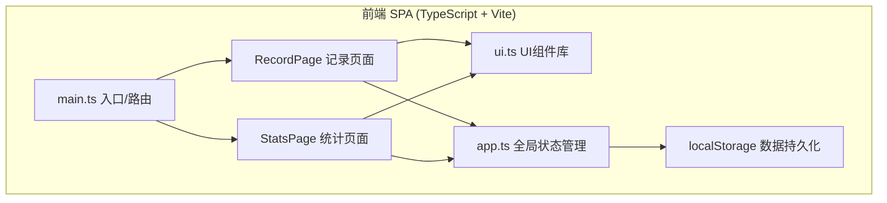
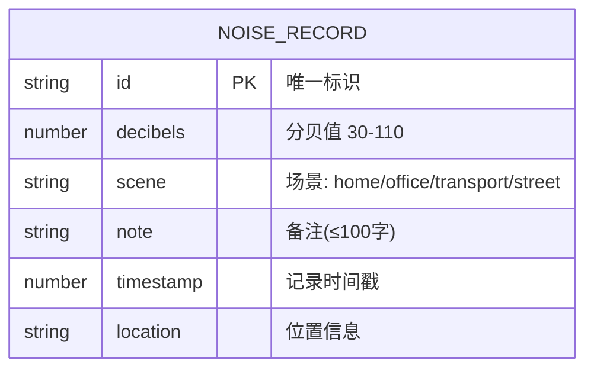

## 1. 架构设计



## 2. 技术描述
- **前端框架**：原生 TypeScript (无React/Vue依赖，用户明确指定文件组织)
- **构建工具**：Vite ^5.2
- **语言**：TypeScript ^5.4 (严格模式, target ES2020, module ESNext)
- **数据存储**：浏览器 localStorage
- **图表渲染**：Canvas 2D API

## 3. 路由定义
| 路由 | 用途 |
|-------|---------|
| / (默认) | 记录页面：分贝滑块、场景选择、记录时间轴 |
| /stats | 统计页面：7天分贝变化折线图 |

使用简单的Hash路由或自定义路由控制器(无第三方路由库依赖)。

## 4. 数据模型

### 4.1 数据模型定义



### 4.2 核心类型定义

```typescript
type SceneType = 'home' | 'office' | 'transport' | 'street';

type HealthLevel = 'safe' | 'warning' | 'harmful' | 'dangerous';

interface NoiseRecord {
  id: string;
  decibels: number;
  scene: SceneType;
  note: string;
  timestamp: number;
  location: string;
}

interface AppState {
  records: NoiseRecord[];
  currentDb: number;
  selectedScene: SceneType | null;
}

interface DailyStats {
  date: string;
  avgDb: number;
  maxDb: number;
  minDb: number;
  count: number;
}
```

## 5. 健康等级映射

| 等级 | 分贝范围 | 颜色 | 标签 |
|------|---------|------|------|
| 安全 | ≤70 dB | #4ade80 | 安全 |
| 警戒 | 70-85 dB | #facc15 | 警戒 |
| 有害 | 85-100 dB | #f97316 | 有害 |
| 危险 | ≥100 dB | #ef4444 | 危险 |

## 6. 文件结构

```
e:\solo\VersionFast\tasks\auto282\
├── package.json
├── vite.config.js
├── tsconfig.json
├── index.html
└── src/
    ├── main.ts          # 应用入口，路由控制器
    ├── app.ts           # 全局状态管理，数据持久化
    ├── pages/
    │   ├── RecordPage.ts  # 记录页面
    │   └── StatsPage.ts   # 统计页面
    └── ui.ts            # 通用UI组件库
```

## 7. 关键性能优化点
- 滑块拖拽使用 `requestAnimationFrame` 节流
- Canvas 图表渲染时缓存离屏计算
- localStorage 操作使用防抖批量写入
- 所有动画使用 CSS transform/opacity 启用GPU加速
- 时间轴记录使用虚拟列表思想(最多渲染20条)
