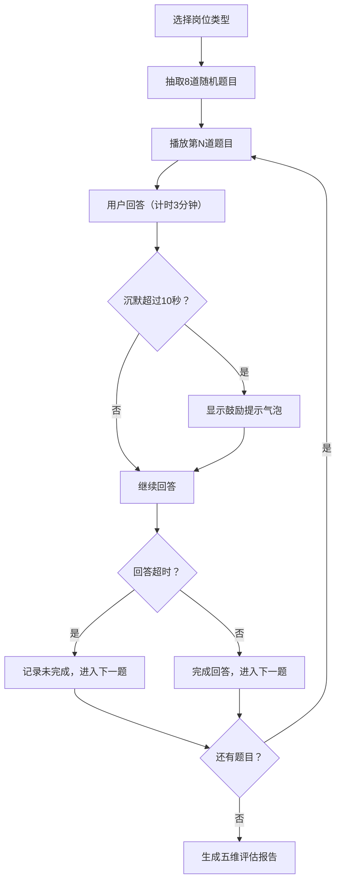

## 1. 产品概述

AI驱动的模拟面试演练工具，帮助求职者在家模拟真实面试场景，通过角色扮演和实时反馈提升面试表现。
- 目标用户：准备求职面试的求职者，涵盖技术岗位（前端、后端、数据）和通用岗位（产品、运营）
- 核心价值：提供沉浸式虚拟面试体验、多维度能力评估报告、即时语音交互反馈

## 2. 核心功能

### 2.1 用户角色
| 角色 | 注册方式 | 核心权限 |
|------|---------|---------|
| 求职者 | 无需注册，直接使用 | 选择岗位、参与模拟面试、查看评估报告 |

### 2.2 功能模块
1. **开始页面**：岗位选择界面、语音设置、开始面试按钮
2. **面试阶段**：虚拟面试官头像、题目展示、语音播报、计时器、回答输入（麦克风/键盘）、鼓励提示
3. **评估报告**：五维雷达图能力展示、分数详情、粒子动画效果

### 2.3 页面详情
| 页面名称 | 模块名称 | 功能描述 |
|---------|---------|----------|
| 开始页面 | 岗位选择 | 技术岗位（前端/后端/数据）、通用岗位（产品/运营）卡片选择 |
| 开始页面 | 语音设置 | 男声/女声切换按钮 |
| 开始页面 | 开始按钮 | 启动面试流程，磨砂玻璃卡片样式 |
| 面试阶段 | 虚拟面试官 | 纯CSS绘制圆形头像，带眨眼动画 |
| 面试阶段 | 题目展示 | 对话弹窗形式逐题播放，支持Web Speech API语音朗读 |
| 面试阶段 | 计时器 | 每题限时3分钟倒计时，顶部呼吸光条显示录音状态 |
| 面试阶段 | 回答输入 | 麦克风输入（推荐）或键盘文本输入 |
| 面试阶段 | 鼓励提示 | 沉默超过10秒显示气泡提示"你可以想一下再回答" |
| 面试阶段 | 超时处理 | 超时自动进入下一题，记录未完成状态 |
| 评估报告 | 雷达图 | Recharts渲染五维分数（表达流畅度、逻辑清晰度、专业深度、应变能力、自信度） |
| 评估报告 | 粒子动画 | 雷达图周围散落碎屑粒子动画表示成绩出炉 |
| 评估报告 | 分数详情 | 各维度得分展示及说明 |

## 3. 核心流程

用户选择岗位类型 → 系统随机抽取5道行为面试题+3道技术面试题 → 虚拟面试官逐题语音播报 → 用户麦克风/键盘回答（计时3分钟，沉默10秒提示，超时跳转）→ 所有题目完成后生成五维能力评估雷达图报告

## 4. 用户界面设计

### 4.1 设计风格
- 主色调：深蓝渐变（#0a1628 → #1a2a4a），科技感配色
- 辅助色：白色文字、淡蓝色强调、呼吸光条渐变扫描动画
- 按钮风格：圆角磨砂玻璃效果，悬停泛起淡蓝涟漪
- 卡片风格：backdrop-filter: blur(12px) 磨砂玻璃效果
- 字体：现代无衬线字体，清晰易读
- 动画：呼吸光条、眨眼动画、涟漪效果、粒子飘散

### 4.2 页面设计概述
| 页面名称 | 模块名称 | UI元素 |
|---------|---------|--------|
| 开始页面 | 岗位选择卡片 | 磨砂玻璃卡片，图标+文字，悬停放大效果 |
| 开始页面 | 语音切换 | 切换按钮，男女声图标 |
| 开始页面 | 开始按钮 | 大号按钮，涟漪动画，渐变背景 |
| 面试阶段 | 虚拟头像 | 圆形CSS头像，居中展示，眨眼动画 |
| 面试阶段 | 题目弹窗 | 对话气泡样式，打字机展示效果 |
| 面试阶段 | 计时器 | 顶部呼吸光条，时间数字显示，红色警告（<30秒） |
| 面试阶段 | 输入区域 | 麦克风图标按钮、文本输入框、提交按钮 |
| 面试阶段 | 鼓励气泡 | 面试官旁浮现气泡，渐入渐出动画 |
| 评估报告 | 雷达图 | Recharts RadarChart，渐变填充，动画展开 |
| 评估报告 | 粒子效果 | Canvas粒子围绕雷达图飘散 |
| 评估报告 | 分数展示 | 五维列表，进度条，详细说明 |

### 4.3 响应式设计
- 桌面优先设计，移动端自适应
- 桌面端：头像居中，左右分布题目与输入区
- 移动端：垂直布局，头像缩小，题目与输入上下排列
- 触摸优化：按钮最小44px高度，触控区域充足

### 4.4 性能要求
- 雷达图渲染保持60FPS
- 语音合成延迟低于500ms
- 粒子动画使用requestAnimationFrame优化
