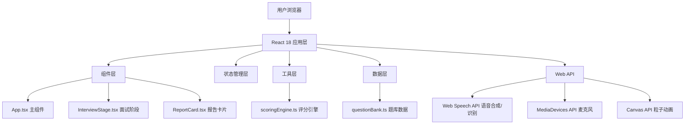

## 1. 架构设计



## 2. 技术描述
- **前端框架**: React@18 + TypeScript@5 + Vite@5
- **初始化工具**: vite-init (react-ts模板)
- **样式方案**: styled-components@6 (CSS-in-JS)
- **图表库**: recharts@2 (雷达图)
- **后端**: 无（纯前端应用）
- **数据库**: 无（使用内置Mock数据）
- **浏览器API**: Web Speech API, MediaDevices API, Canvas API

## 3. 文件结构
| 文件路径 | 用途 |
|---------|------|
| /package.json | 项目依赖与脚本配置 |
| /index.html | 入口HTML，viewport与主题色设置 |
| /vite.config.js | Vite配置，React插件与路径别名 |
| /tsconfig.json | TypeScript严格模式配置 |
| /src/App.tsx | 主组件，面试流程状态机管理 |
| /src/components/InterviewStage.tsx | 面试阶段组件 |
| /src/components/ReportCard.tsx | 报告卡片组件（雷达图+粒子） |
| /src/utils/scoringEngine.ts | 评分引擎（纯函数） |
| /src/data/questionBank.ts | 题库数据与关键词库 |

## 4. 状态管理

### 4.1 应用状态（App.tsx内部useState）
```typescript
type InterviewPhase = 'start' | 'interview' | 'report';
type PositionType = 'frontend' | 'backend' | 'data' | 'product' | 'operation';
type VoiceGender = 'male' | 'female';

interface Answer {
  questionId: string;
  questionText: string;
  questionType: 'behavioral' | 'technical';
  answerText: string;
  duration: number; // 回答时长（秒）
  completed: boolean;
  speechRateVariance: number; // 语速变化率
  keywordsHit: string[];
}

interface AppState {
  phase: InterviewPhase;
  position: PositionType | null;
  voiceGender: VoiceGender;
  questions: Question[];
  currentQuestionIndex: number;
  answers: Answer[];
  scores: DimensionScores | null;
}
```

### 4.2 评分维度
```typescript
interface DimensionScores {
  fluency: number;      // 表达流畅度 0-100
  logic: number;        // 逻辑清晰度 0-100
  expertise: number;    // 专业深度 0-100
  adaptability: number; // 应变能力 0-100
  confidence: number;   // 自信度 0-100
}
```

## 5. 核心模块说明

### 5.1 评分引擎 scoringEngine.ts
- **输入**: Answer[] 回答数组
- **输出**: DimensionScores 五维分数
- **计算规则**:
  - 表达流畅度: 基于回答时长、语速变化率计算
  - 逻辑清晰度: 基于关键词命中率、回答完整性计算
  - 专业深度: 基于专业关键词命中数量计算
  - 应变能力: 基于沉默次数、超时情况计算
  - 自信度: 基于回答时长、停顿频率综合计算

### 5.2 面试阶段 InterviewStage.tsx
- 虚拟面试官头像（纯CSS + 眨眼动画）
- Web Speech API语音合成播报题目
- MediaDevices API获取麦克风输入
- SpeechRecognition API语音转文字（可选降级为键盘输入）
- 3分钟倒计时计时器
- 10秒沉默检测与鼓励气泡
- 超时自动跳转下一题

### 5.3 报告卡片 ReportCard.tsx
- Recharts RadarChart渲染五维雷达图
- Canvas API实现碎屑粒子动画效果（requestAnimationFrame）
- 各维度分数详情展示

## 6. 性能优化方案
- 粒子动画使用requestAnimationFrame，限制最大粒子数量
- 语音合成预加载语音包，降低延迟
- 雷达图动画使用CSS transform/opacity，保证60FPS
- 组件合理使用React.memo避免不必要重渲染

## 7. 响应式断点
| 断点 | 宽度 | 布局 |
|------|------|------|
| 移动端 | < 768px | 垂直堆叠布局 |
| 平板 | 768px - 1024px | 混合布局 |
| 桌面端 | > 1024px | 水平分布布局 |
