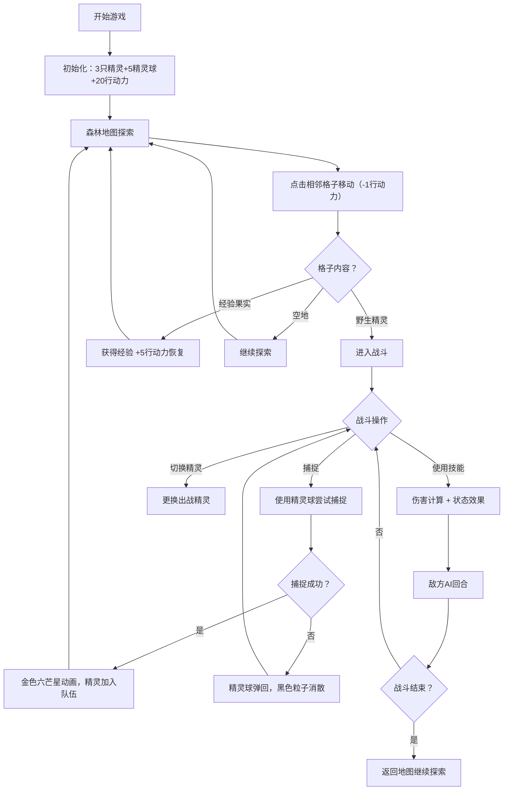

## 1. 产品概述

精灵养成对战游戏是一款运行在浏览器中的轻量级策略游戏，玩家在虚拟森林中捕捉并培养不同属性的精灵，组建战队进行实时回合制对战，解决资源分配与策略决策问题。

- 主要目标：提供休闲娱乐的策略养成体验，玩家通过探索、捕捉、培养精灵并进行战斗获得成就感
- 目标用户：喜欢精灵养成类游戏的休闲玩家

## 2. 核心功能

### 2.1 用户角色
本游戏为单人单机游戏，无需用户注册登录。

| 角色 | 注册方式 | 核心权限 |
|------|----------|----------|
| 玩家 | 无需注册，直接进入游戏 | 探索地图、捕捉精灵、培养战队、进行对战 |

### 2.2 功能模块
1. **地图探索模块**：5x5 森林网格地图、玩家移动、行动力消耗与恢复、野生精灵遭遇、经验果实获取
2. **精灵系统模块**：精灵属性（HP/ATK/DEF/SPD）、属性克制（火克草、草克水、水克火）、主动技能效果、精灵队伍管理（上限6只）
3. **战斗系统模块**：回合制战斗、技能释放、伤害计算、状态效果、敌方AI决策、精灵切换
4. **捕捉系统模块**：精灵球道具、捕捉概率计算（基于剩余HP）、捕捉动画效果、放生机制
5. **动画特效模块**：脉动光晕、粒子特效、转场动画、血条震动、金色六芒星阵

### 2.3 页面详情

| 页面名称 | 模块名称 | 功能描述 |
|----------|----------|----------|
| 主游戏界面 | 顶部状态栏 | 半透明浮层，显示行动力、精灵球数量、地图层数、已捕捉精灵数 |
| 主游戏界面 | 森林地图 | 5x5网格，深棕色描边，玩家金色发光标记，野生精灵淡蓝色光环 |
| 战斗界面 | 敌方信息区 | 敌方精灵血条（绿到红渐变+发光圆点）、属性图标、技能名称 |
| 战斗界面 | 己方精灵区 | 三只精灵缩略卡片（属性对应背景色）、当前选中脉动光晕、技能按钮、切换按钮 |
| 战斗界面 | 捕捉操作 | 精灵球道具使用、捕捉概率、结果动画 |
| 全局 | 动画系统 | 粒子特效、血条震动、旋转门转场、能量球旋转 |

## 3. 核心流程

玩家初始拥有火、水、草三只基础精灵和5个精灵球、20点行动力。在森林地图中探索移动，每步消耗1点行动力，每回合恢复5点。遇到野生精灵进入回合制战斗，可选择攻击、切换精灵或使用精灵球捕捉。捕捉成功后精灵加入队伍（上限6只，超出需放生），战斗胜利获得经验提升精灵属性。

## 4. 用户界面设计

### 4.1 设计风格
- **主色调**：暖色调森林风格，深绿到墨蓝渐变背景（#1b3a3a → #0d1f2d）
- **属性色**：火-橙红、水-蓝紫、草-翠绿
- **按钮风格**：圆角卡片设计，按压下沉反馈，波纹扩散效果
- **字体**：系统无衬线字体
- **网格描边**：深棕色（#5d4037）

### 4.2 页面设计概览

| 页面/区域 | 模块 | UI元素 |
|-----------|------|--------|
| 主界面 | 顶部状态栏 | 半透明浮层，行动力⚡+数字，精灵球🔮+数字，地图层数🗺️，捕捉数📊 |
| 主界面 | 森林地图 | 5x5网格布局，玩家金色闪烁标记，野生精灵淡蓝色脉动光环，格子悬浮反馈 |
| 战斗界面 | 敌方区 | 顶部居中，精灵头像+属性图标，血条（绿→红渐变，两端发光圆点，震动动画），红色能量球缓慢旋转 |
| 战斗界面 | 己方区 | 底部三只精灵卡片，属性色背景，选中四周脉动光晕，技能按钮（含效果描述），切换按钮 |
| 全局 | 转场动画 | 旋转门效果（0.5秒），战斗场景环形竞技场深色石砖纹理 |
| 全局 | 捕捉特效 | 成功：金色六芒星阵闪烁1.5秒；失败：精灵球弹回+黑色粒子消散 |
| 全局 | 粒子特效 | 受伤害红色溅射粒子，放生彩色光点飘散 |

### 4.3 响应式设计
- Desktop-first 设计，最小宽度 768px
- 平板和手机端：按钮间距自动拉大，保持触控友好
- 地图网格自适应容器尺寸
- 字体大小采用相对单位

### 4.4 性能要求
- 60FPS 流畅运行
- 所有动画使用 requestAnimationFrame 驱动
- 战斗场景切换耗时 ≤ 200ms（精灵数 ≤ 6时）
