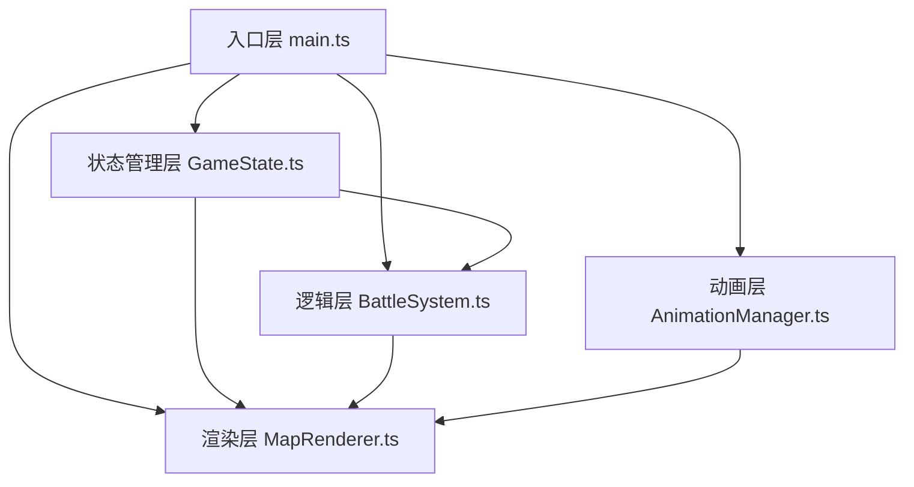

## 1. 架构设计

本项目为纯前端 Canvas 游戏，采用分层架构设计：



## 2. 技术说明

- **前端框架**：原生 TypeScript + Vite（按用户指定，不使用 React/Vue）
- **渲染方式**：HTML5 Canvas 2D API
- **动画驱动**：requestAnimationFrame
- **项目端口**：5173，开启 HMR

## 3. 文件结构

| 文件 | 说明 |
|------|------|
| package.json | 项目依赖与脚本配置 |
| vite.config.js | Vite 构建配置 |
| tsconfig.json | TypeScript 编译配置 |
| index.html | 入口页面，全屏 Canvas + 半透明 UI 层 |
| src/main.ts | 应用启动入口，初始化游戏循环、事件绑定 |
| src/GameState.ts | 单例类，管理玩家队伍、精灵数据、地图状态、战斗状态 |
| src/MapRenderer.ts | 5x5 森林地图绘制、玩家移动、野生精灵光环、网格交互 |
| src/BattleSystem.ts | 回合制战斗逻辑、技能效果、伤害公式、AI决策 |
| src/AnimationManager.ts | 脉动光晕、粒子特效、转场动画、血条震动管理 |

## 4. 数据模型

### 4.1 精灵数据模型

```typescript
// 精灵属性类型
type ElementType = 'fire' | 'water' | 'grass';

// 状态效果类型
type StatusEffectType = 'burn' | 'heal' | 'bind' | null;

// 技能定义
interface Skill {
  name: string;
  element: ElementType;
  description: string;
  effect: StatusEffectType;
  damageMultiplier: number;
}

// 精灵定义
interface Spirit {
  id: string;
  name: string;
  element: ElementType;
  maxHp: number;
  currentHp: number;
  atk: number;
  def: number;
  spd: number;
  skill: Skill;
  statusEffect: StatusEffectType;
  statusTurns: number;
  level: number;
  exp: number;
}

// 地图格子类型
type CellType = 'empty' | 'wild_spirit' | 'exp_fruit' | 'player';

// 地图格子
interface MapCell {
  x: number;
  y: number;
  type: CellType;
  wildSpirit?: Spirit;
  explored: boolean;
}

// 战斗状态
interface BattleState {
  active: boolean;
  playerTeam: Spirit[];
  currentPlayerIndex: number;
  enemySpirit: Spirit;
  turn: 'player' | 'enemy';
  log: string[];
}

// 全局游戏状态
interface GameStateData {
  playerTeam: Spirit[];
  teamSize: number; // max 6
  actionPoints: number;
  maxActionPoints: number;
  spiritBalls: number;
  mapLevel: number;
  caughtCount: number;
  currentPosition: { x: number; y: number };
  mapGrid: MapCell[][];
  battleState: BattleState | null;
  screen: 'map' | 'battle';
}
```

### 4.2 属性克制关系

| 攻击方 | 防守方 | 伤害倍率 |
|--------|--------|----------|
| 火 | 草 | 1.5x |
| 草 | 水 | 1.5x |
| 水 | 火 | 1.5x |
| 同属性/其他 | - | 1.0x |

### 4.3 技能效果

| 技能 | 属性 | 效果 |
|------|------|------|
| 火焰灼烧 | 火 | 造成伤害，敌方持续掉血3回合 |
| 水疗术 | 水 | 造成伤害，恢复自身30%HP |
| 藤蔓缠绕 | 草 | 造成伤害，敌方跳过下一回合 |

### 4.4 捕捉概率

```
捕捉概率 = 0.3 + (1 - 敌方当前HP / 敌方最大HP) * 0.5
范围：30% ~ 80%
```

## 5. 核心算法

### 5.1 伤害计算公式

```
基础伤害 = 攻击力 * 技能倍率 - 防御力 * 0.5
克制修正 = 克制关系倍率 (1.0 / 1.5)
最终伤害 = Max(1, Floor(基础伤害 * 克制修正 * 随机浮动(0.9~1.1)))
```

### 5.2 敌方AI决策逻辑

1. 检查己方是否有克制敌方的属性精灵，优先使用
2. 若当前出战精灵HP < 30%，尝试切换
3. 否则使用普通攻击或技能

### 5.3 地图生成算法

- 5x5 网格，玩家初始位置 (2, 2)
- 随机分布 3-5 只野生精灵（火/水/草随机属性）
- 随机分布 2-3 个经验果实
- 其余为空地

## 6. 性能优化策略

1. 使用 requestAnimationFrame 统一驱动所有动画
2. Canvas 分层渲染（静态地图层 + 动态精灵层 + 特效层）
3. 粒子对象池复用，避免频繁 GC
4. 离屏 Canvas 缓存静态元素
5. 脏矩形区域渲染优化
