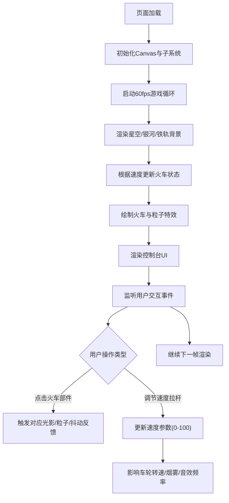

## 1. 产品概述

星夜列车是一款在浏览器中运行的交互式蒸汽朋克风格可视化应用，模拟一列老式蒸汽火车在星空下行驶的舒缓场景。用户通过与火车各部件交互获得光影和音效反馈，并通过驾驶面板控制列车运行。

- 核心价值：提供沉浸式、舒缓的视觉体验，结合丰富的微交互营造蒸汽朋克怀旧氛围
- 目标用户：喜欢艺术可视化、交互式动画和蒸汽朋克美学的用户

## 2. 核心功能

### 2.1 功能模块

1. **火车主体系统**：车身绘制、车轮旋转动画、烟囱烟雾粒子、交互反馈
2. **场景渲染系统**：动态星空、流动银河、流星、铁轨透视、路边房屋树木
3. **驾驶控制台UI**：速度拉杆、温度表、里程计数器、状态指示灯
4. **交互反馈系统**：点击反馈、屏幕抖动、粒子特效

### 2.2 页面详情

| 页面名称 | 模块名称 | 功能描述 |
|----------|----------|----------|
| 主场景 | 火车主体 | 蒸汽火车位于画面左侧三分之一处，包含车身、驾驶室、烟囱、四个车轮、连接杆 |
| 主场景 | 动态背景 | 200颗星星水平移动、半透明银河带、每15秒流星、透视铁轨 |
| 主场景 | 路边景物 | 速度>50时随机出现房屋和树木，透视变形从右向左移动 |
| 控制台 | 速度拉杆 | 垂直滑块0-100，步进5，控制车轮转速、烟雾密度、撞击频率 |
| 控制台 | 温度表 | 半圆形表盘，随运行时间升高，超过80度红色闪烁 |
| 控制台 | 里程计数器 | 六位数码管显示，每秒递增 |
| 控制台 | 状态指示灯 | 蒸汽压力、锅炉水位、电力供应三盏灯 |

## 3. 核心流程

## 4. 用户界面设计

### 4.1 设计风格
- **整体风格**：蒸汽朋克复古风，夜晚星空主题
- **主色调**：
  - 背景：深空蓝黑色渐变（#0a0a1a 到 #1a1a3a）
  - 火车车身：暗红色渐变（#8b0000 到 #5c0000）配金色装饰
  - 控制台：拉丝铜板质感（铜色渐变 #b87333 到 #8b4513）
  - 点缀色：暖黄灯光 #ffa500、金色火花 #ffd700
- **字体**：等宽数码管风格用于计数器，复古衬线体用于标签
- **动效**：缓慢流畅的动画过渡，粒子特效，微交互反馈

### 4.2 页面设计概览

| 模块 | UI元素 | 设计要点 |
|------|--------|----------|
| 星空背景 | 星星、银河、流星 | 星星1-4px冷白到淡蓝，水平0.2px/帧移动；银河alpha 0.3-0.6带状；每15秒流星带渐淡尾迹 |
| 铁轨 | 铁轨、枕木 | 棕色铁轨#4a3728，木质枕木#6b4423间隔60px，远处汇聚消失点 |
| 火车车身 | 车身、驾驶室、烟囱、车轮 | 暗红渐变车身带金边；深棕木纹驾驶室半透明暖黄窗；黑色铸铁锯齿烟囱；铁灰色#708090辐条车轮带动态模糊 |
| 控制台 | 拉杆、温度表、计数器、指示灯 | 垂直暗金轨道铜色滑块；半圆绿黄红渐变表盘；六位等宽数码管；三色状态灯 |
| 交互反馈 | 灯光、烟雾、火花、抖动 | 点击驾驶室灯亮20%持续2秒；点击烟囱喷浓烟；点击车轮30个金橙火花；3px幅度0.2秒抖动 |

### 4.3 响应式设计
- 桌面端优先设计，Canvas自适应窗口大小
- 控制台固定高度120px位于底部

### 4.4 性能要求
- 帧率目标60fps，最低不低于30fps
- 粒子系统优化，控制同时存在的粒子数量
