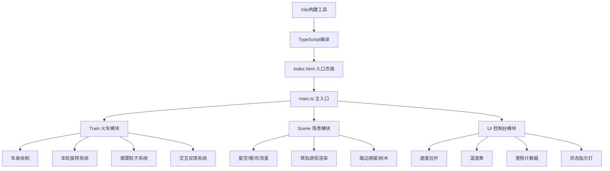

## 1. 架构设计



## 2. 技术说明

- **前端框架**：原生 TypeScript，无额外UI框架
- **构建工具**：Vite@5
- **渲染技术**：HTML5 Canvas 2D API
- **初始化方式**：手动配置 Vite + TypeScript

## 3. 项目文件结构

```
auto293/
├── package.json
├── vite.config.js
├── tsconfig.json
├── index.html
└── src/
    ├── main.ts      # 主入口，游戏循环，子系统管理
    ├── train.ts     # 火车模块：车身、车轮、烟雾、交互
    ├── scene.ts     # 场景模块：星空、铁轨、路边景物
    └── ui.ts        # UI控制台模块：拉杆、仪表、计数器
```

## 4. 模块接口定义

### 4.1 Train 类接口

```typescript
class Train {
  position: { x: number; y: number };
  speed: number;  // 0-100
  wheelRotation: number;
  smokeParticles: SmokeParticle[];
  
  setSpeed(speed: number): void;
  update(deltaTime: number): void;
  render(ctx: CanvasRenderingContext2D): void;
  handleClick(x: number, y: number): InteractionType | null;
  triggerCabLightFlash(): void;
  triggerSmokeBurst(): void;
  triggerSparks(x: number, y: number): void;
}
```

### 4.2 Scene 类接口

```typescript
class Scene {
  stars: Star[];
  milkyWayStars: Star[];
  meteors: Meteor[];
  trackOffset: number;
  sceneryObjects: SceneryObject[];
  
  update(deltaTime: number, speed: number): void;
  render(ctx: CanvasRenderingContext2D): void;
  getTrackPreview(distance: number): { x: number; y: number }[];
}
```

### 4.3 UI 类接口

```typescript
class UI {
  speed: number;
  temperature: number;
  mileage: number;
  indicators: { steam: boolean; water: boolean; power: boolean };
  isDraggingSlider: boolean;
  
  setSpeed(speed: number): void;
  update(deltaTime: number): void;
  render(ctx: CanvasRenderingContext2D, canvasWidth: number, canvasHeight: number): void;
  handleMouseDown(x: number, y: number): boolean;
  handleMouseMove(x: number, y: number): void;
  handleMouseUp(): void;
  onSpeedChange(callback: (speed: number) => void): void;
}
```

## 5. 游戏循环与主流程

```typescript
// main.ts 核心逻辑
function gameLoop(timestamp: number) {
  const deltaTime = Math.min((timestamp - lastTime) / 1000, 1/30);
  lastTime = timestamp;
  
  train.update(deltaTime);
  scene.update(deltaTime, train.speed);
  ui.update(deltaTime);
  
  // 屏幕抖动偏移
  ctx.save();
  if (screenShakeTime > 0) {
    ctx.translate(rand(-shakeAmp, shakeAmp), rand(-shakeAmp, shakeAmp));
  }
  
  scene.render(ctx);
  train.render(ctx);
  
  ctx.restore();
  ui.render(ctx, canvas.width, canvas.height);
  
  requestAnimationFrame(gameLoop);
}
```

## 6. 性能优化策略

1. **粒子池化**：烟雾、火花、流星粒子对象复用，避免频繁GC
2. **离屏渲染**：星空背景使用离屏Canvas缓存，每帧整体平移
3. **帧率控制**：使用deltaTime归一化动画速度，保证不同设备一致性
4. **可见性剔除**：路边景物移出画面后立即回收
5. **渲染分层**：先背景后前景，减少Canvas状态切换开销
