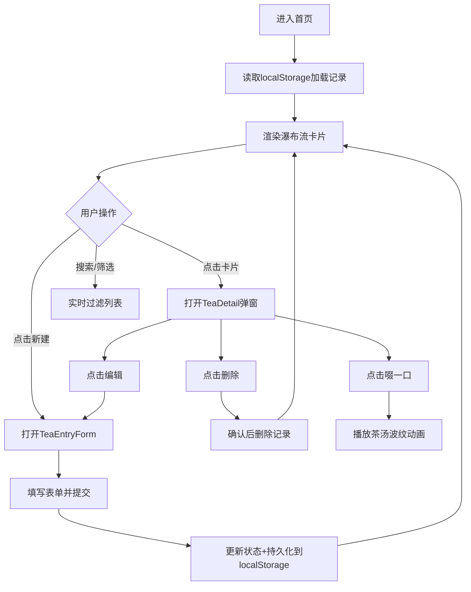

## 1. 产品概述

「一泡录」是一款面向独立茶艺师的茶艺品鉴记录与管理Web应用，用于记录和保存每一泡茶的冲泡参数、口感变化与个人品鉴笔记，使不同茶种的泡法经验和风味档案能够像收藏品一样被保存和展陈。

- 目标用户：独立茶艺师、茶艺爱好者、茶叶收藏者
- 核心价值：打造个人茶艺数字博物馆，系统化管理品鉴经验

## 2. 核心功能

### 2.1 用户角色
| 角色 | 注册方式 | 核心权限 |
|------|----------|----------|
| 茶艺师 | 本地使用（无需注册） | 创建、查看、编辑、删除品鉴记录 |

### 2.2 功能模块
1. **品鉴记录管理**：记录的CRUD操作、表单数据收集
2. **瀑布流展示**：以卡片瀑布流形式展示所有记录
3. **详情弹窗**：点击卡片展开详情，支持编辑/删除/趣味互动
4. **搜索筛选**：按茶种名称和茶类进行组合筛选
5. **统计面板**：全局统计数据实时展示

### 2.3 页面详情
| 页面名称 | 模块名称 | 功能描述 |
|----------|----------|----------|
| 首页 | 顶部搜索区 | 搜索框+清空按钮、茶类下拉选择器、新建记录按钮 |
| 首页 | 卡片瀑布流 | 自适应高度卡片、茶类徽章、悬停动效 |
| 首页 | 统计面板 | 总记录数、茶类数、平均评分、最高分茶种 |
| 详情弹窗 | 详情展示 | 主题色块、字段展示、进度条/圆环可视化 |
| 详情弹窗 | 互动功能 | 「啜一口」茶汤波纹动画、编辑/删除按钮 |
| 表单弹窗 | 新建/编辑表单 | 两列网格布局、滑块控件、表情评分、多行文域 |

## 3. 核心流程

## 4. 用户界面设计

### 4.1 设计风格
- **主色调**：茶绿色(#5b8c5a)、暖木色与米黄色(#f5f0e8)背景
- **辅助色**：六大茶类各有专属渐变配色（绿茶浅绿→苔绿、红茶琥珀→赭石等）
- **按钮样式**：圆角12px，茶绿主色，悬停加深(#4a7348)，点击缩放(scale 0.97, 0.1s)
- **字体**：使用茶绿色(#5b8c5a)标签，暖色系正文字体
- **布局风格**：卡片式布局，瀑布流网格，半透明玻璃效果统计面板
- **图标/emoji**：使用表情符号作为评分视觉反馈(😖→😍)，茶类徽章使用圆形色块

### 4.2 页面设计概览
| 页面名称 | 模块名称 | UI元素 |
|----------|----------|--------|
| 首页 | 搜索区 | 聚焦左侧茶绿色指示线、圆角输入框、下拉选择器 |
| 首页 | 卡片瀑布流 | 圆角16px卡片、上移5px+阴影悬停动效(0.3s ease-out)、圆形茶类徽章(32px) |
| 首页 | 空状态 | 6片茶叶飘落动画、4秒循环 |
| 首页 | 统计面板 | backdrop-filter blur(8px)、rgba(255,255,240,0.65)背景、固定高150px |
| 详情弹窗 | 弹窗层 | rgba(30,30,30,0.8)半透明遮罩、#faf8f0柔白色卡片 |
| 详情弹窗 | 数据展示 | 左侧1/3主题色块、右侧进度条/圆环可视化 |
| 表单弹窗 | 表单区 | 两列网格布局、拖动滑块控件、1-10表情评分条 |

### 4.3 响应式设计
- 桌面优先设计，自适应屏幕宽度
- 瀑布流在大屏多列、小屏单列自适应
- 弹窗在移动端优化为全屏展示

### 4.4 动效设计
- 卡片悬停：上移5px + 柔和阴影，0.3s ease-out
- 按钮交互：hover颜色加深，click scale 0.97，0.1s
- 输入聚焦：左侧2px茶绿色指示线
- 空状态：6片茶叶CSS keyframes飘落动画，4s循环
- 啜一口：茶汤波纹扩散动画，1.2s
