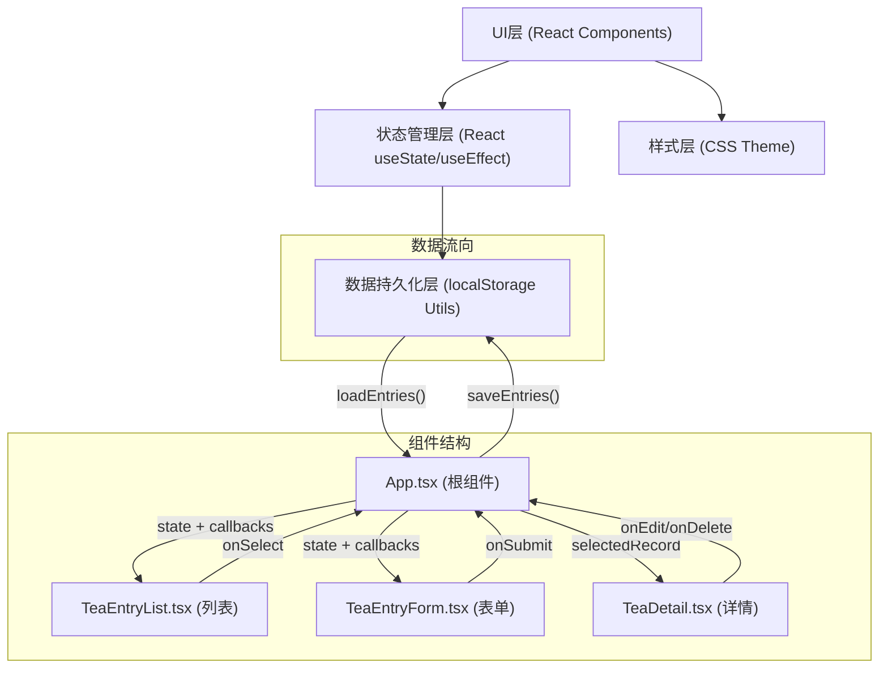
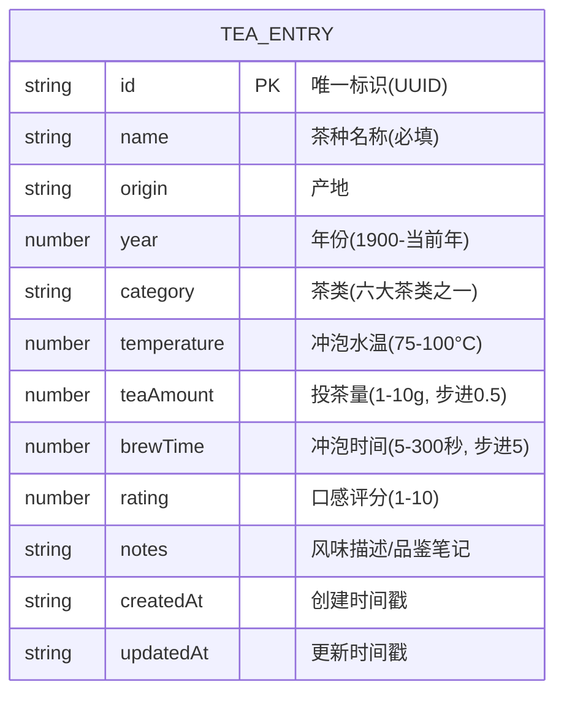
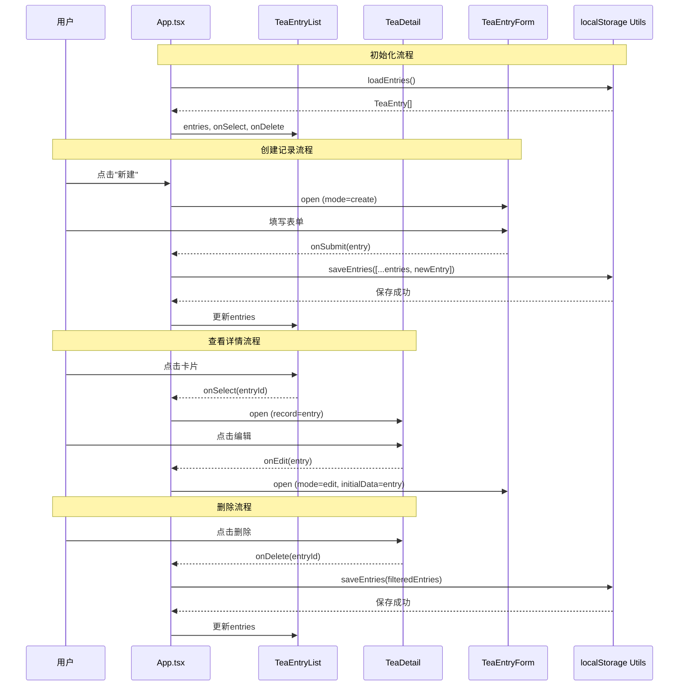

## 1. 架构设计



## 2. 技术描述

- **前端框架**：React 18 + TypeScript 5
- **构建工具**：Vite 5（端口5173，启用HMR）
- **样式方案**：原生CSS（CSS变量定义主题）
- **状态管理**：React内置 useState + useCallback
- **数据持久化**：浏览器 localStorage（异步/防抖处理）
- **图标**：使用 emoji + lucide-react
- **路由**：无需路由（单页应用，弹窗切换视图）

## 3. 文件结构

```
├── package.json
├── vite.config.js
├── tsconfig.json
├── index.html
└── src/
    ├── App.tsx                      # 根组件，全局状态与视图切换
    ├── types/
    │   └── tea.ts                   # TeaEntry 类型定义
    ├── utils/
    │   ├── storage.ts               # localStorage 读写封装
    │   └── teaCategory.ts           # 六大茶类分类与配色映射
    ├── components/
    │   ├── TeaEntryList.tsx         # 瀑布流卡片列表
    │   ├── TeaEntryForm.tsx         # 新建/编辑表单
    │   ├── TeaDetail.tsx            # 详情弹窗
    │   ├── StatsPanel.tsx           # 底部统计面板
    │   └── FilterBar.tsx            # 搜索与筛选栏
    └── styles/
        └── teaTheme.css             # 全局主题样式与动画
```

## 4. 数据模型

### 4.1 TeaEntry 实体



### 4.2 六大茶类枚举

```typescript
type TeaCategory = 'green' | 'white' | 'yellow' | 'oolong' | 'red' | 'black'

const TEA_CATEGORY_CONFIG = {
  green:  { label: '绿茶', gradient: 'linear-gradient(135deg, #d4f5d4, #5b8c5a)' },
  white:  { label: '白茶', gradient: 'linear-gradient(135deg, #f5f5f0, #c9c9b0)' },
  yellow: { label: '黄茶', gradient: 'linear-gradient(135deg, #fff9c4, #c9a227)' },
  oolong: { label: '青茶', gradient: 'linear-gradient(135deg, #c8e6c9, #2e7d32)' },
  red:    { label: '红茶', gradient: 'linear-gradient(135deg, #ffccbc, #bf360c)' },
  black:  { label: '黑茶', gradient: 'linear-gradient(135deg, #a1887f, #3e2723)' },
}
```

## 5. 数据流向说明



## 6. 性能优化策略

- **瀑布流渲染**：使用CSS `column-count` 实现多列瀑布流，避免重排
- **筛选响应**：基于React状态实时过滤，<100ms响应
- **localStorage读写**：使用异步 + debounce(50ms)避免UI阻塞
- **动画**：全部使用CSS transform/opacity，确保GPU加速，FPS≥55
- **memo优化**：列表卡片使用React.memo防止不必要重渲染
