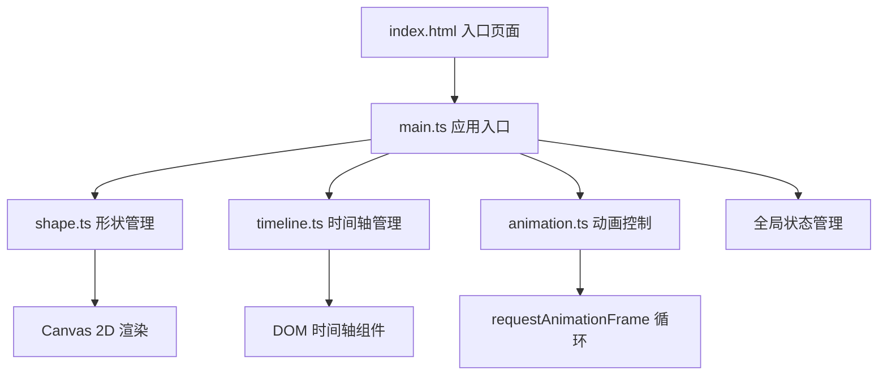

## 1. 架构设计



## 2. 技术描述

- **前端框架**：原生 TypeScript + HTML Canvas 2D + 原生 DOM 组件（不依赖UI框架）
- **构建工具**：Vite 4.x
- **语言版本**：TypeScript 5.x，target ES2020，module ESNext
- **样式方案**：原生 CSS（内联样式 + style 标签）
- **状态管理**：简单的单例模式全局状态，不引入额外库

## 3. 文件结构

```
auto295/
├── index.html                  # 入口页面，包含完整UI结构
├── package.json                # 项目依赖和脚本
├── vite.config.js              # Vite配置
├── tsconfig.json               # TypeScript配置
└── src/
    ├── main.ts                 # 应用入口：初始化、事件绑定、状态管理
    ├── shape.ts                # 形状管理：绘制、更新、选中、大小调整
    ├── timeline.ts             # 时间轴：关键帧增删、拖拽、序列计算
    └── animation.ts            # 动画控制：插值、播放循环、缓动、导入导出
```

## 4. 核心类型定义

### 4.1 形状类型

```typescript
type ShapeType = 'circle' | 'square' | 'triangle' | 'star';

interface ShapeState {
  x: number;           // 位置X
  y: number;           // 位置Y
  rotation: number;    // 旋转角度(度)
  scale: number;       // 缩放比例
  opacity: number;     // 透明度
  color: string;       // 颜色(HEX)
  size: number;        // 基础大小
}

interface Shape {
  type: ShapeType;
  state: ShapeState;
  selected: boolean;
}
```

### 4.2 关键帧类型

```typescript
interface Keyframe {
  id: number;
  time: number;        // 时间轴位置(ms)
  duration: number;    // 到下一帧的持续时间(100-5000ms)
  state: ShapeState;
}
```

### 4.3 动画状态

```typescript
interface AnimationState {
  isPlaying: boolean;
  currentTime: number; // 当前播放时间
  totalDuration: number;
  speed: number;       // 0.5, 1, 1.5, 2
  keyframes: Keyframe[];
  selectedKeyframeId: number | null;
}
```

## 5. 核心模块设计

### 5.1 shape.ts - 形状管理

| 方法 | 说明 | 参数 | 返回 |
|------|------|------|------|
| drawShape | 在Canvas上绘制形状 | ctx: CanvasRenderingContext2D, shape: Shape | void |
| updateShape | 更新形状状态 | shape: Shape, state: Partial<ShapeState> | void |
| hitTest | 检测点是否在形状内 | shape: Shape, x: number, y: number | boolean |
| drawSelection | 绘制选中边框和锚点 | ctx: CanvasRenderingContext2D, shape: Shape | void |
| getAnchorHandle | 获取锚点命中检测 | shape: Shape, x: number, y: number | string \| null |

### 5.2 timeline.ts - 时间轴管理

| 方法 | 说明 | 参数 | 返回 |
|------|------|------|------|
| addKeyframe | 添加关键帧 | time: number, state: ShapeState | Keyframe |
| removeKeyframe | 删除关键帧 | id: number | boolean |
| getKeyframe | 获取关键帧 | id: number | Keyframe \| undefined |
| getSequence | 获取关键帧序列（按时序排序） | - | Keyframe[] |
| updateKeyframe | 更新关键帧属性 | id: number, updates: Partial<Keyframe> | void |
| getTotalDuration | 计算总时长 | - | number |

### 5.3 animation.ts - 动画控制

| 方法 | 说明 | 参数 | 返回 |
|------|------|------|------|
| play | 开始播放动画 | - | void |
| pause | 暂停播放 | - | void |
| reset | 重置到起始帧 | - | void |
| setSpeed | 设置播放速度 | speed: number | void |
| getCurrentState | 获取当前插值状态 | - | ShapeState |
| getProgress | 获取播放进度(0-1) | - | number |
| easeInOut | 缓动函数 | t: number (0-1) | number |
| exportJSON | 导出配置 | - | string |
| importJSON | 导入配置 | json: string | void |

## 6. 性能优化策略

1. **Canvas渲染优化**：仅在需要时重绘，使用脏标记机制
2. **动画循环**：使用 requestAnimationFrame，避免 setTimeout/setInterval
3. **对象池**：关键帧和形状对象复用，减少GC压力
4. **离屏渲染**：复杂形状可预先绘制到离屏Canvas
5. **节流防抖**：参数输入使用节流，避免高频重绘
6. **增量渲染**：仅重新绘制变化的部分区域

## 7. 响应式布局

- 使用CSS Flexbox布局，画布区域 flex: 1，右侧面板 width: 320px
- Canvas元素随容器大小动态调整，监听 window resize 事件
- 时间轴面板固定高度120px，宽度自适应
- 最小宽度 min-width: 1024px
